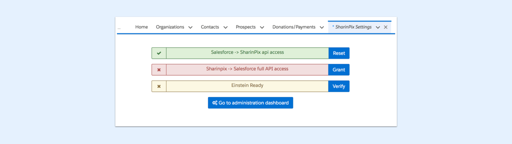
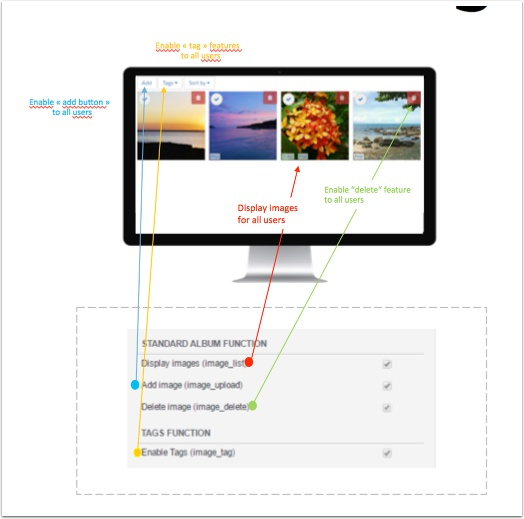
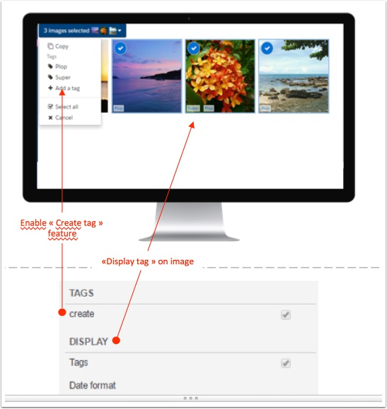
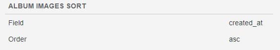
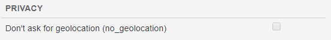
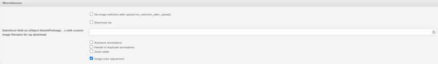
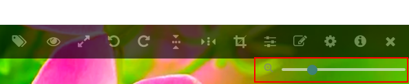
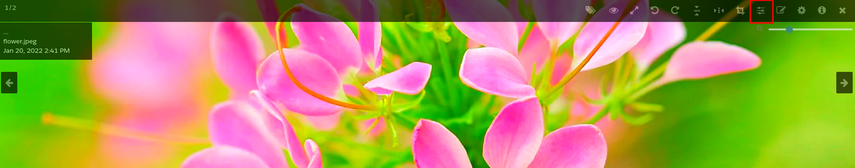

---
layout:
  width: default
  title:
    visible: true
  description:
    visible: true
  tableOfContents:
    visible: true
  outline:
    visible: true
  pagination:
    visible: true
  metadata:
    visible: false
  tags:
    visible: true
  actions:
    visible: true
---

# Customizing your SharinPix Global Settings

The Global Settings allow you to set specific permissions for everybody in your organization. First, we'll walk through getting to the Global Settings, via the SharinPix Administration Dashboard. Then we'll check out some of the basic features that you can enable through the Global settings.

For notification recipients, see [Notification settings](notification-settings.md).


**Note:**

The SharinPix Album abilities available on the Global Settings can also be configured using [SharinPix Permissions](sharinpix-permission-object-how-to-create-and-assign-custom-permission.md).

The SharinPix Global Settings configuration is applied on albums by default **unless** a SharinPix Permission has been assigned to the album.

**However, for security reasons, we strongly advise using a SharinPix Permission to control album abilities instead of the SharinPix Global Settings.**


## Access and configure the SharinPix Global Settings

To access the _SharinPix Global Settings_ from your Organization, proceed as follows:

* Click on the **App Launcher**
* Enter SharinPix Settings in the search bar and select **SharinPix Settings**
* On the SharinPix Settings page, click on the **Go to administration dashboard** button

* _You may have to sign in again to authenticate your credentials._
* Next, click on the **Settings** tab to access the Global Settings

To configure the Global Settings, click on the **Edit Organization** button.

Example of the User Interface in the SharinPix Settings:

.png>)

* To enable/disable album abilities, check/uncheck the checkboxes accordingly.
* Click on the **Update Organization** button located at the bottom of the page to save the changes.

## Overview of the SharinPix Global Settings parameters

Global Settings give users access to the settings below:

* Add Button - for all users
* Display Images from all Users
* Add a tag function
* Delete button

<figure><figcaption></figcaption></figure>

Adding tags to the photos:

<figure><figcaption></figcaption></figure>

Add a tag Icon:

Tag List with Add a Tag link:

Add a Tag:

Create and Display Tags:

Photo with Tags:

<figure><figcaption></figcaption></figure>

**In fullscreen, all the tool icons are visible:**

1\. Tag the image

2\. Download the image

3\. Open the image in fullscreen on another tab

4\. & 5. Rotate the image

6\. & 7. Flip the image

8\. Duplicate the image

9\. Crop the image

10\. Hide/display the image annotations

11\. Annotate the image

12\. Set the image quality

13\. View image information

14\. Close the fullscreen view

15\. Image zoom slider

**Edit Tools - have some fun here**

1. Erase
2. Size of mark
3. Color of mark
4. Text box
5. Marker
6. Line
7. Save
8. Exit
9. Rectangle
10. Circle
11. Arrow
12. Double Arrow

## Menu Command

The **Menu Command** section provides some options as depicted in the images below:

These options are available in the **Thumbnail Menu** as shown below:


For more information about how to access the **Thumbnail Menu** , refer to the following article: [**Thumbnail View - The menu**](../features/user-interface/thumbnail-view-the-menu.md)


## Album Images Sort

The **Album Images Sort** section provides options that can be used to apply sorting on the images found in an album.

<figure><figcaption></figcaption></figure>

## Privacy Settings

The **Privacy** section permits you to set whether to ask the user to access the geolocation or not.

<figure><figcaption></figcaption></figure>

## Miscellaneous

<figure><figcaption></figcaption></figure>

This section provides the following options:

* No image selection after upload
  * By default, after the first upload to an album, all the images uploaded are selected. After applying the **No images selection after upload** options, the images will not be selected after the first upload.
* Download zip
  * The **Download zip** option enables the user to download the images in a zip file.

* Salesforce field on sObject SharinPixImage\_\_c with custom image filename for zip download
  * This parameter allows us to download the image with a custom filename. The value of the custom filename should be stored in a Salesforce field on the **SharinPixImage\_\_c** sObject.
  * The **Salesforce field API name** should then be used as the value for the parameter **download\_custom\_filename**, for example: download\_custom\_filename: 'CustomFilename\_\_c', where _CustomFilename\_\_c_ refers to the API name of the Salesforce field storing the value for the custom filename.
* Autosave annotations
  * By default, the save button has to be clicked to save annotations on the image. After applying the **Autosave annotations** option, annotations are saved automatically as they are added.
* Handle to duplicate annotations
  * The **Handle to duplicate annotations** allows duplication of an annotation.
* Zoom slider
  * The **Zoom slider** provides a slider to zoom in and zoom out of the image.

<figure><figcaption></figcaption></figure>

* Image color adjustment
  * The **Image color adjustment** option enables the **color\_adjustment** ability which allows the user to adjust the brightness, contrast and saturation.

<figure><figcaption></figcaption></figure>


**Information:**

Global Settings allow the system administrators to choose which features to be made available for every organizational user by default. After that, you can restrict "who sees what" using [SharinPix Permission records](sharinpix-permission-object-how-to-create-and-assign-custom-permission.md) or [SharinPix Permission Parameters](sharinpix-permission.md).

