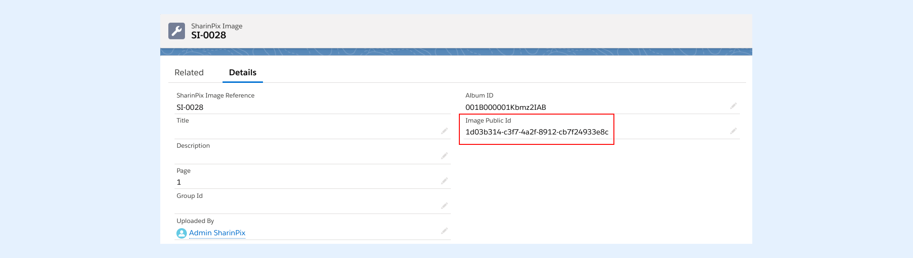
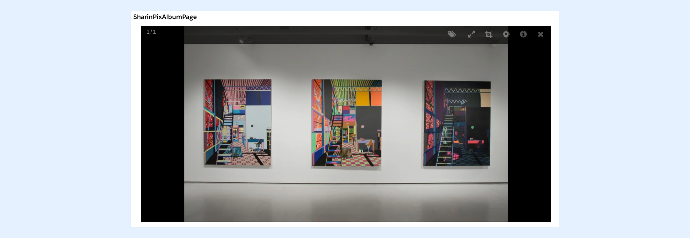

---
layout:
  width: default
  title:
    visible: true
  description:
    visible: true
  tableOfContents:
    visible: true
  outline:
    visible: true
  pagination:
    visible: true
  metadata:
    visible: false
  tags:
    visible: true
---

# How to display one image or a group of images using the SharinPix Album component? (Developer-Orient

This article demonstrates how to:

* [Display a specific image on a SharinPix Album](how-to-display-one-image-or-a-group-of-images-using-the-sharinpix-album-component-developer-oriented.md#display-a-specific-image-on-a-sharinpix-album)
* [Display a group of specified images on a SharinPix Album](how-to-display-one-image-or-a-group-of-images-using-the-sharinpix-album-component-developer-oriented.md#display-a-group-of-specified-images-on-a-sharinpix-album)

The SharinPix abilities includes the parameter, **filter\_group** , that takes as value the **Public IDs** of the images to be displayed.

Below is a code snippet demonstrating how this parameter is added to the SharinPix abilities:

```
{
	abilities:
    	{
        	'<<public id of album>>':{
            	Access:{
                	image_list:true
                }
			}
        },
    filter_group: '<<Public ID of image>>' // Filter one image
	filter_group: [<<Public ID of image>>, <<Public ID of image>>, <<Public ID of image>>] //Filter multiple images
    Id: '<<public id of album>>'
}
```


**Note:**

* For the **filter\_group** parameter to work, it should be added at the **root**.
* Only a maximum of **25 images** will be displayed. If there are more than 25 public IDs in the list then only the first 25 images will be displayed.

However, using another method, you can directly open an image in full size upon loading of the SharinPix album. For more information about how to implement this, please refer to the article [Open a specific image in Full View](../cookbook/open-a-specific-image-in-full-view.md).



**Tip:**

For more information about SharinPix abilities, refer to the article [SharinPix abilities](sharinpix-abilities.md).


Therefore, to display one or more images on a SharinPix Album, we will proceed as follows:

1. Retrieve the required public image ID(s)
2. Implement an Apex class consisting of the SharinPix Album's parameters (including the **filter\_group** parameter)
3. Implement a Visualforce page that will display the album

## Retrieve the required Image Public ID(s)

To display an image or a group of images in a SharinPix Album, you first need to retrieve the image ID(s). There are two ways of retrieving an image ID:

1. [By using the SharinPix Image Sync](how-to-display-one-image-or-a-group-of-images-using-the-sharinpix-album-component-developer-oriented.md#using-sharinpix-image-sync-to-retrieve-an-image-id)
2. [By using the SharinPix Admin Dashboard](how-to-display-one-image-or-a-group-of-images-using-the-sharinpix-album-component-developer-oriented.md#using-the-sharinpix-admin-dashboard-to-retrieve-an-image-id)

### Using SharinPix Image Sync to retrieve an image ID

Image Sync is a SharinPix functionality allowing users to extract useful data from an image when it is uploaded to a record's SharinPix Album.

Using Image sync, a **SharinPix Image** record is created whenever an image is uploaded to an album. The SharinPix Image record stores image details such as ID, format or dimensions. Therefore, to retrieve the ID of an image using image sync, simply open its corresponding SharinPix Image entry, and copy the **Image Public ID** from there.&#x20;




**Tip:**<br>

For more information about the SharinPix Image Sync and its setup, refer to the following articles:

* [What are the uses of Image Sync?](../image-sync/what-are-the-uses-of-image-sync.md)
* [Setup SharinPix Image Sync](../image-sync/setup-sharinpix-image-sync.md)


### Using the SharinPix Admin Dashboard to retrieve an Image ID

To retrieve an Image ID via the SharinPix Admin Dashboard, follow the steps below:

* Using the App Launcher, search and open **SharinPix Settings**
* Once the SharinPix Settings tab is opened, click on the button **Go to administration dashboard**. This step will direct you to the admin dashboard
* Next, on the admin dashboard, click on the **Albums** option on the top menu bar
* Search and open the album containing the desired image(s)
* Once the album is opened, search for the required image and click on the available link to open it

.png)

* Once the image is opened, you can access its Image Public ID from the URL.

Below is an example of such URL:

<mark style="color:$danger;">`https://app.sharinpix.com/admin/images/2dd58ca9-9893-451b-b64e-0c969fc57248`</mark>

The Public Image ID is found at the end of the URL, that is <mark style="color:$danger;">`2dd58ca9-9893-451b-b64e-0c969fc57248`</mark> in this case.

* You can now copy the image ID

Now that you know how to retrieve image IDs, we can go ahead with the actual implementation.

## Display a specific image on a SharinPix Album

To display a specific image on a SharinPix Album follow the steps below:

* Retrieve the **Image Public ID** of the desired image
* Implement an Apex class with the required SharinPix abilities including the **filter\_group** parameter. You can use the code snippet below for this implementation. Here the Image Public ID is **1d03b314-c3f7-4a2f-8912-cb7f24933e8c**. You should replace this value with your Image Public ID

```apex
public class SharinPixAlbumController {
	public String parameters {get; set;}
    public SharinPixAlbumController(ApexPages.StandardController stdCtrl) {
        Id albumId = stdCtrl.getId();
        
        Map<String, Object> params = new Map<String, Object> { 
            'abilities' =>  new Map<String, Object> { 
                albumId =>  new Map<String, Object> { 
                    'Access' =>  new Map<String, Object> { 
                        'see' => true,
                        'image_list' => true,
                        'image_upload' => true,
                        'image_delete' => true
                    }
                }
            },
            'Id' => albumId,
            'filter_group' => '1d03b314-c3f7-4a2f-8912-cb7f24933e8c'
		};
        parameters = JSON.serialize(params);
    }
}
```

* Implement a Visualforce page that will display the SharinPix Album with the chosen image. You can do so by using the code snippet below:

```
<apex:page StandardController="Account" extensions="SharinPixAlbumController">
	<sharinpix:SharinPix parameters="{! parameters }" height="500px" />
</apex:page>
```

You can now test your implementation by adding the Visualforce page on your page record (add to the Account record page if you used the above code snippets).

The results will be as follows:




## Display a group of specified images on a SharinPix Album

This implementation is similar to that used in the previous section. The only difference here is that we will use a list of Image Public IDs instead of a single ID. To do so follow the steps below:

* Retrieve the **Image Public IDs** of the desired images
* Implement an Apex class with the required SharinPix abilities, including the **filter\_group** parameter, using the code snippet below:

```apex
public class SharinPixAlbumController {
	public String parameters {get; set;}
    public SharinPixAlbumController(ApexPages.StandardController stdCtrl) {
        Id albumId = stdCtrl.getId();
        
        Map<String, Object> params = new Map<String, Object> { 
            'abilities' =>  new Map<String, Object> { 
                albumId =>  new Map<String, Object> { 
                    'Access' =>  new Map<String, Object> { 
                        'see' => true,
                        'image_list' => true,
                        'image_upload' => true,
                        'image_delete' => true
                    }
                }
            },
            'Id' => albumId,
            'filter_group' => new List<String>{'1d03b314-c3f7-4a2f-8912-cb7f24933e8c', '0d3d4306-91dc-44d4-8290-53b67926b452'}
		};
        parameters = JSON.serialize(params);
    }
}
```

As you can see here, we used a **list of String** to hold the desired Image Public IDs.

* Next, implement a Visualforce page using the code snippet below:

```
<apex:page StandardController="Account" extensions="SharinPixAlbumController">
	<sharinpix:SharinPix parameters="{! parameters }" height="500px" />
</apex:page>
```

You are all done!

Now, go ahead and add the Visualforce page on the Account record page to test your new implementation.

The results will be as follows:


As you can see in the above example, only the two specified images (that is, images with public IDs added as value to the filter\_group parameter in the above code snippet) are being displayed.
