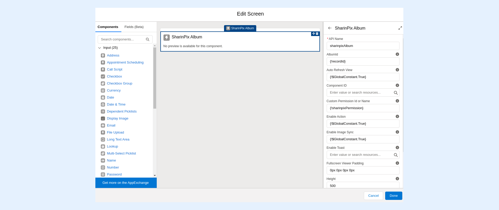
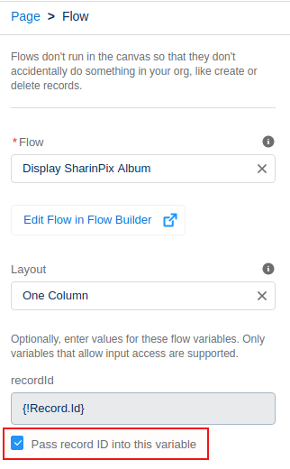

---
layout:
  width: default
  title:
    visible: true
  description:
    visible: true
  tableOfContents:
    visible: true
  outline:
    visible: true
  pagination:
    visible: true
  metadata:
    visible: false
  tags:
    visible: true
---

# How to dynamically assign SharinPix Permission records to albums using Flows? (Admin-Friendly)

Most of the time visibility rules and SharinPix Permission records are used to provide different SharinPix album experience to users while using the same page. But, using Salesforce Flows to handle SharinPix albums can offer a way to dynamically change the album's behaviour based on different contexts such as the current user viewing it.

The following sections demonstrate how to create a Salesforce Flow that will display a SharinPix album, which dynamically changes behaviour based on the current user viewing it.

## Creation of the Salesforce Flow


**Prerequisites:**

* Before implementing the Flow, you should ensure that the users have access to Salesforce Flow. If that's not already the case, you can refer to the following articles to provide the access:
* [https://help.salesforce.com/articleView?id=sf.wcc\_setup\_add\_run\_flows\_perms.htm\&type=5](https://help.salesforce.com/articleView?id=sf.wcc_setup_add_run_flows_perms.htm\&type=5)
* [https://trailhead.salesforce.com/en/content/learn/modules/flow-testing-and-distribution/enable-user-access](https://trailhead.salesforce.com/en/content/learn/modules/flow-testing-and-distribution/enable-user-access)
* For our demonstration, we will use the following SharinPix Permission records:
  * **Account - View Only:** Allows users to view the images uploaded onto the album
  * **Account - All Access:** Provides all album access to the users


This section demonstrates how to build a Salesforce Flow that will dynamically assign the correct SharinPix Permission record to a SharinPix Album based on the current user's profile.

**Note:** _For more information on how to create SharinPix Permission records, click_ [_here_](sharinpix-permission-object-how-to-create-and-assign-custom-permission.md)_._

&#x20;To implement the Flow, follow the steps below:

* Go to **Setup** then type Flow in the Quick Find box. Under Process Automation, select **Flows**
* Click on **New Flow**. You will be directed to the Flow Designer
* Select **Screen Flow**
* Next, from the **Manager** tab, click on **New Resource** and enter the following details:
  * Resource Type: **Variable**
  * API Name: **recordId**
  * Data Type: **Text**
  * Default Value: **{!$GlobalConstant.EmptyString}**
  * Availability Outside the Flow: **Available for input**
* Click on **New Resource** again and enter the following details:
  * Resource Type: **Formula**
  * API Name: **sharinpixPermission**
  * Data Type: **Text**
  * In the **Formula** section, enter the following formula:

<mark style="color:$danger;">`IF( IF( OR( {!$Profile.Name} = 'Standard User', {!$Profile.Name} = 'Minumun Access - Salesforce' ), true, false), 'Account - View Only', 'Account - All Access')`</mark>

The above formula stores the value, **Account - View Only**, in the variable, **sharinpixPermission**, when the current user profile is **Standard User** _or_ **Minumun Access - Salesforce**.

For any other user profile, the value, **Account - All Access,** is stored.

**Note:** _The value stored in **sharinpixPermission** refers to the SharinPix Permission record to be assigned to the SharinPix Album component._

The next step is to setup a **Screen** element that will display a SharinPix Album. To do so:&#x20;

* Go on the **Elements** tab, then drag and drop the **Screen** element onto the blank canvas. Label the Screen **Album**
* Next, drag and drop a **SharinPix Album** component onto the screen canvas
* Disable the **Show Header** and **Show Footer** options

* Enter the following details for the SharinPix Album component:
  * API Name: **sharinpixAlbum**
  * AlbumId: **{!recordId}**
  * Custom Permission Id or Name: **{!sharinpixPermission}**
  * The other SharinPix Album's parameters are optional and can be configured as you prefer

* Click on **Done** to save the changes
* Link the **Screen** element to the **Start** element before saving the Flow

Once the Flow is saved, go ahead and add the same onto the desired record page.

**Note:** _For cases in which the Flow is added to a record page using the Lightning App Builder, ensure that the option Pass record ID into this variable is checked._

<figure><figcaption></figcaption></figure>

## Demo

For this demo, we added the newly-created Flow to the Account record page.

The example below depicts the album when logged as a user having the profile **Standard User** or **Minumun Access - Salesforce**. Here the user can only view the images.

The screenshot below depicts the album when logged as a user having a profile other than **Standard User** or **Minumun Access - Salesforce**. Here you can see that the user can add, delete and even edit the images available in the album.

