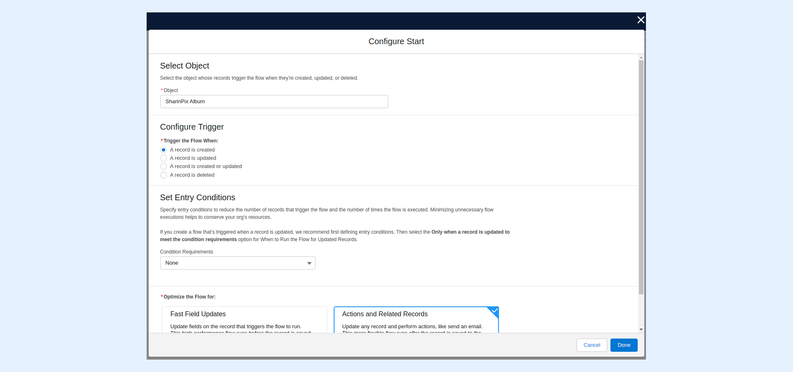
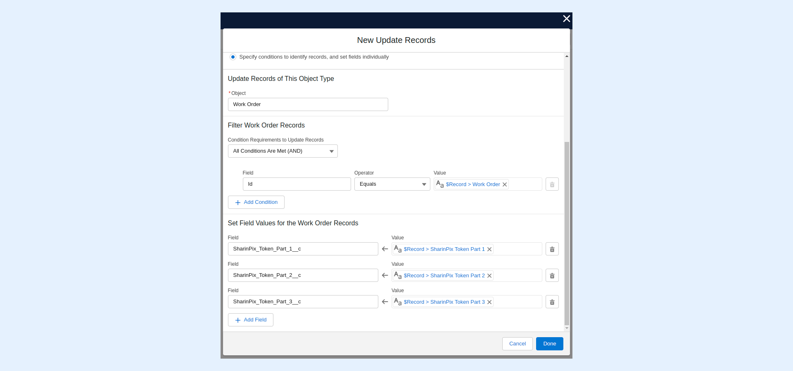
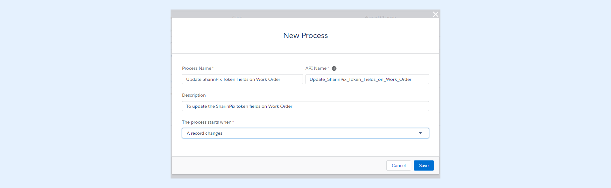

---
layout:
  width: default
  title:
    visible: true
  description:
    visible: true
  tableOfContents:
    visible: true
  outline:
    visible: true
  pagination:
    visible: true
  metadata:
    visible: false
  tags:
    visible: true
---

# How to pull the SharinPix Token onto my object? (Developer-oriented)

The present article will demonstrate how it is possible to:

* [Access the SharinPix Token from the parent Object](how-to-pull-the-sharinpix-token-onto-my-object-developer-oriented.md#access-the-sharinpix-token-from-the-parent-object)
* [Use the token to generate a SharinPix Mobile App URL](how-to-pull-the-sharinpix-token-onto-my-object-developer-oriented.md)


Tip:

For more information on how to automatically generate _SharinPix tokens for image upload_ , refer to the following article:

[SharinPix automatic token generation (Admin Friendly)](../mobile-app/sharinpix-automatic-mobile-upload-token-generation-admin-friendly.md)


## Access the SharinPix Token from the parent object


**Note:**

In the present context, the Work Order object is referred to as the Parent Object.


### Update Parent Object when related SharinPix Album is created

* Create a lookup relationship

In order to pull out a field value from the SharinPix Album object onto a parent object(Account), a **Lookup Relationship** from the SharinPix Album object towards the Parent Object needs to be created.

* Create a Flow that updates the related parent record when a SharinPix album is created.

#### Creating the Flow

* Go to Setup. In the Quick Find Box, type **Flows**.
* Under **Process Automation** , select **Flows**.
* Click on the **New Flow** button.
* Select the option **Record-Triggered Flow** , and click on the **Create** button

.png>)

* After clicking on _Create_ , the _Configure Start_ modal will be displayed. Fill in the modal as indicated below:
  * **Select Object** : SharinPix Album
  * **Configure Trigger** : A record is created
  * Leave the remaining parameters as they are.

* Next, add an **Update Triggering Record** element.

.png>)

.png>)

* On the _Update Triggering Record_ modal, enter the following information:
  * **Label:** Update SharinPix Token Fields
  * **How to Find Records to Update and Set Their Values:** Specify conditions to identify records, and set fields individually
  * **Object:** Work Order
  * In the **Field Account Records** section:
    * **Condition Requirements to Update Record:** All Conditions Are Met (AND)
    * **Field:** Id
    * **Operator:** Equals
    * **Value:** {!$Record.Work\_Order\_\_c}
  * Add the following entries in the **Set Field Values for the Account Records** section:
    1. For the _Field_, select the **SharinPix\_Token\_Part\_1\_\_c** field, for the _Operator_ select **Equals,** and for the _Value_ select **{!$Record.sharinpix\_\_SharinPix\_Token\_Part\_1\_\_c}**
    2. For the _Field_, select the **SharinPix\_Token\_Part\_2\_\_c** field, for the _Operator_ select **Equals,** and for the _Value_ select **{!$Record.sharinpix\_\_SharinPix\_Token\_Part\_2\_\_c}**
    3. For the _Field_, select the **SharinPix\_Token\_Part\_3\_\_c** field, for the _Operator_ select **Equals,** and for the _Value_ select **{!$Record.sharinpix\_\_SharinPix\_Token\_Part\_3\_\_c}**

* Click on **Done** to save and activate the Flow.

#### DEPRECATED: Creating the Process Builder


**Note:**

This section is deprecated and only used for Process Builder maintenance.


* Go to Setup. In the Quick Find Box, type “Process Builder”.
* Under the section Process Automation, select Process Builder.
* Click on the button New.
* Fill in the fields as shown below:

1. In the Process Name, enter the name for your process. (In this context, it is **Update SharinPix Token Fields on Work Order**).
2. The API Name will then generate the API name of the process name.
3. Enter a description of the process. (optional)
4. In **The process starts when** the field, select **A record changes**.
5. Then click Save.

The Process Builder will then open.

* Click on **Add Object**.
* On the right-hand side, under Object, select an object related to the current one, in this context it is Work Order.
* Start the Process: **Only when a record is created**.

.png>)

* Click Save.

Select **Add Criteria**.

When the right-hand-side appears:

* In the field Criteria Name, enter the name for the Criteria.
* Under Criteria Executing Actions, select **No criteria-just execute the actions!**

<figure><figcaption></figcaption></figure>

Click on **Add Action**.

When the right-hand-side appears:

* In the Action Type field, select **Update Records**.
* Give a name to the action inside the Action Name field. In this case, it is **Update SharinPix Token Fields**.
* &#x20;Inside the Record Type field:
  1. For Select a Record to Update, choose **Select a record related to the sharinpix\_\_SharinPixAlbum\_\_c**.
  2. Inside Type to filter list, choose **Work Order.**
* &#x20;For Criteria for Updating Records, choose **No criteria—just update the records!**&#x20;
* Inside Set new field values for the records you update :
  1. Select **SharinPix Token Part 1** with Type **Field Reference** and Value which references the field **SharinPix Token Part 1** of the related Object with is SharinPix Album in our context. (In this case, it is sharinpix\_\_SharinPixAlbum\_\_c .sharinpix\_\_SharinPix\_Token\_Part\_1\_\_c).
  2. Select **SharinPix Token Part 2** with Type **Field Reference** and Value which references the field **SharinPix Token Part 2** of the related Object with is SharinPix Album in our context. (In this case, it is sharinpix\_\_SharinPixAlbum\_\_c .sharinpix\_\_SharinPix\_Token\_Part\_2\_\_c).
  3. Select **SharinPix Token Part 3** with Type **Field Reference** and Value which references the field **SharinPix Token Part 3** of the related Object with is SharinPix Album in our context. (In this case, it is sharinpix\_\_SharinPixAlbum\_\_c .sharinpix\_\_SharinPix\_Token\_Part\_3\_\_c).
* Click Save.

.png>)

**Save.** Then, in the upper right corner, **Activate.**

You can now access the SharinPix Token on the Work Order object.
