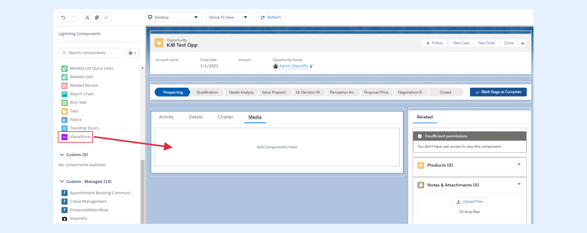
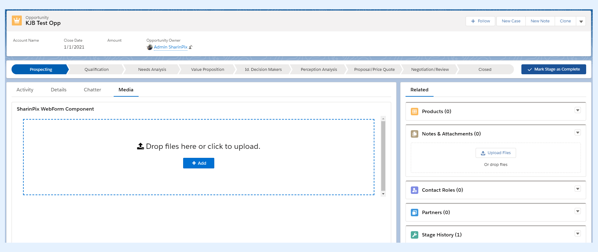

---
layout:
  width: default
  title:
    visible: true
  description:
    visible: true
  tableOfContents:
    visible: true
  outline:
    visible: true
  pagination:
    visible: true
  metadata:
    visible: false
  tags:
    visible: true
---

# Integration in a WebForm (Admin Friendly)

## Case Study: WeSurvey

WeSurvey is a company which provides surveys on behalf of their clients using the Salesforce CRM. Mary, a Salesforce admin working for WeSurvey, was recently assigned to a project which aims at collecting information about color blindness. One exercise that was required for the project was to ask people to upload images having colors that matched a specific color description. This exercise included two more requirements:

* Only files having the extension .jpg, .psd, .ai or .png should be uploaded.
* At least two files should be uploaded.

Even though the description was simple, Mary received hundreds of faulty records from the respondents. Many of them uploaded images having inaccurate extension or number of images. Because of that, she now has to personally contact the respondents and ask them to re-upload the files hoping that they clearly understand the requirements this time.

### SharinPix WebForm to the rescue!

A friend of Mary recommended her to use the **SharinPix WebForm** to solve her problem. She was told that this component can be used to restrict respondents from submitting files that do not conform to the requirements. With this in mind, she decided to give it a try and actually solved her problem.

## Integration of SharinPix with WebForm.


**Assumption:**

For this section, a Visualforce Page containing the WebForm (**SharinPixWebFormComponent** in this case) should be created.

For more information about how to create the Visualforce Page, refer to the following article : [Integration in a WebForm (Developer-oriented)](integration-in-a-webform-developer-oriented.md)


To use the SharinPix WebForm, Mary added a Visualforce Page to the record page of an Opportunity.

The steps below show how she proceeded:

* Go to the record page of any Opportunity.
* Click on  then on **Edit Page**.
* In Lightning App Builder, drag the **Visualforce** component onto the page.

* For the added Visualforce component:
  1. For the field **Label** enter **SharinPix WebForm Component**.
  2. For the field **Visualforce Page Name** , select **SharinPixWebFormComponent.**
  3. For the field **Height** , enter 500.
* Click **Save**  then **Back.**

You can now access the WebForm Component form the record page.


**Note** : In this context, the constraints applied to the album are:

* The file extension can only be of type .jpg or .png
* At least two files should be uploaded.


To upload files via the WebForm :

* Click on **Add** to upload the images.
* Upload at least two images having the correct extension (that is, either .jpg or .png in this case).
* Click on **Submit Album**.

.png>)

The files are now available in the album of the current record.

Let's suppose you upload a file having the wrong extension and attempt to submit it. The following will be displayed.

