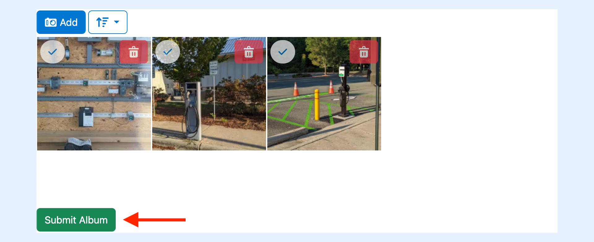

---
layout:
  width: default
  title:
    visible: true
  description:
    visible: true
  tableOfContents:
    visible: true
  outline:
    visible: true
  pagination:
    visible: true
  metadata:
    visible: false
  tags:
    visible: true
---

# Integration in a WebForm (Developer-oriented)

The **SharinPix WebForm** component is useful in situations where external users need to upload files as it ensures monitoring over what is being uploaded. This can be done by providing album constraints written in a JSON format. These constraints are added to the token.

The concept used by SharinPix WebForm is as follows:

* A URL is made available to the external user which gives them access to a temporary album. This temporary album provides a platform to enable the validation of the images being uploaded.

<figure><figcaption></figcaption></figure>

The above example shows the URL format. **AlbumId** refers to the Id of the album and **TokenGenerated** refers to the generated token containing the restrictions.

* If the uploaded files do not match the constraints, appropriate error messages will be displayed. For example, if a file with an incorrect extension is uploaded to the album and submission is attempted, an error message will pop-up, stating that the extension is incorrect.


* If the uploaded files are valid, the user can submit them by clicking on the **Submit** button.



* The files are then submitted to the album found on the corresponding record. This album will be referred to as the **target album** throughout this article.

## Implementation of a Visualforce Page containing a WebForm.

To use the SharinPix WebForm, create a Visualforce Page containing the **WebForm** component as demonstrated in the code snippet below:

```apex
<apex:page>
<sharinpix:WebForm constraints="{ 'min_files': 2, 'file_extensions': ['jpg', 'png'] }" 
        targetAlbumId="{! CASESAFEID($currentPage.parameters.Id) }"
        permissionId="a051I00000LwoJxQAJ"
        submitButtonLabel="Submit Album"
        height="350px"/>
</apex:page>
```

The **WebForm** component is included in the SharinPix package and consists of the following attributes:

* **constraints**: This attribute refers to the restrictions applied to the album.  The constraints should be written in a JSON format. In this example, the restrictions are:
  1. &#x20;**min\_files** : The minimum number of files that need to be uploaded.
  2. **file\_extensions** : The file extensions allowed.
* **targetAlbumId :** This attribute refers to the ID of the targeted album. Here, the target album ID refers to the current record ID.
* **permissionId** : The ID of the [SharinPix Permission](sharinpix-permission-object-how-to-create-and-assign-custom-permission.md) which defines the WebForm album abilities.
* **submitButtonLabel**: This attribute is used to set the label of the submit button.
* **height**: To set the height of the component.&#x20;


**Tip:**

The SharinPix WebForm component triggers an event named, **album-validated** , upon successful submission of images. This event can be captured and used to perform several actions such as the display of successful messages or to refresh the component.

The code snippet below, demonstrates how the **album-validated** event can be used to refresh the WebForm component upon successful image submission:


```
<apex:page >
    <apex:form >
        <apex:outputPanel id="panelID">
            <sharinpix:WebForm constraints="{ 'min_files': 2, 'file_extensions': ['jpg', 'png'] }" 
                       targetAlbumId="{! CASESAFEID($currentPage.parameters.Id) }"
                       permissionId="a051I00000LwoJxQAJ"
                       submitButtonLabel="Submit Album"
                       height="350px"/>
        </apex:outputPanel>    
        <apex:actionFunction name="rerenderPanel" rerender="panelID" />

        <script>
            var eventMethod = window.addEventListener ? "addEventListener" : "attachEvent";
            var eventer = window[eventMethod];
            var messageEvent = eventMethod == "attachEvent" ? "onmessage" : "message";
            eventer(messageEvent, function (e) {
                if (e.origin !== "https://app.sharinpix.com") return;

                if (e.data.name == "album-validated") {
                    rerenderPanel();
                }
            }, false);
        </script>
    </apex:form>
</apex:page>
```

**Note:** In the following section, we will be using the **Opportunity** object.

Once the Visualforce page is ready, you can add the same to the desired record page. To do so:

* Go to the desired record page.
* Click on  then on **Edit Page**.
* In Lightning App Builder, drag the **Visualforce** component onto the page.


* Choose the appropriate Visualforce Page component.
* Click **Save** then **Back.**

You can now access the WebForm Component on the record page.


