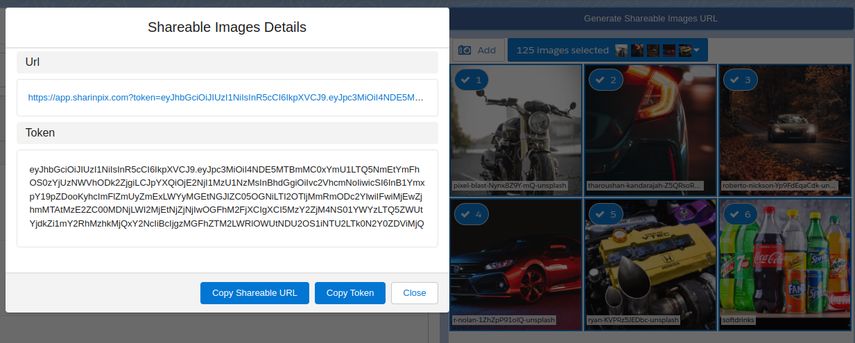

---
layout:
  width: default
  title:
    visible: true
  description:
    visible: true
  tableOfContents:
    visible: true
  outline:
    visible: true
  pagination:
    visible: true
  metadata:
    visible: false
  tags:
    visible: true
---

# Online token generation methods

SharinPix online tokens are used to display SharinPix components **online** within your organization or on the SharinPix mobile app, while connected to the internet.

Such tokens are commonly used:

* In your Salesforce organization to display a SharinPix image or components such as the SharinPix album or search.
* In the SharinPix mobile app to display a SharinPix image, album, or search.

Online tokens can be generated:

1. [Using the SharinPix Share Selection Lightning component.](../lightning-web-component/sharinpix-share-selection.md) (Admin-Friendly)
2. [Using custom Apex methods. (Developer-Oriented)](online-token-generation-methods.md#id-2.-using-custom-apex-methods)
3. [Using Apex Triggers. (Developer-Oriented)](online-token-generation-methods.md#id-3.-using-apex-triggers)

This article outlines the methods to generate online tokens.


**Tips:**

* **For more information on SharinPix tokens, refer to this article:** [Working with SharinPix Tokens](../best-practices/working-with-sharinpix-tokens.md)
* The [SharinPix Permission object](sharinpix-permission-object-how-to-create-and-assign-custom-permission.md) is an easy and maintainable alternative to token generation by code. It is preferred to use SharinPix Permission records for SharinPix Lightning components that enable the use of custom SharinPix permission.
* The [Code Generator](../cookbook/sharinpix-code-generator.md) provides an interface allowing users to manually add, remove or modify SharinPix Album abilities and features before generating the corresponding code. It is a handy tool to test and construct corresponding token values in Apex classes and Visualforce pages.


## 1. Using the SharinPix Share Selection Lightning component.

The SharinPix Share Selection component is a button allowing users to generate an online **search** token of images pre-selected on another SharinPix component such as the SharinPix Album, SharinPix Search and SharinPIx Related Search.

<figure><figcaption></figcaption></figure>

For more information on how to configure and use the SharinPix Share Selection component, refer to this article: [SharinPix Share Selection](../lightning-web-component/sharinpix-share-selection.md)

## 2. Using custom Apex methods

You can create your own Apex method to generate SharinPix online tokens.

The code snippet below demonstrates how to generate a SharinPix online token in an Apex method:

```apex
public String generateToken(Id recordID) {
  sharinpix.Client clientInstance = sharinpix.Client.getInstance();
  String token = clientInstance.token(
      new Map<String, Object> {
          'Id' => recordID,
          'path' => '/pagelayout/' + recordID,
          'abilities' => new Map<String, Object> {
              recordID => new Map<String, Object> {
                  'Access' => new Map<String, Boolean> {
                      'see' => true,
                      'image_list' => true,
                      'image_upload' => true
                  }
              }
          }
      }
  );
  return token;
}
```

## 3. Using Apex Triggers

You can implement an automatic online token generation using an Apex Trigger and store the generated token in a Salesforce field.

Below is an example code to generate a token to view the images on a work order.

```apex
sharinpix.Client clientInstance = sharinpix.Client.getInstance();
String token;
for (WorkOrder wOrder : Trigger.new) {
     if (String.isBlank(wOrder.SharinPix_Token__c)) {
         token = sharinpix.Client.getInstance().token(
             new Map<String, Object> {
                 'Id' => wOrder.Id,
                 'exp' => 0, //the value 0 means non expiring token
                 'path' => '/pagelayout/' + wOrder.Id,
                 'abilities' => new Map<String, Object> {
                     wOrder.Id => new Map<String, Object> {
                         'Access' => new Map<String, Boolean> {
                             'see' => true,
                             'image_list' => true,
                             'image_upload' => true
                         }
                     }
                 }
             }
         );
	}
}
//Save token value in Salesforce field
```

For more information on how to implement such Apex Trigger, refer to the following article: [SharinPix automatic token generation (Developer-oriented)](sharinpix-automatic-token-generation-developer-oriented.md)
