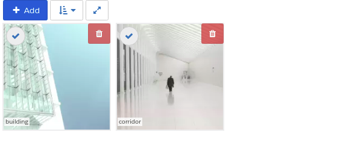
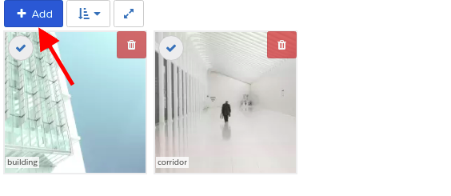
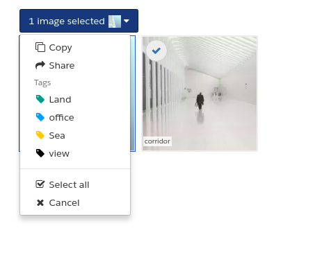
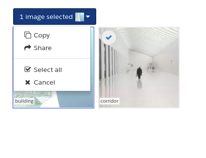
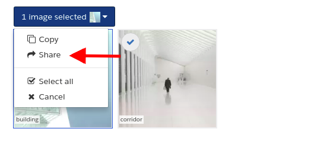
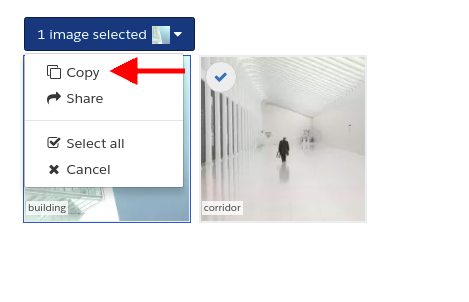
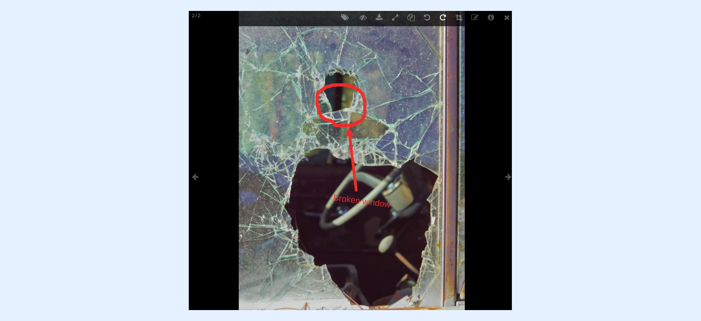
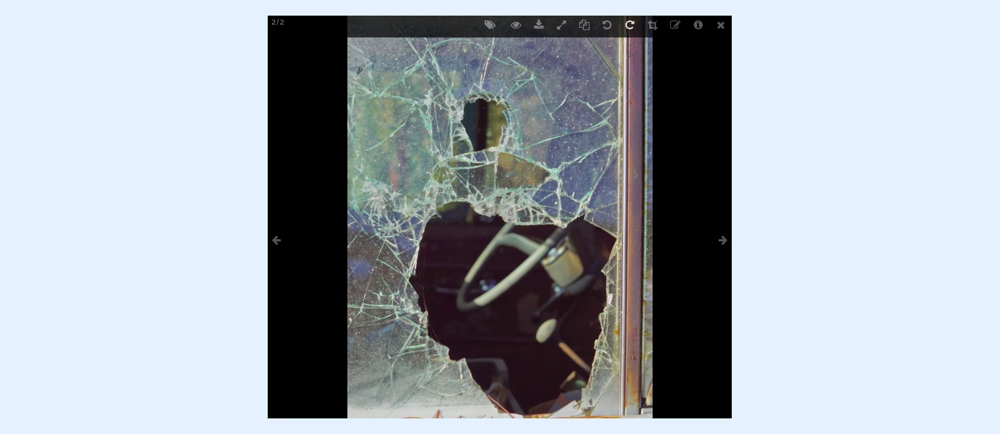
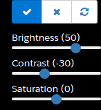
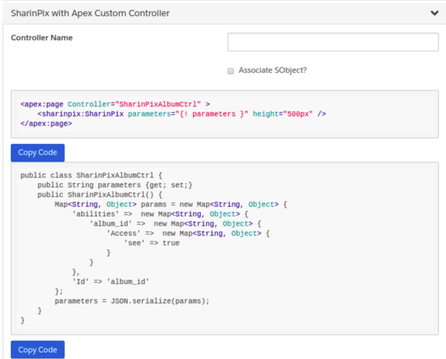

---
layout:
  width: default
  title:
    visible: true
  description:
    visible: true
  tableOfContents:
    visible: true
  outline:
    visible: true
  pagination:
    visible: true
  metadata:
    visible: false
  tags:
    visible: true
---

# SharinPix Abilities

This article covers the following.

* [What are SharinPix Image Abilities ?](sharinpix-abilities.md#what-are-sharinpix-image-abilities)
* [Where are SharinPix Abilities used ?](sharinpix-abilities.md#where-are-sharinpix-abilities-used)
* [Generate SharinPix abilities automatically](sharinpix-abilities.md#generate-sharinpix-abilities-automatically)

## What are SharinPix Image Abilities ?

SharinPix abilities are designations that can expand or restrict the features enabled on the SharinPix Album.

## Where are SharinPix Abilities used ?

* On the SharinPix Visualforce Component: [Using on Classic with a Visualforce Page WITHOUT an Apex Controller (Admin Friendly version)](../features/main-integration/using-on-classic-with-a-visualforce-page-without-an-apex-controller-admin-friendly-version.md)
* On the SharinPix Canvas App: [Using on Classic with SharinPix Canvas App](../features/main-integration/using-on-classic-with-sharinpix-canvas-app.md)
* On the SharinPix Album within a web form: [Using on a Web Form](../features/main-integration/using-on-a-web-form.md)
* As a way to launch the SharinPix Offline Mobile App from Salesforce FSL mobile application: [Using on Field Service Lightning App](../features/main-integration/using-on-salesforce-field-service-app-field-service-lightning.md)

Find below a list of abilities and the features they enable.

## 1. see

The see ability allows the images on a SharinPix Album to be accessible and visible.

The screenshot below shows what happens when **see** is enabled on the SharinPix Album.

<figure><figcaption></figcaption></figure>

## 2. image\_list

The **image\_list** ability allows the SharinPix Album to display images for all users.

The screenshot below shows what happens when the **image\_list** ability is enabled.

<figure><figcaption></figcaption></figure>

## 3. image\_upload

The **image\_upload** ability allows images to be added to the SharinPix Album.

The result on the SharinPix Album when **image\_upload** is enabled.


<figure><figcaption></figcaption></figure>

## 4. image\_tag

The **image\_tag** ability allows images to be tagged with different labels.

The result on the SharinPix Album when the **image\_tag** ability is enabled.

<figure><figcaption></figcaption></figure>

The result on the SharinPix Album when the **image\_tag** ability is disabled.

<figure><figcaption></figcaption></figure>

## 5. Share

<figure><figcaption></figcaption></figure>

The **Share** ability allows the creation of a link that makes it possible for selected images to be shared publicly. For more information on how to use the Share feature, click [here](../features/menu-commands/share-link.md).

## 6. image\_copy

The **image\_copy** ability allows the user to select one or more images and copy them from one SharinPix Album and paste them onto another SharinPix Album.

<figure><figcaption></figcaption></figure>

## 7. image\_duplicate

The ability **image\_duplicate** makes an exact copy of a selected image.


## 8. image\_annotate

The ability **image\_annotate** allows the user to attach an annotation to a given image. The annotation can be a geometric shape, a free-hand sketch, or even a sticker, etc..


## 9. image\_rotate

The **image\_rotate** ability enables the user to rotate the image in a clockwise or anti-clockwise direction.


## 10. image\_crop

The **image\_crop** ability enables the user to crop out any part of a given image.


## 11. image\_download

The **image\_download** ability enables the user to download a given image on his/her own device.

.png>)

## 12. image\_delete

The **image\_delete** ability enables the user to delete an image or multiple images from the SharinPix Album.


## 13. image\_caption

 (1).png>)

The **image\_caption** ability enables the user to add a **Title** and **Description** to an image.

## 14. annotation\_toggle

The **annotation\_toggle** ability enables the user to toggle the visibility of the annotations which are already present on the given image.





## 15. color\_adjustment

The **color\_adjustment** ability enables the user to adjust the brightness, contrast and saturation of the image.

<figure><figcaption></figcaption></figure>


<figure><figcaption></figcaption></figure>

.png>)

## Behavior abilities

Some abilities also permit changing the behavior of the SharinPix Album, such as sorting.

With  <mark style="color:$danger;">`Sort`</mark> you can use these 2 parameters:

* <mark style="color:$danger;">`field`</mark>- corresponds to the date used to sort the images of the search results. It takes two values:
  * <mark style="color:$danger;">`created_at`</mark> - It is the date on which the image has been uploaded to SharinPix.
  * <mark style="color:$danger;">`date_taken`</mark> - It is the date on which the photo has been captured by a device.
* <mark style="color:$danger;">`order`</mark>  - corresponds to the order in which the images appear in the search results. it takes these values:
  * <mark style="color:$danger;">`asc`</mark> - The images appear from the least recent to the most recent(based on the date defined in <mark style="color:$danger;">`field`</mark>)
  * <mark style="color:$danger;">`desc`</mark> - The images appear from the most recent to the least recent(based on the date defined in <mark style="color:$danger;">`field`</mark>)

You can use this as an example in a inline VF Page with this code to force the sort to be ascending and depending on the date on which the photo has been captured by the camera:

```
<SharinPix:SharinPix height="500px" 
                     parameters="{
                        'Id': '{!CASESAFEID($CurrentPage.parameters.Id)}',
                        'abilities':{
                        '{! CASESAFEID($currentPage.parameters.Id) }':{
                        'Access':{'see':true,
                                'image_list':true,
                                'image_upload':true,
                                'image_delete':true,
                                'fullscreen':true,
                                'image_caption':true}},
                        'Sort':{'field':'taken_at',
                                'order':'asc'}
                        }
                    }"
/>
```

### Generate SharinPix abilities automatically <a href="#generate-sharinpix-abilities-automatically" id="generate-sharinpix-abilities-automatically"></a>

&#x20;The **SharinPix Code Generator** offers a quick and easy user interface to select the different SharinPix Abilities and generate the corresponding Code to be used in:

* Canvas App
* Visualforce Component
* Apex Custom Controller
* Lightning Component
* SharinPix Permission


**Alert:**\
\
Where do we find the Standard Album Function? What I have that says this doesn't look like this.


From the **Standard album function** section, select the SharinPix Abilities you want to enable on the SharinPix Album.&#x20;

* **Default:** the default value is automatically assigned for each SharinPix Ability.
* **Yes for All options:** Enable all SharinPix Abilities.
* **No for All options:** Disable all SharinPix Abilities.
* Select **Default**/**Yes**/**No** for each SharinPix Ability to assign its default value or enable/disable it accordingly.

The screenshot below describes the **Standard album function** section:


After selecting the value for each SharinPix ability, the automatically-generated code for each component is shown in the following samples:

### Canvas


### Visualforce Component


### SharinPix with Apex Custom Controller

<figure><figcaption></figcaption></figure>

### Lightning Component


### Date Format

If Empty, no dates are displayed on the thumbnail.

If not empty, the date is displayed (depending on the field used for sorting, the date could be either date taken or date uploaded).

More information about date formats can be found [here](/broken/spaces/VeS2KFLWXcoY15x9kHdt/pages/bPkucKIzfNREoczL4gdX).
