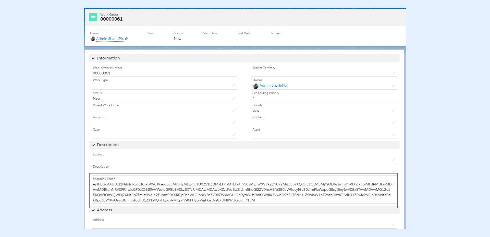

---
layout:
  width: default
  title:
    visible: true
  description:
    visible: true
  tableOfContents:
    visible: true
  outline:
    visible: true
  pagination:
    visible: true
  metadata:
    visible: false
  tags:
    visible: true
---

# SharinPix automatic token generation (Developer-oriented)

## Overview

In this article, you will learn how to use a trigger to automatically generate a token on an object.

### Setting-Up


**Assumption:**

For this demo, we will use the **WorkOrder** object.


Firstly, we need to create a field on the WorkOrder object that will hold the generated token.

For the new field:

1. Data type: **Text Area (Long)**
2. Field Label: **SharinPix Token**

## Creation of the Trigger

In this section, we will create a Trigger on the **WorkOrder** object.&#x20;

Name the Trigger **SharinPixWorkOrderTrigger** and use the code snippet below to create it:

```apex
trigger SharinPixWorkOrderTrigger on WorkOrder (after insert, before update) {
    sharinpix.Client clientInstance = sharinpix.Client.getInstance();
    String token;
    List<WorkOrder> updatedWOrders = new List<WorkOrder>();
    for (WorkOrder wOrder : Trigger.new) {
        if (String.isBlank(wOrder.SharinPix_Token__c)) {
            token = sharinpix.Client.getInstance().token(
                new Map<String, Object> {
                    'Id' => wOrder.Id,
                    'exp' => 0,
                    'path' => '/pagelayout/' + wOrder.Id,
                    'abilities' => new Map<String, Object> {
                        wOrder.Id => new Map<String, Object> {
                            'Access' => new Map<String, Boolean> {
                                'see' => true,
                                'image_list' => true,
                                'image_upload' => true,
                                'image_delete' => true
                            }
                        },
                        'Display' => new Map<String, Object> {
                            'tags'=> true
                        }
                    }
                }
            );
            if (Trigger.isInsert) {
                updatedWOrders.add(new WorkOrder(
                    Id = wOrder.Id,
                    SharinPix_Token__c = token
                ));
            } else {
                wOrder.SharinPix_Token__c = token;
            }
            
        }
    }
    if (Trigger.isInsert) { update updatedWOrders; }
}
```

The Trigger **SharinPixWorkOrderTrigger**:

1. Generate a token
2. Stores the value of the token generated in the field **SharinPix Token**

Below is the Apex Test Class '**SharinPixWorkOrderTriggerTest**' of the above Apex Trigger.

```apex
@isTest
public class SharinPixWorkOrderTriggerTest {

    @isTest
    public static void testWorkOrderTrigger() {
        WorkOrder wOrder = new WorkOrder(Subject='Visiting Green Field');
        Test.startTest();
        insert wOrder;
        Test.stopTest();
        List<WorkOrder> expectedWorkOrder = [
                                                SELECT Id, Subject, SharinPix_Token__c
                                                FROM WorkOrder
                                                WHERE Id = :wOrder.Id
                                                LIMIT 1
                                             ];
        System.assertEquals('Visiting Green Field', expectedWorkOrder[0].Subject);
        System.assert(expectedWorkOrder[0].SharinPix_Token__c.length() > 0);
    }
}
```

### Find the SharinPix Token

A SharinPix Token is now generated whenever a new WorkOrder is created. This token can be found inside the **SharinPix Token** field of the newly-created object.




**Tip:**

The above token can be used to open the SharinPix album within the SharinPix mobile app using the app's online mode feature. For more information on how to make use of the online mode feature, refer to the following article:

[SharinPix Mobile App: Online mode](../mobile-app/sharinpix-mobile-app-online-mode.md)

