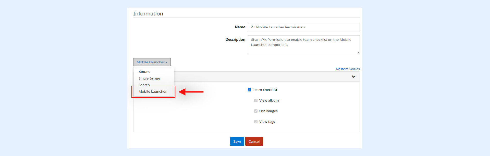

---
layout:
  width: default
  title:
    visible: true
  description:
    visible: true
  tableOfContents:
    visible: true
  outline:
    visible: true
  pagination:
    visible: true
  metadata:
    visible: false
  tags:
    visible: true
---

# SharinPix Permission for SharinPix Mobile Launcher Component

This article presents the list of abilities available in a SharinPix Permission record for the [Mobile Launcher component](../lightning-web-component/sharinpix-mobile-launcher.md).


**Note:**

When creating a SharinPix Permission for the SharinPix Mobile Launcher, ensure that the Mobile Launcher component is selected as depicted below.

For detailed steps on creating and assigning a SharinPix Permission to the SharinPix Mobile Launcher component, please refer to this article: [SharinPix Permission object - How to create and assign custom permission?](sharinpix-permission-object-how-to-create-and-assign-custom-permission.md)


## List of Component Abilities

* **Team checklist:** Enables all required token abilities for the team checklist feature. _**Note:** The **team checklist** feature allows the user to view images already uploaded to the album t&#x68;_&#x65; checklist relates to.
  * **View album:** Provides users access to the album on which photos are being uploaded.
  * **List images:** Allows users to see photos uploaded to the checklist.
  * **View tags:** Allows users to use the available checklist tags to upload photos.


**Tips:**

* For more information about the team checklist feature, refer to this article: [SharinPix Mobile App: Team Checklist](../mobile-app/sharinpix-mobile-app-team-checklist.md)
* For more information on how to enable the team checklist feature on all devices by default, refer to this link: [Configure Team Checklist parameter on the Global Settings](../mobile-app/sharinpix-mobile-app-global-configuration.md)
* For more information on how to configure the team checklist parameter in SharinPix deeplinks, refer to the following link: [Team Checklist parameter](../mobile-app/sharinpix-mobile-app-deeplink-syntax.md#team)
* To programmatically configure the team checklist token abilities, you can either:
  * Pass the related SharinPix Permission record ID to your component (admin-friendly method).
  * Configure the token as demonstrated in the code snippet available [in this article](../mobile-app/sharinpix-mobile-app-team-checklist.md) (developer-oriented method). _**Note:**_ For some custom components, you can directly pass a SharinPix Permission ID to provide the correct Team Checklist token abilities.

