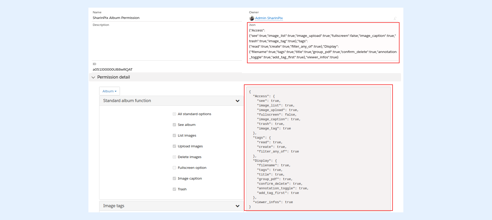

---
layout:
  width: default
  title:
    visible: true
  description:
    visible: true
  tableOfContents:
    visible: true
  outline:
    visible: true
  pagination:
    visible: true
  metadata:
    visible: false
  tags:
    visible: true
---

# SharinPix Permission object - How to create and assign custom permission?

The SharinPix Permission object permits users to configure a set of SharinPix album abilities.

Once created, a SharinPix Permission record can be assigned to:

* SharinPix Album components
* SharinPix Single Image component
* SharinPix Search components
* [SharinPix Mobile Launcher component](sharinpix-permission-for-sharinpix-mobile-launcher-component.md)

In this article, we will demonstrate how to:

* [Create a SharinPix Permission record](sharinpix-permission-object-how-to-create-and-assign-custom-permission.md#creation-of-a-sharinpix-permission-record)
* [Assign a SharinPix Permission record to different SharinPix components](sharinpix-permission-object-how-to-create-and-assign-custom-permission.md#assign-a-sharinpix-permission-record-to-the-sharinpix-component)

## Creation of a SharinPix Permission record


**Information:**

The following sections demonstrate how to create a SharinPix Permission for a [SharinPix Album](../lightning-web-component/sharinpix-album.md) component.


To create a new SharinPix Permission record, follow the steps below:

* From App Launcher, type **SharinPix Permission**
* Then click on the button **New**
* Next, in the **Information** section, enter the **Name** of the permission. You can leave the description blank since it is optional.


* Select the desired component from the dropdown. For demo purposes, we'll leave the selected value as **Album**.

_**Note:**_ This dropdown allows users to select the component for which he/she wants to set up the abilities in the permission record; pick the component



**Tip:**

The SharinPix Album abilities available in the SharinPix Permission record are also available on the **SharinPix Global Settings**.

When no SharinPix Permission is assigned, the abilities set in the SharinPix Global Settings will be applied to all album components by default.

For more information about the SharinPix album's abilities, refer to the following article: [SharinPix abilities](sharinpix-abilities.md)

For more information on how to set the abilities on the SharinPix Global Settings, refer to the following article: [Extended Setup - Customizing your SharinPix Global Settings](../getting-started-with-sharinpix/advanced-setup/advanced-configuration-customizing-your-sharinpix-components-with-sharinpix-permissions.md)


* Next, go ahead and configure the abilities you want to apply to the album by selecting the corresponding checkboxes.

.png>)


Each checkbox has 3 states:

* **Default value:** When a dash is present in the checkbox, as demonstrated in the above image for the checkbox corresponding to the **Delete images** ability, this means that the ability value will reflect the value set in **SharinPix Global Settings** by default. For example, if in this case the **Delete images** ability has been set up to true in the SharinPix Global Settings, it will be enabled on the album as well even if the permission record has been assigned to the same album.<br>
* **False:** When a checkbox is left blank, this will force the ability value to false as demonstrated by the **Fullscreen option** ability's checkbox in the above image.<br>
* **True:** When a checkbox is selected, this will force the ability value to true as demonstrated by the **Tag images** ability's checkbox in the above image.


* Once you have configured the necessary abilities, click on the **Save** button to create the SharinPix Permission record

## Assign a SharinPix Permission record to the SharinPix component

### Assign to a standard SharinPix component

To assign a SharinPix Permission record to a standard SharinPix component such as the SharinPix Album component, follow the steps below:

* Go to the permission record and copy the name (or the ID generated).


In this demo, we will copy the name of the permission record created in the previous section, that is **SharinPix Album Permission**, and assign it to a standard SharinPix Album component. _Note:_ _You can copy the SharinPix Permission ID instead._

* Next, open the **Lightning App Builder** page on any record page containing the SharinPix Album component.
* Then, in the SharinPix Album parameters section, paste the SharinPix Permission name in the **Custom Permission Id or Name** parameter as shown below:

<figure><figcaption></figcaption></figure>


**Note:**

The **Custom Permission Id or Name** parameter is also available on other SharinPix components on which you can assign a custom SharinPix permission.


* Click on **Save** when done

You can now test if the ability changes have been applied to your SharinPix Album component at the record page level.

### Assign to your customized SharinPix component (Developer-Oriented)

A SharinPix Permission record can also be assigned to a customized SharinPix component such as a custom search or a custom SharinPix album. To do so, copy the **permission ID** and assign it to the **permissionId** attribute in your custom code.&#x20;

Here's an example:


```
<sharinpix:SharinPix permissionId="a051I00000UB8wRQAT" height="300px" parameters="{! parameters }"></sharinpix:SharinPix>
```


**Tip:**

A code snippet of the configured abilities is also generated when creating a SharinPix Permission record. This code snippet can be used in your custom implementation, for example in:

* [Token generation](sharinpix-security-token.md)
* [Visualforce implementation](../features/main-integration/using-on-lightning-with-your-own-personalized-visualforce-component-dev-skills.md)
* [Lightning component development](../features/main-integration/using-on-lighting-with-your-own-personalized-lightning-component-dev-skills.md)





**Limitation:**

Using the **Uploader** ability to restrict uploads to the device's camera only is currently not supported on Android devices.

