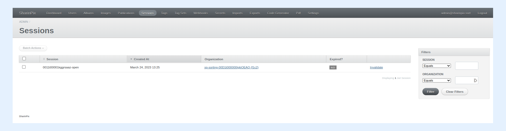
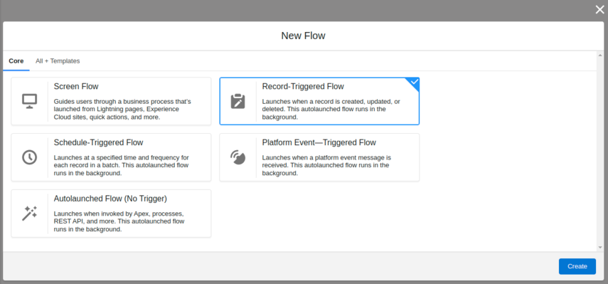
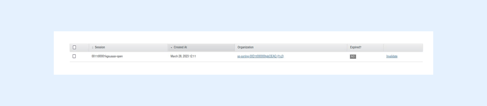

---
layout:
  width: default
  title:
    visible: true
  description:
    visible: true
  tableOfContents:
    visible: true
  outline:
    visible: true
  pagination:
    visible: true
  metadata:
    visible: false
  tags:
    visible: true
---

# Token validation or invalidation using Session ID

## Overview

SharinPix tokens securely transmit information from its SharinPix components to Salesforce. They are commonly used:

* To display specific SharinPix images.
* On SharinPix components such as albums and search components.
* To upload photos using the SharinPix mobile app.

A token expiration date can be set using the **exp** parameter when the token validation period is known. Expired tokens are no more valid and cannot be used to upload photos.

In cases, where the token expiration date is unknown or the token should be invalidated after a specific record action, a session ID can be created to control the token validity.

One example is restricting access to a SharinPix Album component by invalidating its token once an Opportunity record has been closed.


**Tip:**

For more information on SharinPix Tokens, refer to this article:

[Working with SharinPix Tokens](../best-practices/working-with-sharinpix-tokens.md)



**Note:**&#x20;

* Validating/Invalidating tokens can be performed by **admins** only.
* Invalidated tokens can be validated again using the session ID.


## Setting-Up

First, when creating a token, it should include " session\_id: 'album-id-open' ",(Example: **0011t00001kgsuaaar-open**) as shown below.

Adding session id in the token will create a session and then will be used to validate or invalidate that token.

You can refer to the articles below to create a token:

* [SharinPix security token](sharinpix-security-token.md)
* [SharinPix automatic token generation](sharinpix-automatic-token-generation-developer-oriented.md)

## Validating or invalidating a token

There are two different approaches to perform this task:

1. Through the administration dashboard
2. Using a Salesforce Flow

### 1. Update token validity through administration dashboard.

Go to SharinPix Settings --> administration dashboard --> Sessions

Then choose the sessionId you want to validate/invalidate, then click on the hyperlink 'invalidate' or 'validate' as shown below.

### 2. Update token validity through Salesforce Flow.

This section demonstrates how to create a Flow that invokes the Apex class, **UpdateSessionValidity** in order to invalidate a token when an Opportunity record stage is changed to Closed.

To do so, follow the steps below:

* Go to Setup. In the Quick Find Box, type **Flows**.
* Under **Process Automation**, select **Flows**.
* Click on the **New Flow** button.
* Select the option **Record-Triggered Flow**, and click on the **Create** button.

<figure><figcaption></figcaption></figure>

* After clicking on _Create_, the _Configure Start_ modal will be displayed. Fill in the modal as indicated below:
  * **Select Object**: Opportunity
  * **Configure Trigger**: A record is updated
  * For the **Set Entry Conditions** section:
    1. &#x20;Select **All Conditions Are Met (AND)**
    2. For the Field, select **StageName**
    3. Select **Equals** as Operator
    4. Select **'Closed'** for the Value parameter
  * **When to Run the Flow for Updated Records**: Only when a record is updated to meet the condition requirements 
  * **Optimize the Flow for:** Actions and Related Records
* Click on **Done** to save the configurations.

After creating a flow, add an **Action** element.

.png>)

On the _Action_ modal, use the search bar to find the **sharinpix\_\_UpdateSessionValidity** Apex class.

Click on **sharinpix\_\_UpdateSessionValidity**.

On the _Action_ modal for _sharinpix\_\_UpdateSessionValidity_, populate the fields as indicated below:

* **Label:** Enter a label.
* **Description:** Enter a description (optional).
* **Session ID:** Enter the session Id for the token you wish to validate or invalidate.
* **Valid:** It should be either true or false.
  * Note: Parameter true is for validating the session while false is for invalidating the session.

.png>)

* Click **Done** to save the _Action_ configurations.  &#x20;
* Save the Flow and activate it.

## Demo

To test the Flow:

* Go on an Opportunity record, and update the stage to Closed.
* The token was for a SharinPix Album, therefore check if you are not able to access the SharinPix Album.

### Before updating Stage to Closed

The SharinPix Album (before stage is changed to Closed ) is illustrated in the picture below.

The picture below shows the session Id is valid before updating the Opportunity record.

### After updating Stage to Closed

The picture below demonstrates the SharinPix Album after updating the stage to Closed.

The picture shows the session Id has been invalidated when the Opportunity's status changed to Closed.

