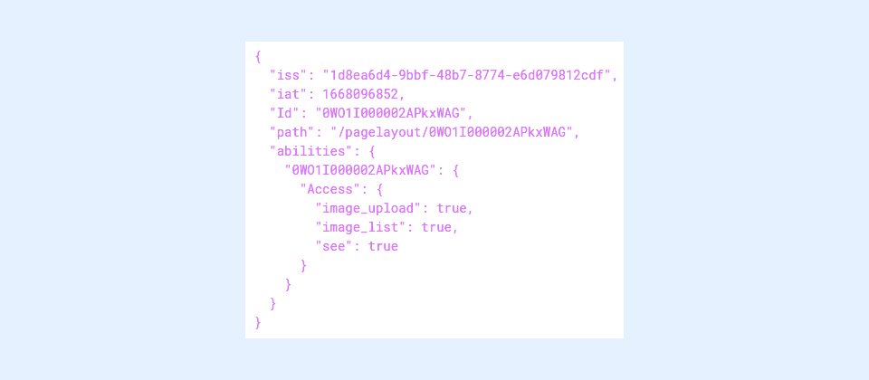

# Working with SharinPix Tokens

SharinPix makes use of [JSON Web Tokens](working-with-sharinpix-tokens.md#json-web-tokens-jwt) to securely transmit information from its components and mobile app to Salesforce.

SharinPix tokens are categorized as follows:

1. [SharinPix Online Tokens](working-with-sharinpix-tokens.md#sharinpix-online-token) - Used to display SharinPix components online in your Salesforce organization or on the SharinPix mobile app.
2. [SharinPix Mobile Upload Tokens](working-with-sharinpix-tokens.md#sharinpix-mobile-upload-token) - Used to upload photos using the SharinPix mobile app.

SharinPix tokens can be generated in different ways depending on the use case.

The following sections further define the two types of SharinPix tokens, provides the common SharinPix token use cases and methods to generate SharinPix tokens.

## JSON Web Tokens (JWT)

SharinPix makes use of JSON Web Token to securely transmit information from its components and mobile app to Salesforce. The transmitted information is authenticated and digitally signed using a secret key referred to as the SharinPix Secret.

JSON Web Tokens:

* Allow secure transmission of information between parties.
* Ensure safer data transmission using encrypted tokens.
* Include the following elements separated by dots (.):
  1. **Header:** Consists of the token type and the algorithm used.
  2. **Payload :** Includes data and user rights.
  3. **Secret:** Used to authenticate the request.

The token consists of the following parameters:

* **Issuer** **:** A key used in the token payload to determine who is the owner and to which organization the album and images belong.
* **Secret** **:** A key used to verify the authenticity of the requests.


**Note:**

* The secret key (i.e., SharinPix Secret) should be generated before the token generation.
* SharinPix Secrets can be generated and retrieved from the [SharinPix Administration Dashboard](../getting-started-with-sharinpix/overview-of-the-sharinpix-administration-dashboard.md) using the **Secret** tab as depicted below.
* Deleting a secret key invalidates all tokens generated with the same. In such cases, the tokens should be regenerated.


.png>)

The example below depicts the encoded and decoded version of a SharinPix token:

.png>)


**Tip:**

* To view the abilities of a SharinPix token, copy and paste the encoded token value on the following JWT website: [jwt.io](https://jwt.io/)
* For more information about JWT, refer to the following JWT article: [Introduction to JSON Web Tokens](https://jwt.io/introduction)


## SharinPix Online Token

SharinPix online tokens are used to display SharinPix components **online** within your organization or on the SharinPix mobile app.

Such tokens are commonly used within your Salesforce organization. It can also be used to bring the same experience in the SharinPix mobile app, _provided that the device is online_.

### Online Token Example

A typical online token consists of the following parameters:

* **iss** : Defines the token issuer, that is, who created and signed the token. This parameter is mandatory as it links the token to the user's organization.
* **iat** : Defines the time at which the token was issued. _Note: The time corresponds to seconds since Unix epoch._
* **Id** : Points to the album ID or record ID on which the photos are made available.
* **path** : The address on which SharinPix should open.
* **abilities** : Contains the permissions/abilities given to manipulate the SharinPix images and data.

The code snippet below shows the parameters of a decoded online token:

```json
{
  "iss": "1d8ea6d4-9bbf-48b7-8774-e6d079812cdf",
  "iat": 1668096852,
  "Id": "0WO1I000002APkxWAG",
  "path": "/pagelayout/0WO1I000002APkxWAG",
  "abilities": {
    "0WO1I000002APkxWAG": {
      "Access": {
        "image_upload": true,
        "image_list": true,
        "see": true
      }
    }
  }
}
```

### Online token generation methods

SharinPix provides the following methods to generate online tokens:

* [Using the SharinPix Share Selection Lightning component.](../lightning-web-component/sharinpix-share-selection.md)
* [Using Apex methods.](../access-and-security/online-token-generation-methods.md)
* [Using Apex Triggers.](../access-and-security/sharinpix-automatic-token-generation-developer-oriented.md)


**Tip:**

* For more information about online token methods and how to select the appropriate method for your use case, refer to the following article: [Online token generation methods](../access-and-security/online-token-generation-methods.md)
* The SharinPx package includes the [SharinPix Permission object](../access-and-security/sharinpix-permission-object-how-to-create-and-assign-custom-permission.md) which is an easy and maintainable alternative to token generation by code. It is preferred to use SharinPix Permission records for SharinPix Lightning components that enable the use of custom SharinPix permission.


## SharinPix Mobile Upload Token

SharinPix mobile upload tokens are used to securely upload photos and PDF forms from the SharinPix mobile app to Salesforce. Such tokens can be used by users to perform the upload without being connected to Salesforce.

### Mobile Upload Token Use Cases

Mobile upload tokens are commonly used to:

* Upload photos using the SharinPix mobile app.
* Edit, manipulate and upload PDF forms using the SharinPix mobile app. Click [here](../features/main-integration/using-sharinpix-deeplink-to-launch-a-pdf-from-salesforce-mobile.md) for more information on how to configure the PDF form feature.
* Enable other SharinPix mobile features such as the **checklist** option which provides a list of tags ready to be filled with pictures. Click [here](../mobile-app/sharinpix-mobile-app-deeplink-syntax.md) for more information on the SharinPix mobile features.

### Mobile Upload Token Example

A typical mobile upload token consists of the following parameters:

* **iss** : Defines the token issuer, that is, who created and signed the token. This parameter is mandatory as it links the token to the user's organization.
* **iat** : Defines the time at which the token was issued. _Note: The time corresponds to seconds since Unix epoch._
* **exp** : Refers to the token expiration time in UNIX timestamp format measured in milliseconds. Note:
  * It is strongly recommended to set sufficient time for the token expiration to allow complete photo upload and synchronization.
  * No exp parameter in the token decoded value means that no expiration has been set up.
  * Expired tokens are no more valid and cannot be used to upload photos.
* **album\_id** : Points to the album ID or record ID on which the photos should be uploaded. _Note: A mobile upload token should **always** have an album\_id parameter._
* **name** : Contains the reference name of the token. This parameter is typically set to the record name or record number.

The code snippet below shows the parameters of a decoded mobile upload token:

```json
{
  "iss": "0000000a-bc00-0a11-b1aa-000xxxxx00xx",
  "iat": 1578555613,
  "exp" : 1528281766,
  "album_id": "0WO1I000000mabcXYZ",
  "name": "WO 5560"
}
```


**Note:**

Deletion of the secret key on the SharinPix admin dashboard will automatically invalidate all tokens generated in the Salesforce organization.


### Mobile upload token generation methods

SharinPix provides the following methods to generate mobile upload tokens:

1. [Using Salesforce Flows.](../mobile-app/sharinpix-automatic-mobile-upload-token-generation-admin-friendly.md)
2. [Using Apex methods.](../cookbook/utils-methods.md)
3. [Using Apex Triggers.](../mobile-app/mobile-token-generation-methods.md)


**Tip:**

For more information about mobile token methods and how to select the appropriate method for your use case, refer to the following article: [Mobile token generation methods](../mobile-app/mobile-token-generation-methods.md)


## How to easily differentiate between online and mobile upload tokens?

SharinPix online and mobile uploads tokens can be easily differentiated by their payload contents.

For instance, mobile upload tokens will include:

* An **album\_id** parameter.
* A **name** parameter.

.png>)

Online tokens, on the other hand, usually have more parameters in the token payload and typically consist of:

* A **path** parameter.
* An **Id** parameter.
* An **abilities** parameter.


