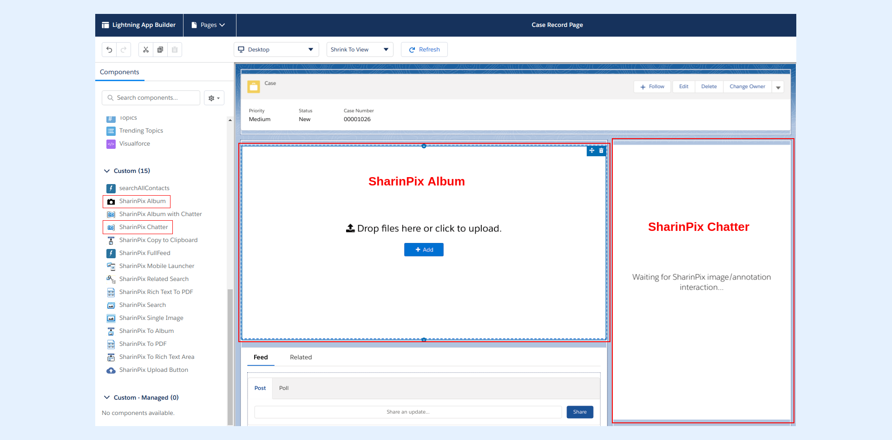

---
layout:
  width: default
  title:
    visible: true
  description:
    visible: true
  tableOfContents:
    visible: true
  outline:
    visible: true
  pagination:
    visible: true
  metadata:
    visible: false
  tags:
    visible: true
---

# Personnalise your Page with SharinPix Chatter Feed

As we saw in the previous section, we can add Chatter on specific images or annotations with the **SharinPix Album with Chatter** component. However, it requires quite a lot of space and it is sometimes convenient to separate the SharinPix Album and the Chatter component.


**Information:**

* The **SharinPix Album with Chatter** component was previously named **SharinPix with Chatter**.
* The **SharinPix Album** component was previously named **SharinPix**.


## Setup

Edit your lightning page by clicking on the "Edit Page" in the settings dropdown.

<figure><figcaption></figcaption></figure>

Once done, add the the **SharinPix Album** component and the **SharinPix Chatter** component on the page wherever it is appropriate for you.

<figure><figcaption></figcaption></figure>

Once done, add the same **Component ID** to the to both components. (The **Component ID** is an arbitrary text, in my case it is **accountPage**).

Once completed, click on the save button on the top right corner.

## Usage

You can now use the chatter in the same way as shown [here](use-the-pre-build-sharinpix-album-with-chatter-feed.md).
