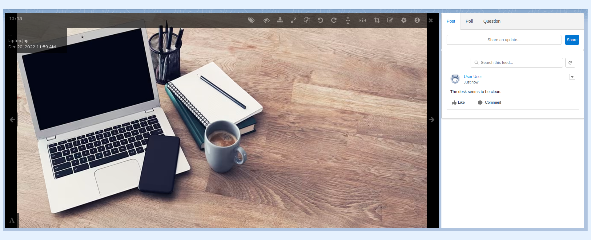
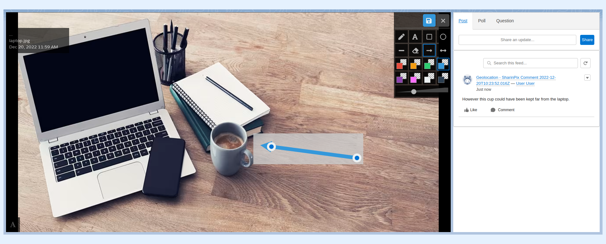

---
layout:
  width: default
  title:
    visible: true
  description:
    visible: true
  tableOfContents:
    visible: true
  outline:
    visible: true
  pagination:
    visible: true
  metadata:
    visible: false
  tags:
    visible: true
---

# SharinPix Chatter Feed for Image and Annotation - how it works? what to expect?

SharinPix allows users to start a chatter discussion on specific images or also specific annotations. This might be very useful in many use cases.

## Examples of chatter being used

Here is an example of chatter being used on an image

Here is an example of chatter being used on an annotation

