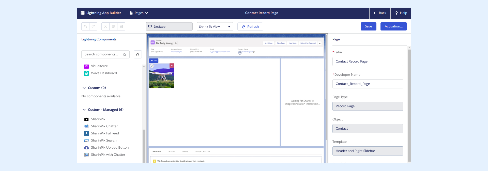
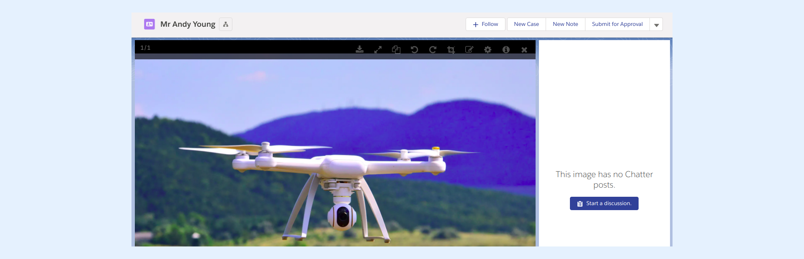
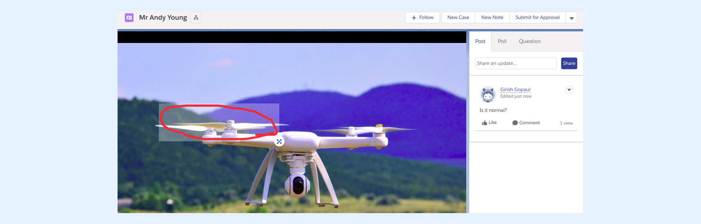

---
layout:
  width: default
  title:
    visible: true
  description:
    visible: true
  tableOfContents:
    visible: true
  outline:
    visible: true
  pagination:
    visible: true
  metadata:
    visible: false
  tags:
    visible: true
---

# Use the pre-build SharinPix Album with Chatter Feed

SharinPix allows you to use chatter on specific images with the built-in component, **SharinPix Album with Chatter**.


**Information:**

The **SharinPix Album with Chatter** component was previously named **SharinPix with Chatter**.


## Setting up SharinPix Album with Chatter

Edit the page in lightning view.

<figure><figcaption></figcaption></figure>

Once done, search for the **SharinPix Album with Chatter** component and drag and drop the it on the preview page. Click save when done.

## Using the Chatter

**On Images**

You can now go back onto your page and start using the Chatter.\
Click on the image you want to start a discussion on, and click on the **Start a discussion** button on the right side of the component.

**On Annotations**

Chatter can also be used on specific Annotations by click on the annotation, then starting a discussion.

