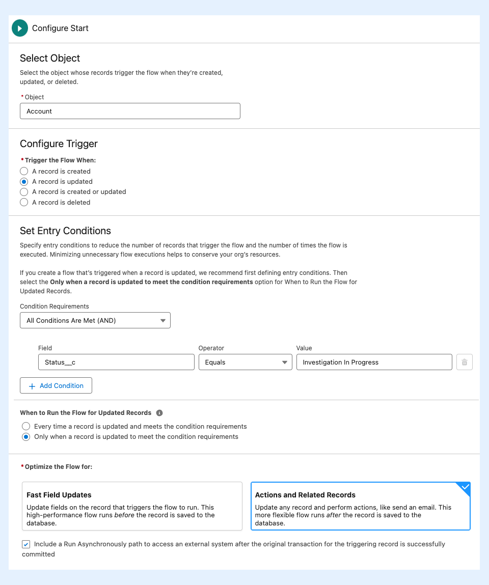
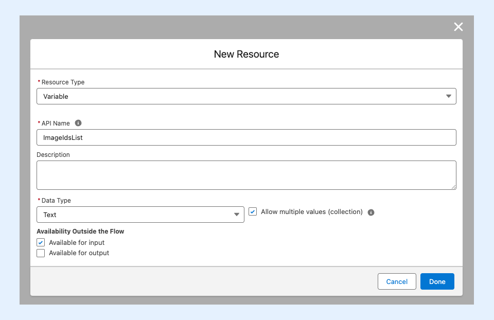
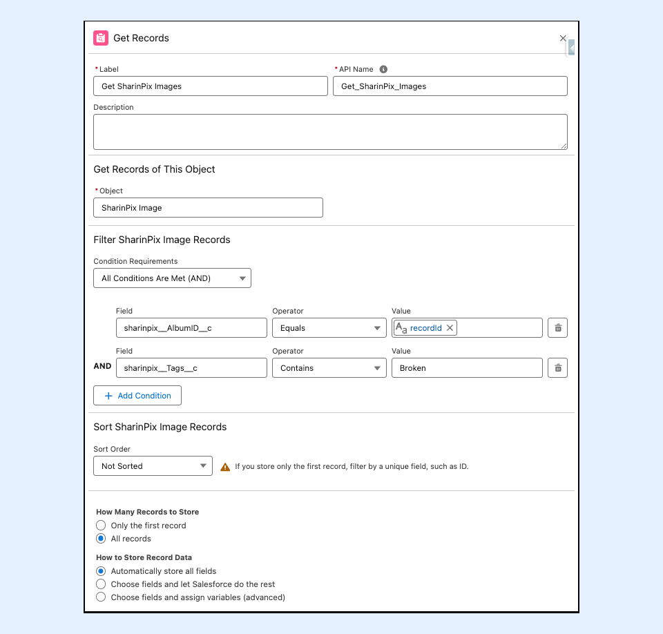
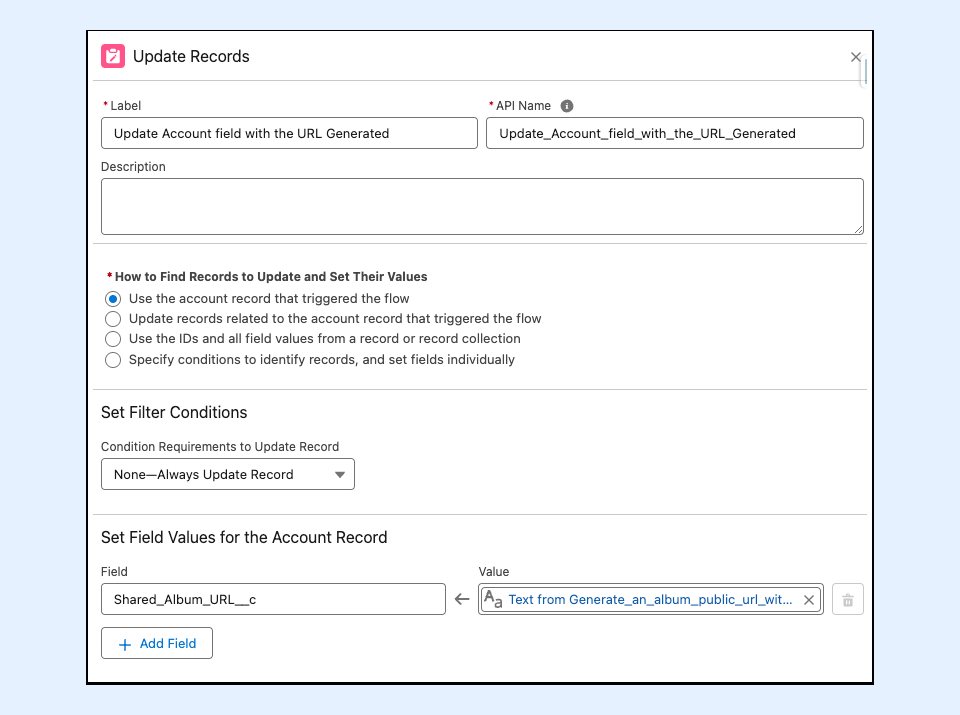
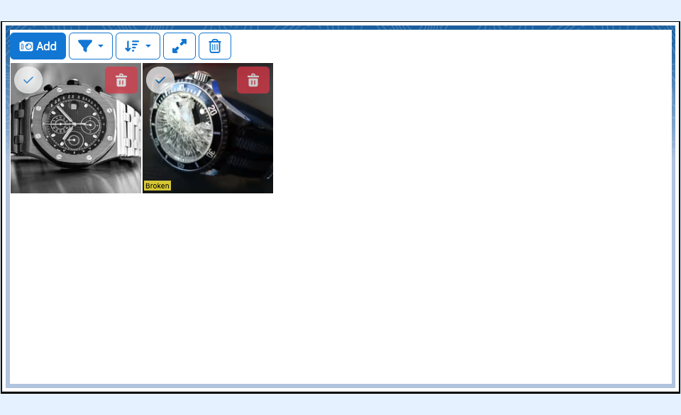
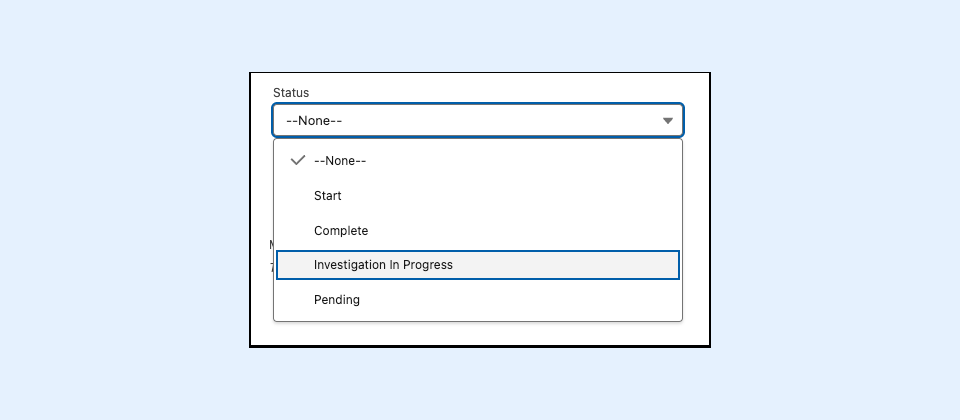
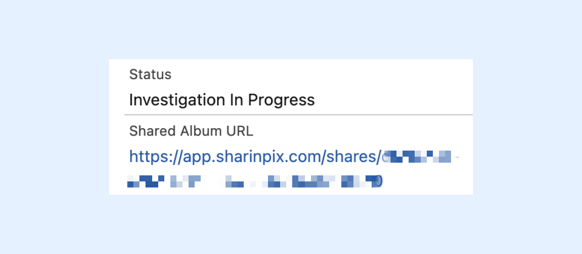
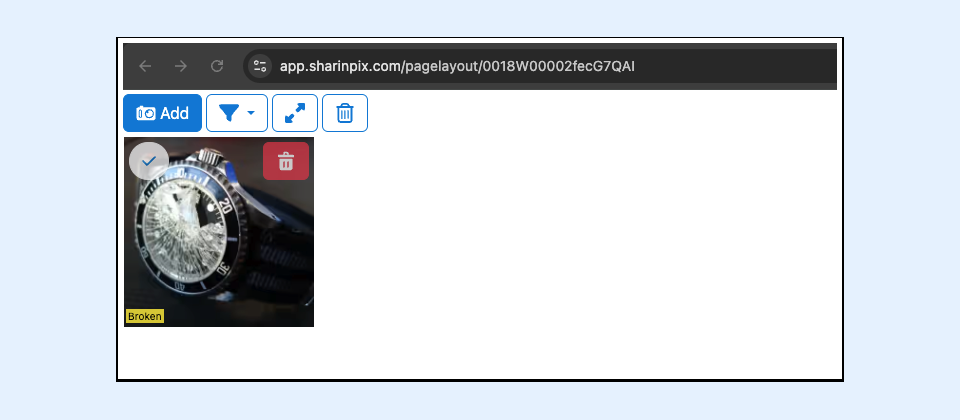

---
layout:
  width: default
  title:
    visible: true
  description:
    visible: true
  tableOfContents:
    visible: true
  outline:
    visible: true
  pagination:
    visible: true
  metadata:
    visible: false
  tags:
    visible: true
---

# Generate SharinPix Shareable Album Links Automatically

This article demonstrates generating and sharing an album's public URL with specific images using a Salesforce Flow. The generated URL is accessible across any platform or device and enables end users to modify the album (upload, delete, add tags, etc.) depending on the SharinPix Permission given.

In the following sections, you will learn how to generate an album's public URL with:

* [All images from an album](generate-sharinpix-shareable-album-links-automatically.md#generate-an-albums-public-url-with-all-images-from-an-album)
* [Specific images from an album](generate-sharinpix-shareable-album-links-automatically.md#generate-an-albums-public-url-with-specific-images-from-an-album)


**Tips:**

The album URL can also be generated manually using a Lightning button. For more information on the Lightning component, please refer to this article: [SharinPix Share](../lightning-web-component/sharinpix-share.md)


## Prerequisites

For this feature, you should

* Ensure that the [SharinPix Permission Sets,](../access-and-security/sharinpix-permission-sets.md) named **SharinPix Share Permission** and **SharinPix Lightning Components** , have been assigned to all users intending to use the configurations described in this article to generate SharinPix Shareable album links.
* Ensure that your SharinPix Package version is either v**1.312** or above. If your SharinPix package has an older version, refer to the following article below to update the same: [How to update SharinPix package from the AppExchange?](https://app.gitbook.com/s/i8tH1o5AHthxksYgF6ij/how-to-update-sharinpix-package-from-the-appexchange)

## Getting Started

The Apex class, **ShareAutomation** , is used to generate the album's public URL. It provides several fields that can be used to parametrize the sharing. The table below provides more details for each field:

| **Field Name**                          | 
<strong>Description</strong> 
                                                                                                                                                                 | **Is Field Value Mandatory?** |
| --------------------------------------- | ------------------------------------------------------------------------------------------------------------------------------------------------------------------------------------------------------- | ----------------------------- |
| 
Record ID 
                    | 
The current record ID. 
                                                                                                                                                                       | **Yes**                       |
| 
Custom Permission Id or Name 
 | The custom **Permission Id or Name** created for the abilities on the shared album. If no value is provided for this field, the shared album will be on a view-only mode.                               | No                            |
| 
List of Image Ids 
            | The list of **image public IDs** of images to be included in the Shared album. If no value is provided for this field, all images available on the record's album will be included in the shared album. | No                            |

## Generate an album's public URL with all images from an album

In the following sections, we will use the **Account** object to generate a Shareable URL of an album component with all the images, using the SharinPix Apex class, **ShareAutomation** , in a [Salesforce Flow](generate-sharinpix-shareable-album-links-automatically.md#creation-of-salesforce-flow) (Admin-Oriented). The generated URL will then be inserted in a field on the Account record for this demo.

### Creation of Salesforce Flow

 (1).png>)

This section demonstrates how to create a **Flow** that invokes the Apex class **ShareAutomation** to generate the share.

To do so, follow the steps below:

* Go to Setup. In the Quick Find Box, type **Flow**
* Click on the button **New Flow** located on the top right corner
* Select **Start From Scratch** and then **Record-Triggered Flow** as the Flow type
* Once on the Flow builder, click on the **Edit** link located in the **Start** element, then
  * For the, **Trigger the Flow When** , section, select **A record is updated**
  * Choose **Account** as the object
  * Add a **Condition Requirements** as **All Conditions Are Met (AND)**
    * Next, choose **Status** as the **field** , **Equals** as the **operator,** and **Investigation In Progress** as the **value**
  * For the **When to Run the Flow for Updated Records** section, select **Only when a record is updated to meet the condition requirements.**
  * Enable the checkbox **Include a Run Asynchronously path to access an external system after the original transaction for the triggering record is successfully committed.** _<mark style="color:$danger;">Note: The flow should be run on an asynchronous path as the method does perform callouts.</mark>_

.png>)

* Then, go to the **Manager** tab and click on the **New Resource** button to create a variable as follows:
  * For the variable, select **Variable** as the **Resource Type**
  * Enter **recordId** as the **API Name**
  * Select **Text** as the **Data Type**
  * For the **Availability Outside the Flow** section, select **Available for input**
  * Click **Done** to save

 (1).png>)

Next add an Action element.

* On the _Action_ modal, use the search bar to find the **sharinpix\_\_ShareAutomation** Apex class.
* Click on **sharinpix\_\_ShareAutomation**.
* On the _Action_ modal for _sharinpix\_\_ShareAutomation_ , populate the fields as indicated below:
  * **Label:** Generate an album public url with all images from the album
  * **Description:** Enter a description (optional)
  * **Record ID** : {!recordId}
    * _Note: This is a mandatory field and refers to the current Account ID._
  * **Custom Permission Id or Name**: PermissionName (Create a SharinPix Permission with the permissions/abilities needed for the users using this public album)
    * _<mark style="color:$danger;">Note: This permission will be provided to the public album. If upload, edit or delete permissions are present, the viewers of the shared URL will be able to make changes to your images that will</mark>_ _<mark style="color:$danger;">**reflect on your Salesforce**</mark><mark style="color:$danger;">.</mark>_
  * **List of Image Ids** : _<mark style="color:$danger;">We do not provide any image ids if we want to obtain all images from an album.</mark>_

.png>)

Lastly, Add an **Update Records** element onto the canvas. For this element, enter the following details:

1. Enter **Update Account field with the URL Generated** as the label
2. In the **Set Field Values for the Account Record** section, enter **Shared\_All\_Album\_Images\_URL\_\_c** as the Field, and choose **Text from Generate\_an\_album\_public\_url\_with\_all\_Images**(Example: {!Generate\_an\_album\_public\_url\_with\_Specified\_Images}).

.png>)

## Generate an album's public URL with specific images from an album

In the following sections, we will use the **Account** object to generate a Shareable URL of an album component with images tagged as 'Broken' whenever the status of an Account record is changed to the value 'Investigation In Progress', using the SharinPix Apex class, **ShareAutomation** , in a [Salesforce Flow](generate-sharinpix-shareable-album-links-automatically.md#creation-of-salesforce-flow) (Admin-Oriented). The generated URL will then be inserted in a field on the Account record for this demo.

This public album can be shared using the link generated for the client. For example, for the client to get an idea of what you are investigating, they could see the images with the broken object.

### Creation of the Salesforce Flow

.png>)

This section demonstrates how to create a **Flow** that invokes the Apex class **ShareAutomation** to generate the share.

To do so, follow the steps below:

* Go to Setup. In the Quick Find Box, type **Flow**
* Click on the button **New Flow** located on the top right corner
* Select **Start From Scratch** and then **Record-Triggered Flow** as the Flow type
* Once on the Flow builder, click on the **Edit** link located in the **Start** element, then
  * For the, **Trigger the Flow When** , section, select **A record is updated**
  * Choose **Account** as the object
  * Add a **Condition Requirements** as **All Conditions Are Met (AND)**
    * Next, choose **Status** as the **field** , **Equals** as the **operator,** and **Investigation In Progress** as the **value**
  * For the **When to Run the Flow for Updated Records** section, select **Only when a record is updated to meet the condition requirements.**
  * Enable the checkbox **Include a Run Asynchronously path to access an external system after the original transaction for the triggering record is successfully committed.** _<mark style="color:red;">Note: The flow should be run on an asynchronous path as the method does perform callouts.</mark>_

* Then, go to the **Manager** tab and click on the **New Resource** button to create a variable as follows:
  * For the variable, select **Variable** as the **Resource Type**
  * Enter **recordId** as the **API Name**
  * Select **Text** as the **Data Type**
  * For the **Availability Outside the Flow** section, select **Available for input**
  * Click **Done** to save

<figure><figcaption></figcaption></figure>

* Create **New Resource** button to create a variable as follows:
  * For the variable, select **Variable** as the **Resource Type**
  * Enter **ImageIdsList** as the **API Name**
  * Select **Text** as the **Data Type**
  * **Enable** the checkbox **Allow multiple values (Collection)**
  * For the **Availability Outside the Flow** section, select **Available for input**
  * Click **Done** to save

<figure><figcaption></figcaption></figure>

* Next, add a **Get Record** element onto the canvas. For this element, enter the following details:
  1. Enter **Get SharinPix Images** as the label
  2. In the **Get Records of This Object** section, choose the SharinPix Image object.
  3. In the **Filter SharinPix Image Records** section:
     * Enter **sharinpix\_\_AlbumID\_\_c** as the Field, **Equals** as the operator and for the value, choose the resource created above **recordId.**
     * Enter **sharinpix\_\_Tags\_\_c** as the Field, **Contains** as the operator and for the value, enter the value **Broken**.
  4. For the **How Many Records to Store** section, select **All records**
  5. Click on **Done** to save

<figure><figcaption></figcaption></figure>

* Next, add a **Loop** element onto the canvas. For this element, enter the following details:
  1. Enter **Loop through each SharinPix Image** as the label
  2. In the **Select Collection Variable** section, choose the **Get SharinPix Image** records created earlier.

<figure><figcaption></figcaption></figure>

Next add an **Assignment** element inside the loop element, to assign the each SharinPix Image Ids to the **ImageIdsList** variable, as we will need a list of images Ids as a parameter for the **ShareAutomation** action, to generate the public URL for an album with those images. For this element, enter the following details:

1. Enter **Assign SharinPix Image Public Ids** as the label
2. In the **Select Variable Values** section, enter **ImageIdsList** as the Variable, **Add** as the operator and for the value, choose **Current Item from Loop** and then **Image Public Id** (Example: {!Loop\_through\_each\_SharinPix\_Image.sharinpix\_\_ImagePublicId\_\_c})**.**

<figure><figcaption></figcaption></figure>

Next add an Action element.

* On the _Action_ modal, use the search bar to find the **sharinpix\_\_ShareAutomation** Apex class.
* Click on **sharinpix\_\_ShareAutomation**.
* On the _Action_ modal for _sharinpix\_\_ShareAutomation_, populate the fields as indicated below:
  * **Label:** Generate an album public url with Specified Images
  * **Description:** Enter a description (optional)
  * **Record ID**: {!recordId}
    * _Note: This is a mandatory field and refers to the current Account ID._
  * **Custom Permission Id or Name**: PermissionName (Create a SharinPix Permission with the permissions/abilities needed for the users using this public album)
    * _Note: This permission will be provided to the public album. <mark style="color:$danger;">If upload, edit or delete permissions are present, the viewers of the shared URL will be able to make changes to your images that will</mark>_ _<mark style="color:$danger;">**reflect on your Salesforce**</mark><mark style="color:$danger;">.</mark>_
  * **List of Image Ids**: ImageIdsList (variable being populated with the SharinPix Image Ids)
    * Note: If no value is provided here, all the images on the album will be available on the shared album.

<figure><figcaption></figcaption></figure>

Lastly, Add an **Update Records** element onto the canvas. For this element, enter the following details:

1. Enter **Update Account field with the URL Generated** as the label
2. In the **Set Field Values for the Account Record** section, enter **Shared\_Album\_URL\_\_c** as the Field, and choose **Text from Generate\_an\_album\_public\_url\_with\_Specified\_Images** (Example: {!Generate\_an\_album\_public\_url\_with\_Specified\_Images}).

<figure><figcaption></figcaption></figure>

### Demo 

To test the Flow:

* Go on an Account record and upload some images to its corresponding SharinPix album with one or 2 images with the tag 'Broken'.

<figure><figcaption></figcaption></figure>

* Then, change the Status of the Account to 'Investigation In Progress'.

<figure><figcaption></figcaption></figure>

* On the Account record, the url generated through the flow should be available on the field 'Shared Album URL'.

<figure><figcaption></figcaption></figure>

* Open the URL on a browser as shown below, this URL can be shared to clients via email.

<figure><figcaption></figcaption></figure>
