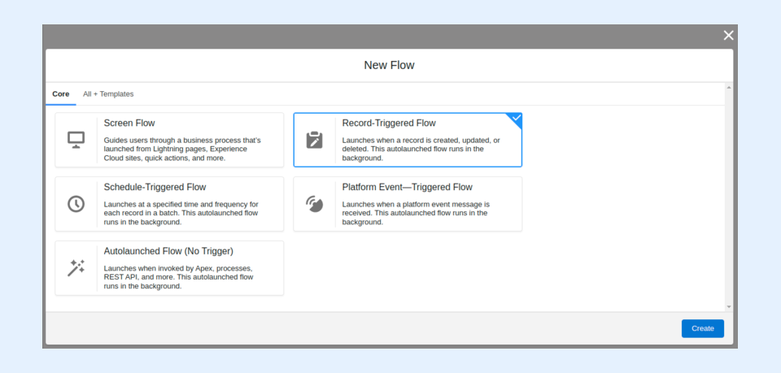

---
layout:
  width: default
  title:
    visible: true
  description:
    visible: true
  tableOfContents:
    visible: true
  outline:
    visible: true
  pagination:
    visible: true
  metadata:
    visible: false
  tags:
    visible: true
---

# Implement a SharinPix Token Decoder in Salesforce (Developer-Oriented)

This article demonstrates how to implement an Apex method to decode SharinPix tokens within Salesforce.

The following sections include:

1. [The Apex method to decode a SharinPix token.](implement-a-sharinpix-token-decoder-in-salesforce-developer-oriented.md#apex-method)
2. [A use case example demonstrating how to call the Apex method in a Salesforce Flow to decode and save the decoded token in a Salesforce field.](implement-a-sharinpix-token-decoder-in-salesforce-developer-oriented.md#example-using-a-salesforce-flow-to-decode-a-token-and-save-it-in-a-field)


**Tip:**

SharinPix tokens can also be decoded easily outside of Salesforce using the [jwt.io](https://jwt.io/) website.


## Apex Method

The code snippet below shows an Apex method used to decode SharinPix tokens.

```apex
public static Map<String, Object> decode(string token){
    string payload = token.split('\\.')[1];
    payload = payload.replace('-', '+');
    payload = payload.replace('_', '/');
    string jsonPayload = EncodingUtil.base64decode(payload).toString();
    Map<String, Object> decodeTokenObject = (Map<String, Object>) JSON.deserializeUntyped(jsonPayload);
    return decodeTokenObject;
}
```

## Example: Using a Salesforce Flow to decode a token and save it in a field

In this section, we will demonstrate how to call the token decoder in a Salesforce Flow to decode an Account's token and save the decoded value in a field.

### Creating the Invocable Class

To call the token decoder method in a Salesforce Flow, you should first create an [Apex invocable class](https://developer.salesforce.com/docs/atlas.en-us.apexcode.meta/apexcode/apex_classes_annotation_InvocableMethod.htm) that will accept the following parameters from the Flow to decode the token:

1. **recordId** : ID of the record for which you want to decode the token.
2. **encodedToken** : The encoded token.
3. **decodedTokenFieldName** : API name of the field storing the decoded token.

The code below is an example of an invocable class used to decode SharinPix tokens.

```apex
public class SharinPixTokenDecoder {
    @InvocableMethod    
    public static void decodeToken(List<Parameters> paramsList) {
        SObject obj;        
        List<SObject> sObjectsToUpdate = new List<SObject>(); 

		for(Parameters params : paramsList) {
            obj = params.recordId.getSObjectType().newSObject(params.recordId);

            String payload = params.encodedToken.split('\\.')[1];
            payload = payload.replace('-', '+');
            payload = payload.replace('_', '/');
            string jsonPayload = EncodingUtil.base64decode(payload).toString();
            Map<String, Object> decodeTokenObject = (Map<String, Object>) JSON.deserializeUntyped(jsonPayload);

            obj.put(params.decodedTokenFieldName, decodeTokenObject.toString());
            sObjectsToUpdate.add(obj);
        }
        update sObjectsToUpdate;
    }       

    public with sharing class Parameters{
        @InvocableVariable(label='Record ID' description='ID of record.' required=true)
        public Id recordId;

        @InvocableVariable(label='Encoded Token' description='The encoded token.' required=true)
        public String encodedToken;
        
        @InvocableVariable(label='Decoded Token Field API Name' description='API name of field storing the decoded token.' required=true)
        public String decodedTokenFieldName;
    }
}
```

The corresponding test class is as follows:

```apex
@isTest
public class SharinPixTokenDecoderTest {
    @isTest static void testDecodedFieldValue() {
        String token;
        Account acc = new Account(Name = 'Test Record Name');
        insert acc;
    
        token = sharinpix.Client.getInstance().token(
            new Map<String, Object> {
                'exp' => 0,
    				'album_id' => acc.Id,
    				'name' => acc.name
    			}
        );
    
        acc.SharinPix_Token__c = token;
        update acc;
    
        List<SharinPixTokenDecoder.Parameters> paramsList = new List<SharinPixTokenDecoder.Parameters>();
        SharinPixTokenDecoder.Parameters param = new SharinPixTokenDecoder.Parameters();
        param.recordId = acc.Id;
        param.encodedToken = acc.SharinPix_Token__c;
        param.decodedTokenFieldName = 'SharinPix_Decoded_Token__c';
        paramsList.add(param);
    
        Test.startTest();
        SharinPixTokenDecoder.decodeToken(paramsList);
        Test.stopTest();
    
        Account myAccount = [SELECT Id, Name, SharinPix_Decoded_Token__c FROM Account WHERE Id =: acc.Id LIMIT 1];
        String decodedToken = myAccount.SharinPix_Decoded_Token__c;
        System.assert(decodedToken.contains(myAccount.Id));
        System.assert(decodedToken.contains(myAccount.Name));
    }
 }
```

### Creating the Salesforce Flow

Once the invocable class is ready, go ahead and create the Salesforce Flow as explained below.

* Go to Setup. In the Quick Find Box, type **Flows**.
* Under **Process Automation** , select **Flows**.
* Click on the **New Flow** button.
* Select the option **Record-Triggered Flow** , and click on the **Create** button.



* After clicking on _Create_, the _Configure Start_ modal will be displayed. Fill in the modal as indicated below:
  * **Select Object**: Account
  * **Configure Trigger**: A record is created or updated
  * For the **Set Entry Conditions**, select **All Conditions Are Met (AND)**&#x61;nd fill in the details as follows:
    1. **Field:** SharinPix\_Token\_\_c _(or your token field API name)_
    2. **Operator:** Is Null
    3. **Value:** False
  * Leave the other fields as is.
* Click on **Done** to save the configuration.

.png>)

* Next, add an **Action** element.

.png>)

.png>)

* On the _Action_ modal, use the search bar to find the **SharinPixTokenDecoder** Apex class, that is, the name of the invocable Apex class.
* On the _Action_ modal for _SharinPixTokenDecoder_, populate the fields as indicated below:
* **Label:** SharinPix Token Decoder
* **Description:** Enter a description (optional)
* **Decoded Token Field API Name:** SharinPix\_Decoded\_Token\_\_c
* **Encoded Token:** {!$Record.SharinPix\_Token\_\_c}
* **Record ID:** {!$Record.Id}

.png>)

* Click **Done** to save the _Action_ configurations.
* Save the Flow and activate it.

#### Demo

To test the Flow:

1. Generate a new token on an Account record.
2. Verify that the decoded field is populated with the decoded value as depicted below.

.png>)
