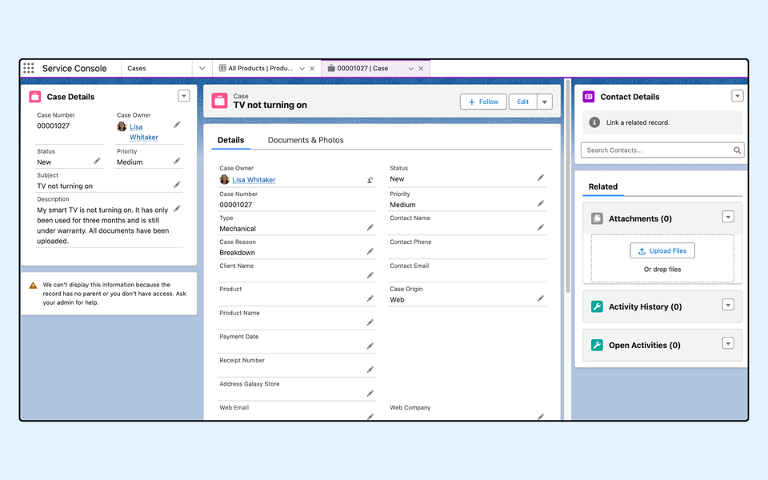
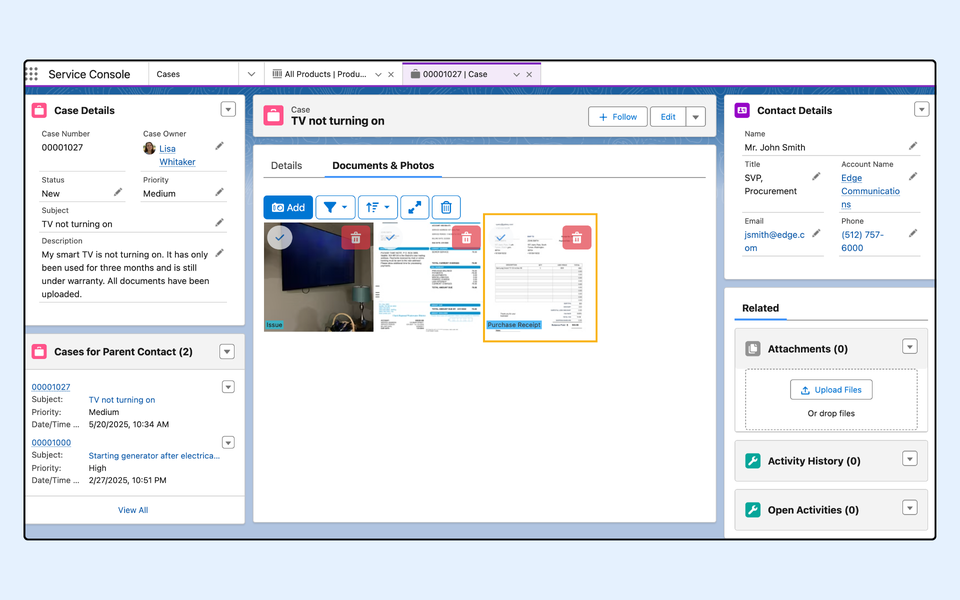
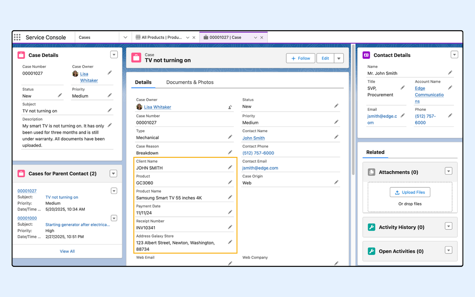

---
layout:
  width: default
  title:
    visible: true
  description:
    visible: true
  tableOfContents:
    visible: true
  outline:
    visible: true
  pagination:
    visible: true
  metadata:
    visible: false
  tags:
    visible: true
---

# SharinPix AI Extractor Integration in Salesforce Flow (Admin-Oriented)

## Overview

The **SharinPix AI Extractor** allows users to analyze and extract data from images using generative AI capabilities.

The automation eliminates the need for manual data entry by extracting relevant details from uploaded images, such as receipts and proof of address, and automatically populating corresponding Salesforce fields.

This document covers the following topics:

* [**Use Case Overview**:](sharinpix-ai-extractor-integration-in-salesforce-flow-admin-oriented.md#use-case-overview) An explanation of how the SharinPix AI Extractor is applied to a common customer support scenario, demonstrating its efficiency in automating case record updates within Salesforce Service Cloud.
* [**AIExtractorAutomation Parameters**:](sharinpix-ai-extractor-integration-in-salesforce-flow-admin-oriented.md#aiextractorautomation-parameters) A breakdown of the input and output parameters that power the AI extraction process, detailing how the data is processed and returned.
* [**Implementation Guide**:](sharinpix-ai-extractor-integration-in-salesforce-flow-admin-oriented.md#implementation-guide) A step-by-step guide on integrating the **SharinPix AI Extractor** within a Salesforce Flow, including how to configure elements and actions for seamless automation.
* [**Demo Overview: AI-Driven Case Record Updates with AIExtractor Automation**:](sharinpix-ai-extractor-integration-in-salesforce-flow-admin-oriented.md#demo-overview-ai-driven-case-record-updates-with-aiextractor-automation) A demonstration showing how a customer’s case is automatically updated with extracted information from an uploaded receipt, enhancing the case resolution process.


**Prerequisites:**

Before integrating the AI Extractor in a Salesforce Flow,

* Ensure that you have enabled SharinPix AI feature in your org. Follow this documentation for more: [SharinPix Generative AI Analyse/Extract Image Capabilities](sharinpix-generative-ai-analysis-extract-image-capabilities.md)
* Ensure that you are on a recent SharinPix Package Version. Follow this document to [upgrade the SharinPix package](https://app.gitbook.com/s/i8tH1o5AHthxksYgF6ij/how-to-update-sharinpix-package-from-the-appexchange)


## Use Case Overview

A retail shop selling electronics (e.g., TVs, radios, washing machines) has an after-sales website where customers can create support cases. When submitting a case, customers upload images such as:

* Purchase receipts
* Proof of address
* Photos depicting the issue with the product

Salesforce agents handle these cases within Salesforce Service Cloud. Instead of manually reviewing and inputting information from the uploaded documents, an automated process powered by SharinPix extracts key details and updates the necessary fields.

In our specific use case, the goal is to automatically extract contact details and product information from purchase receipts to enhance the case record.

## AIExtractorAutomation Parameters

### Input Parameters

Below are the **inputs** required when using the **AIExtractorAutomation** invocable method in a Salesforce Flow.

| **Parameter**      | **Description**                                                                                                                                                                                                                                                                                                                                                                                                                      |
| ------------------ | ------------------------------------------------------------------------------------------------------------------------------------------------------------------------------------------------------------------------------------------------------------------------------------------------------------------------------------------------------------------------------------------------------------------------------------ |
| List of Image URLs | <ul><li>This is a list containing the URLs of images to be processed by the <mark style="color:$danger;"><code>AIExtractorAutomation</code></mark>.</li><li>Each entry in the list represents the URL of an image that will be analyzed by the model.</li></ul>                                                                                                                                                                      |
| Prompt             | <ul><li>The <mark style="color:$danger;"><code>Prompt</code></mark> parameter is a string that contains the question or instruction to be passed to the GPT model.</li><li>This prompt guides the model on what information to extract from the provided images.</li><li>It could be a general question like "What is the content of this image?" or a more specific instruction such as "Identify any text in the image."</li></ul> |

### Output Parameters

Below are the **outputs** received when using the **AIExtractorAutomation** invocable method.

| **Parameter**              | **Description**                                                                                                                                                                                                                                                                                                                                                                |
| -------------------------- | ------------------------------------------------------------------------------------------------------------------------------------------------------------------------------------------------------------------------------------------------------------------------------------------------------------------------------------------------------------------------------ |
| List of Values (JSON list) | <ul><li>This is a collection of image extraction results.</li><li>Each result in the list represents a specific image processed by the <mark style="color:$danger;"><code>AIExtractorAutomation</code></mark> class.</li><li>Each entry provides detailed information extracted from individual images.</li></ul>                                                              |
| Raw Result                 | <ul><li>The <mark style="color:$danger;"><code>Raw Result</code></mark> parameter holds the full JSON output.</li><li>This is the raw data returned by the <mark style="color:red;"><code>AIExtractor</code></mark> class, including all image extraction results.</li><li>It contains the details for all the images sent for extraction in a single JSON response.</li></ul> |

## Implementation Guide

This section will walk you through the steps needed to create a **Salesforce Flow** that invokes the **AIExtractorAutomation** Apex class. This flow will extract contact and product details from purchase receipts uploaded by customers. It will trigger automatically when a new case is created and populate the case record with relevant details from the receipt.

 (2).png>)

### Step 1: Create a New Record-Triggered Flow

To do so, follow the steps below:

* Go to Setup. In the Quick Find Box, type **Flows**.
* Under **Process Automation** , select **Flows**.
* Click on the **New Flow** button.
* Select the option **Record-Triggered Flow** , and click on the **Create** button.
* After clicking on _Create_ , the \_Configure Start \_modal will be displayed. Fill in the modal as indicated below:
  * **Select Object** : Case
  * **Configure Trigger** : A record is created
  * For the **Set Entry Conditions** section:
    * Select **None**
  * **When to Run the Flow for Updated Records** : Every time a record is updated and meets the condition requirements
  * **Optimize the Flow for** : Actions and Related Records
  * Enable **Include a Run Asynchronously path to access an external system after the original transaction for the triggering record is successfully committed**

<figure><figcaption></figcaption></figure>

### Step 2: Add a Get Element to get the SharinPix Image (Receipt)

Next, add a **Get Element** to retrieve the receipt image associated with the Case record.

For the Get Records element:

* Label: Get SharinPix Image
* Object: SharinPix Image
* Conditions:
  * **sharinpix\_\_AlbumID\_\_c** (Field) equals (operator) **{!$Record.Id}** (newly-created resource named Id)
  * **sharinpix\_\_DisplayTags\_\_c** (Field) equals (operator) **Purchase Receipt** (tag added to the Receipt Image)
* In the **How Many Records to Store** , check the **Only the first record** option
* In the **Where to Store Field Values** , check the **Automatically store all fields** option
* Click **Done**

 (1) (2).png>)

### Step 3: Add an Assignment Element to assign the receipt image URL

Create a new variable and assign the record's Image URL Full to it.

1\. Go on the **Manager** tab and click on **New Resource**.

* Resource Type: Variable
* API Name: ImageUrls
* Data Type: Text
* Check the **Allow multiple values (collection)**

 (1) (2).png>)

2\. Add **Assignment Element**.

* Label: Assign Image Urls
* Conditions: **{!ImageUrls}** (Variable) Add (operator)**{!Get\_SharinPix\_Image.sharinpix\_\_ImageURLFull\_\_c}** (value)

 (1) (2).png>)

### Step 4: Add the Action to extract contact and product details from the receipt

Create a new variable for the prompt to be passed to the AI to retrieve the contact and product details from the receipt in a JSON format

* Go on the **Manager** tab and click on **New Resource**.
* Resource Type: Variable
* API Name: Prompt
* Data Type: Text
* Default Value: I have an automation which takes list of object with the following: client\_name, product\_name, payment\_date, receipt\_number and address\_galaxy\_store. I would like to extract these information provided from the images and you should return a JSON corresponding to what I can input to my automation. All values should be converted to String inside the JSON. Output only the JSON in a single-line without any markdown associated and remove any round brackets.

Create two other variables for the output obtained from the AIExtractorAutomation

1. ResultsList
   * Go on the **Manager** tab and click on **New Resource**.
   * Resource Type: Variable
   * API Name: ResultsList
   * Data Type: Text
   * Check the **Allow multiple values (collection)**
2. Results
   * Go on the **Manager** tab and click on **New Resource**.
   * Resource Type: Variable
   * API Name: Results
   * Data Type: Text

.png>)

Add an **Action** element

* Search for <mark style="color:$danger;">`Sharinpix__AIExtractorAutomation`</mark>
* On the **Action** \_ \_ modal for <mark style="color:$danger;">`Sharinpix__AIExtractorAutomation`</mark>, populate the fields as indicated below:

| **Field**          | **Example Value** |
| ------------------ | ----------------- |
| List of Image URLs | {!ImageUrls}      |
| Prompt             | {!Prompt}         |

 (1) (2).png>)

### Step 5: Parse the Extracted Result

Once the AI extractor processes the receipt, the next step is to parse the extracted data (contact and product details) into separate components that can be used to update different fields in the **Case** record. To achieve this, we will use the [**FlowJSONParser**](sharinpix-flow-json-parser-integration-in-salesforce-flow-admin-oriented.md) invocable method as explain below:

Add an **Action** element

* Search for <mark style="color:$danger;">`SharinPix Flow JSON Parser`</mark>
* Label: Parse Results
* Set Input Values for the Selected Action: populate the fields as indicated below:

| **Field**            | **Example Value**       |
| -------------------- | ----------------------- |
| Ignore Error?        | {!$GlobalConstant.True} |
| JSON String to Parse | {!Results}              |
| Field01              | client\_name            |
| Field02              | product\_name           |
| Field03              | payment\_date           |
| Field04              | receipt\_number         |
| Field05              | address\_galaxy\_store  |

<figure><figcaption></figcaption></figure>

* On the **Show Advanced Options**
  * **Enable** Manually assign variables
  * Store Output Values: populate the fields as indicated below:

| **Field** | **Example Value**                      |
| --------- | -------------------------------------- |
| Value01   | {!$Record.Client\_Name\_\_c}           |
| Value02   | {!$Record.Product\_Name\_\_c}          |
| Value03   | {!$Record.Payment\_Date\_\_c}          |
| Value04   | {!$Record.Receipt\_Number\_\_c}        |
| Value05   | {!$Record.Address\_Galaxy\_Store\_\_c} |

 (1) (2).png>)

### Step 6: Add an Update Element to update the Case record

This step is used to update the corresponding fields on the Case record.

Add an **Update** element

* Select _Use the IDs and all field values from a record or record collection_
* Do not add any filter conditions.
* In the **Select Record(s) to Update** section, populate with **{!$Record}**(Triggering Case)

 (1) (2).png>)

## Demo Overview: AI-Driven Case Record Updates with AIExtractor Automation

In this demo, we will show how seamless and efficient the automation process is, saving time for both customers and Salesforce agents by reducing manual data entry and ensuring that all relevant case details are available at a glance.

**1. Case Record Creation:**

* The process begins when a customer submits a support case for the issue of their **TV not turning on** on the after-sales website. As part of their submission, the customer uploads photos depicting the issue with the product, the **purchase receipt** , which is tagged with the label **'Purchase Receipt'** to easily identify it as shown in the diagram below.

<figure><figcaption></figcaption></figure>

<figure><figcaption></figcaption></figure>

**2. Flow Triggered:**

* Once the case record is created, the **Flow** is automatically triggered in Salesforce. The Flow calls the **AIExtractorAutomation** , which processes the uploaded purchase receipt to extract relevant details, such as contact information (e.g., client name) and product information (e.g., product name, purchase date).

**3. Case Record Update:**

* After the extraction process is completed, the **case record** is updated with the extracted information. This includes auto-populating the case fields with the extracted contact and product information, allowing the Salesforce agents to quickly access the relevant data and take the necessary next steps in resolving the case.

<figure><figcaption></figcaption></figure>
