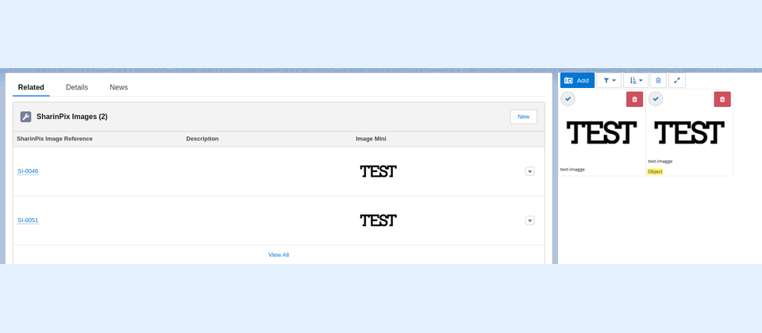

---
layout:
  width: default
  title:
    visible: true
  description:
    visible: true
  tableOfContents:
    visible: true
  outline:
    visible: true
  pagination:
    visible: true
  metadata:
    visible: false
  tags:
    visible: true
---

# Utils methods

## Utils methods

Utils are available for you to avoid direct access to our rest API and an integrated usage directly from the SharinPix package in Apex from Salesforce.

Methods

* [renameAlbum](utils-methods.md#renamealbum)
* [duplicateAlbum](utils-methods.md#duplicatealbum)
* [getAlbumImages](utils-methods.md#getalbumimages)
* [getImageDetails](utils-methods.md#getimagedetails)
* [duplicateImageToAlbum](utils-methods.md#duplicateimagetoalbum)
* [duplicateImages](utils-methods.md#duplicateimages)
* [getImageUrl](utils-methods.md#getimageurl)
* [getImageEndpoint](utils-methods.md#getimageendpoint)
* [croppedImageUrl](utils-methods.md#croppedimageurl)
* [getImageExternalUrls](utils-methods.md#getimageexternalurls)
* [getOrgTags](utils-methods.md#getorgtags)
* [getAlbumTagImages](utils-methods.md#getalbumtagimages)
* [getTagsOnImage](utils-methods.md#gettagsonimage)
* [getTagNamesOnImage](utils-methods.md#gettagnamesonimage)
* [addTag](utils-methods.md#addtag)
* [removeTags](utils-methods.md#removetags)
* [clearTags](utils-methods.md#cleartags)
* [uploadAttachment](utils-methods.md#uploadattachment)
* [uploadContentDocument](utils-methods.md#uploadcontentdocument)
* [uploadFromUrl](utils-methods.md#uploadfromurl)
* [uploadWebshot](utils-methods.md#uploadwebshot)
* [generateMobileAppUrl](utils-methods.md#generatemobileappurl)
* [splitToken](utils-methods.md#splittoken)
* [getAlbumImageIds](utils-methods.md#getalbumimageids)
* [deleteImage](utils-methods.md#deleteimage)
* [deleteImages](utils-methods.md#deleteimages)
* [updateSessionIdValidity](utils-methods.md#sessionidvalidity)
* [createContentDocumentFromUrl](utils-methods.md#createcontentdocumentfromurl)

### Utils Method Example <a href="#example" id="example"></a>

### renameAlbum <a href="#renamealbum" id="renamealbum"></a>

_global Boolean **renameAlbum**(String **oldAlbumId**, String **newAlbumId**)_

* _Renames an album._

#### renameAlbum <a href="#renamealbum_1" id="renamealbum_1"></a>

_global Boolean **renameAlbum**(String **oldAlbumId**, String **newAlbumId**, Boolean **mergeAlbum**)_<br>

* _Renames an album. The **mergeAlbum** parameter is used to specify whether to merge the old and new albums or not._

```apex
sharinpix.Utils u = new sharinpix.Utils();
boolean renamed = u.renameAlbum('0018a00001rL2scAAC','0018a00001rL2sXAAS', true);
System.debug(renamed);
```

Image below shows the albums before using the renameAlbum method.

<figure><figcaption></figcaption></figure>

After using the method renameAlbum with mergeAlbum parameter 'true', all the images from the old Album have been merged in the new Album as shown below.

<figure><figcaption></figcaption></figure>

### duplicateAlbum <a href="#duplicatealbum" id="duplicatealbum"></a>

#### duplicateAlbum with no Tags or Tags equals to false <a href="#duplicatealbum-with-no-tags" id="duplicatealbum-with-no-tags"></a>

_global String **duplicateAlbum**(String **sourceAlbumId**, String **destinationAlbumId**)_

* Copies all images from a source album to a destination album.

The code below shows the code without tags.

```apex
SharinPix.Utils utls = new SharinPix.Utils();
utls.duplicateAlbum('0018a00001rL2scAAC','0018a00001rL2sXAAS');
```

Image below shows the source record where the album an image with the tag "**object"**.

<figure><figcaption></figcaption></figure>

The image below shows the destination record where the image from the source record has been populated without the tags because in the code snippet we have not mentioned if "Tags" is **true** or **false**.

<figure><figcaption></figcaption></figure>

#### DuplicateAlbum with Tags True <a href="#duplicatealbum-with-tags-true-false" id="duplicatealbum-with-tags-true-false"></a>

_global String **duplicateAlbum**(String **sourceAlbumId**, String **destinationAlbumId**, Boolean **includeTags**)_

* Copies all images from a source album to a destination album. This method also allows the duplication of tags along with the images.

The image below shows the code where tags is true.

```apex
SharinPix.Utils utls = new SharinPix.Utils();
utls.duplicateAlbum('0018a00001rL2scAAC','0018a00001rL2sXAAS',true);
```

Image below shows the source record where the album an image with the tag "**object"**.

<figure><figcaption></figcaption></figure>

The image below shows the destination record where the image from the source record has been populated and has been assign the tag "**object"** when the code snippet was executed.

<figure><figcaption></figcaption></figure>

**duplicateAlbum with Einstein Boxes (DEPRECATED)**


This method has been deprecated and should not be included in new implementations as [Salesforce retired Einstein Vision on July 31, 2023](https://help.salesforce.com/s/articleView?id=000394460\&type=1).


_global String duplicateAlbum(String sourceAlbumId, String destinationAlbumId, Map\<String,Object> params)_

* Copies all images from a source album to a destination album if einstein\_boxes equals to true. This method also allows the duplication of labels along with the images.

```apex
SharinPix.Utils utls = new SharinPix.Utils();
utls.duplicateAlbum('0018a00001rL2scAAC','0018a00001rL2sXAAS',new Map<String,Object>{'einstein_boxes' => true, 'tags' => true});
```


For **destination records,** the tags will only appear if we mentioned **true** in the code snippet.


### getAlbumImages <a href="#getalbumimages" id="getalbumimages"></a>

_global List\<Object> **getAlbumImages**(String **albumId**)_

* Gets all images from an album.

Below code shows how to get the details from an image (e.g: brightness, color, contrast, created\_at,...)

```apex
sharinpix.Utils u = new sharinpix.Utils();
list<object> lstobj = u.getAlbumImages('0018a00001rL2sXAAS');
```

### getImageDetails <a href="#getimagedetails" id="getimagedetails"></a>

_global Map\<String, Object> **getImageDetails**(String **imageId**)_

* _Gets image details._

```apex
sharinpix.Utils u = new sharinpix.Utils();
Map<String, object> response = u.getImageDetails('66d6d11a-6399-4713-be28-ebcbdc148c3b');
System.debug(response);
```

### duplicateImageToAlbum <a href="#duplicateimagetoalbum" id="duplicateimagetoalbum"></a>

_global string **duplicateImageToAlbum**(string **imageId**_, string **albumId**, map\<string, object> **options**)

* Duplicates an image to a specified album. The **options** parameter can be used to enable tag and image sync while duplicating the image. _An example on how to call this method has been given at the end of this article._

```apex
sharinpix.Utils u = new sharinpix.Utils();
string response = u.duplicateImageToAlbum('64fae218-12b8-47ee-ad5a-e0d733e5eade','0018F00000SyyvJQAR',new map<string, object>{'tags' => true, 'sync' => true});
System.debug(response);
```

### duplicateImages <a href="#duplicateimages" id="duplicateimages"></a>

#### duplicateImages with no Tags or Tags equals to false <a href="#duplicateimages-with-no-tags-or-tags-equals-to-false" id="duplicateimages-with-no-tags-or-tags-equals-to-false"></a>

_global List\<Object> **duplicateImages**(List\<String> **imageIds**, String **destinationAlbumId**)_

* _Duplicates one or more images to another album._

```apex
sharinpix.Utils u = new sharinpix.Utils();
List<object> response = u.duplicateImages(new list<String>{'66d6d11a-6399-4713-be28-ebcbdc148c3b'}, '0018F00000SyyvJQAR');
System.debug(response);
```

#### duplicateImages with Tags True <a href="#duplicateimages-with-tags-true" id="duplicateimages-with-tags-true"></a>

_global List\<Object> **duplicateImages**(List\<String> **imageIds**, String **destinationAlbumId,** Map\<String, Object> **options**)_

* _Duplicates one or more images to another album. This method also allows the duplication of tags along with the images._

```apex
sharinpix.Utils u = new sharinpix.Utils();
List<object> response = u.duplicateImages(new list<String>{'66d6d11a-6399-4713-be28-ebcbdc148c3b'}, '0018F00000SyyvJQAR', new Map<String, Object> {'tags' => true});
System.debug(response);
```


**Tip:**

The SharinPix package also include the **Image** class which includes useful methods for image management such as a method to move images. For more information about the Image class, please refer to the article below:

[Image methods](image-methods.md)


### getImageUrl <a href="#getimageurl" id="getimageurl"></a>

_global String **getImageUrl**(String **imageId**, Map\<String, Object> **sharinpix**, List\<Object> **transformations**)_

* _Gets the URL of a transformed image._

```apex
sharinpix.Utils u = new sharinpix.Utils();
String imgURL = u.getImageUrl('66d6d11a-6399-4713-be28-ebcbdc148c3b', new Map<String, object>{'download' => false},new List<Object>{new map<String,object>{'crop' => 'fit', 'width' => 500}});
System.debug(imgURL);
```

* _Get the original url of an image (This url is a direct expiring url to the storage)_<br>

```apex
sharinpix.Utils u = new sharinpix.Utils();
String imgURL = u.getImageUrl('2ae9c19c-3ad3-4844-bacc-71c2cd3313a8', new Map<String, object>{'original' => true},new List<Object>{});
System.debug(imgURL);
```

### getImageEndpoint <a href="#getimageendpoint" id="getimageendpoint"></a>

global String **getImageEndpoint** (String **imageId**, Map\<String, Object> **sharinpix**, List\<Object> **transformations**)

* Get endpoint of transformed image

```apex
sharinpix.Utils u = new sharinpix.Utils();
String imgURL = u.getImageEndpoint('2ae9c19c-3ad3-4844-bacc-71c2cd3313a8', new Map<String, object>{'original' => true},new List<Object>{});
System.debug(imgURL);
```

### croppedImageUrl <a href="#croppedimageurl" id="croppedimageurl"></a>

_global String **croppedImageUrl**(String **imageId**, String **cropStyle**, Integer **width**, Integer **height**)_

* Crops or resizes images.

```apex
sharinpix.Utils u = new sharinpix.Utils();
string getUrl = u.croppedImageUrl('bab2179a-9e8d-4ad9-a42c-d7bc45eccdf5','fill',100,100);
System.debug(getUrl);
```

### getImageExternalUrl <a href="#getimageexternalurl" id="getimageexternalurl"></a>

_global Map\<String, Object> **getImageExternalUrl**(Map\<String, Object> **imageTransformation**)_

* Applies transformations on an image and get an external URL.

```apex
sharinpix.Utils u = new sharinpix.Utils();
Map<String,Object> image = new Map<String,Object>{'image_id' => '66d6d11a-6399-4713-be28-ebcbdc148c3b','crop' => 'fit','height' => 100,'width' => 100};
Map<String, Object> imageObj = u.getImageExternalUrl(image);
System.debug(imageObj);
```

### getImageExternalUrls <a href="#getimageexternalurls" id="getimageexternalurls"></a>

_global List\<Object> **getImageExternalUrls**(List\<Map\<String, Object>> **imageTransformations**)_

* _Applies transformations on images and get external images URLs._

```apex
sharinpix.Utils u = new sharinpix.Utils();
list<Map<String,Object>> getImgExtUrl = new list<Map<String,Object>>{
    new Map<String,Object>{
        'image_id' => '66d6d11a-6399-4713-be28-ebcbdc148c3b',
        'transformations' => new Map<string, object> {
        'crop' => 'fit',
        'height' => 100,
        'width' => 100
            }
    }
};

List<object> lstObj = u.getImageExternalUrls(getImgExtUrl);
Map<String, Object> fieldsToValue = (Map<String, Object>) JSON.deserializeUntyped(JSON.serialize(lstObj[0]));
System.debug(fieldsToValue.get('url'));
```

### getOrgTags <a href="#getorgtags" id="getorgtags"></a>

_global List\<Object> **getOrgTags**()_

* Retrieves all tags present in your Organization.

```apex
sharinpix.Utils u = new sharinpix.Utils();
list <object> lstobj = u.getOrgTags();
System.debug(lstobj);
```

### getAlbumTagImages <a href="#getalbumtagimages" id="getalbumtagimages"></a>

_global List\<Object> **getAlbumTagImages**(String **albumId**)_

* Retrieves the list of images having tags from an album.

```apex
sharinpix.Utils u = new sharinpix.Utils();
list <Object> lstObj =u.getAlbumTagImages('0018a00001rL2scAAC');
System.debug(lstObj);
```

### getAlbumTagImages <a href="#getalbumtagimages_1" id="getalbumtagimages_1"></a>

_global List\<Object> **getAlbumTagImages**(String **albumId**, String **tagName**)_

* Retrieves all tagged images having a specific tag name from an album.

```apex
sharinpix.Utils u = new sharinpix.Utils();
list <Object> lstObj = u.getAlbumTagImages('0018a00001rL2scAAC','Plan');
System.debug(lstObj);
```

### getTagsOnImage <a href="#gettagsonimage" id="gettagsonimage"></a>

_global List\<Object> **getTagsOnImage**(String **imageId**)_

* Retrieves all tags applied to an image.

```apex
sharinpix.Utils u = new sharinpix.Utils();
list <object> lstobj = u.getTagsOnImage('bab2179a-9e8d-4ad9-a42c-d7bc45eccdf5');
System.debug(lstobj);
```

### getTagNamesOnImage <a href="#gettagnamesonimage" id="gettagnamesonimage"></a>

_global List\<String> **getTagNamesOnImage**(String **imageId**)_

* Retrieves all tag names available on an image.

```apex
sharinpix.Utils u = new sharinpix.Utils();
list <String> lstobj = u.getTagNamesOnImage('bab2179a-9e8d-4ad9-a42c-d7bc45eccdf5');
System.debug(lstobj);
```

### addTag <a href="#addtag" id="addtag"></a>

_global Object **addTag**(String imageId, String **tagName**)_

* Adds a tag on an image.

```apex
sharinpix.Utils u = new sharinpix.Utils();
u.addTag('bab2179a-9e8d-4ad9-a42c-d7bc45eccdf5','testInsertTags');
```

### removeTags <a href="#removetags" id="removetags"></a>

_global Boolean_ (String **imageId**, String\[] **tags**)

* Removes tags from a tagged image.

```apex
sharinpix.Utils u = new sharinpix.Utils();
Boolean tagRemoved = false;
tagRemoved = u.removeTags('66d6d11a-6399-4713-be28-ebcbdc148c3b',new list<String>{'Plan'});
```

### clearTags <a href="#cleartags" id="cleartags"></a>

_global Boolean **clearTags**(String **imageId**)_

* Clears all tags applied to an image.

```apex
sharinpix.Utils u = new sharinpix.Utils();
u.clearTags('bab2179a-9e8d-4ad9-a42c-d7bc45eccdf5');
```

### uploadAttachment <a href="#uploadattachment" id="uploadattachment"></a>

_global Object **uploadAttachment**(Id **attachmentId**, String **albumId**)_

* Uploads Salesforce attachments to SharinPix albums.

```apex
sharinpix.Utils u = new sharinpix.Utils();
object result =u.uploadAttachment('00P8a00000HCfOWAA1','0018a00001rL2scAAC');
System.debug(result);
```

### uploadAttachment <a href="#uploadattachment_1" id="uploadattachment_1"></a>

_global Object **uploadAttachment**(Id **attachmentId**, String **albumId**, Map\<String, Object> **userMetadatas**)_

* Uploads Salesforce attachments to SharinPix albums.

```apex
sharinpix.Utils u = new sharinpix.Utils();
object result =u.uploadAttachment('00P8a00000HCfOWAA1','0018a00001rL2scAAC',null);
System.debug(result);
```

### uploadAttachment <a href="#uploadattachment_2" id="uploadattachment_2"></a>

global Object **uploadAttachment**(Id **attachmentId**, String **albumId**, Map\<String, Object> **userMetadatas**, List\<String> **tags**)

* Uploads Attachments to SharinPix albums with tags. Using this method, you can also provide a list of tags to be applied to every image.

```apex
sharinpix.Utils u = new sharinpix.Utils();
object result =u.uploadAttachment('0698a00000HCfOWAA1','0018a00001rL2scAAC',null,new List<String>{ 'tagA', 'tagB' });
System.debug(result);
```

### uploadContentDocument <a href="#uploadcontentdocument" id="uploadcontentdocument"></a>

_global Object **uploadContentDocument**(Id **contentDocumentId**, String **albumId**)_

* Uploads Salesforce ContentDocuments to SharinPix albums.

```apex
sharinpix.Utils u = new sharinpix.Utils();
object result =u.uploadContentDocument('0698a00000HCfOWAA1','0018a00001rL2scAAC');
System.debug(result);
```

### uploadContentDocument <a href="#uploadcontentdocument_1" id="uploadcontentdocument_1"></a>

_global Object **uploadContentDocument**(Id **contentDocumentId**, String **albumId**, Map\<String, Object> **userMetadatas**)_

* Uploads Salesforce ContentDocuments to SharinPix albums.

```apex
sharinpix.Utils u = new sharinpix.Utils();
object result =u.uploadContentDocument('0698a00000HCfOWAA1','0018a00001rL2scAAC',null);
System.debug(result);
```

### uploadContentDocument <a href="#uploadcontentdocument_2" id="uploadcontentdocument_2"></a>

_global Object **uploadContentDocument**(Id **contentDocumentId**, String **albumId**, Map\<String, Object> **userMetadatas**, List\<String> **tags**)_

* Uploads Salesforce ContentDocuments to SharinPix albums. Using this method, you can also provide a title and description within the _**userMetadatas**_ parameter and a list of tags within the _**tags**_ parameter to be applied to every image.

```apex
sharinpix.Utils u = new sharinpix.Utils();
object result =u.uploadContentDocument('0698a00000HCfOWAA1', '0018a00001rL2scAAC', new Map<String, Object> { 'sp_title' => 'sample title', 'sp_description' => 'sample description' }, new List<String> { 'tagA', 'tagB' });
System.debug(result);
```

### uploadFromUrl <a href="#uploadfromurl" id="uploadfromurl"></a>

_global Object **uploadFromUrl**(String **imageUrl**, String **albumId**, String **filename**)_

* Uploads an image to SharinPix using an URL.

```apex
sharinpix.Utils u = new sharinpix.Utils();
string url ='https://picsum.photos/1200/1000';
object result = u.uploadFromUrl(url,'0018a00001rL2scAAC','image.jpg');
System.debug(result);
```

### uploadFromUrl <a href="#uploadfromurl_1" id="uploadfromurl_1"></a>

_global Object **uploadFromUrl**(String **imageUrl**, String **albumId**, String **filename**, map\<string, object> **metadatas**)_

* Uploads an image to SharinPix using an URL. Using this method, you can also provide specific metadata as title, description and contentDocumentId within the _**userMetadatas**_ parameter to be applied to the image.

```apex
sharinpix.Utils u = new sharinpix.Utils();
string url ='https://picsum.photos/1200/1000';
object result = u.uploadFromUrl(url,'0018a00001rL2scAAC','test1', new Map<string, string> { 'contentDocumentId' => '0698a00000HCfOWAA1', 'sp_title' => 'sample title', 'sp_description' => 'sample description' });
System.debug(result);
```

### uploadWebshot <a href="#uploadwebshot" id="uploadwebshot"></a>

_global Object **uploadWebshot**(String **url**, String **albumId**)_

* Captures screenshot from website URL and uploads to SharinPix.

```apex
sharinpix.Utils u = new sharinpix.Utils();
string url ='https://www.google.com';
object getUploadWebShot = u.uploadWebshot(url,'0018a00001rL2scAAC');
System.debug(getUploadWebShot);
```

### uploadWebshot <a href="#uploadwebshot_1" id="uploadwebshot_1"></a>

_global Object **uploadWebshot**(String **url**, String **albumId**, Map\<string, object> **options**)_

* Captures screenshot from website URL and uploads to SharinPix. Using this method you can also provide a list of tags to be applied on every image. For e.g :\
  sharinpix.Utils.uploadWebshot('https:/test/maps/test', '00324000004GUxhAAG', new Map\<string, object>{ 'tags' => new List\<string> {'mapTag'\}});

```apex
sharinpix.Utils u = new sharinpix.Utils();
object response = u.uploadWebshot('https://www.google.com/','5008a00001uwxsNAAQ',new Map<String,object> {'tags'=> 'test'});
System.debug(response);
```

### generateMobileAppUrl <a href="#generatemobileappurl" id="generatemobileappurl"></a>

_global String **generateMobileAppUrl**(String **albumId**, Map\<String, Object> **options**)_

* Generates the SharinPix URL used to launch the mobile application.

```apex
sharinpix.Utils u = new sharinpix.Utils();
Map <String, object> opt = new Map<String,Object>{
    'name'=> 'TestName',
        'linkExpiration' => 500
};

string appurl = u.generateMobileAppUrl('61a65f12-eccd-4b42-bd7d-2de4a8699b80',opt);
System.debug(appurl);
```

### generateMobileAppUrl <a href="#generatemobileappurl_1" id="generatemobileappurl_1"></a>

_global String **generateMobileAppUrl**(String **albumId**, String **name**, Map\<String, Object> **options**, Integer **linkExpiration**)_

* Generates the SharinPix URL used to launch the mobile application.

```apex
sharinpix.Utils u = new sharinpix.Utils();
Map<String, object> options = new map<String,object>{
    'name' => 'TestName',
    'linkExpiration' => 500
};
    String appurl = u.generateMobileAppUrl('61a65f12-eccd-4b42-bd7d-2de4a8699b80',options);
System.debug('appurl : '+ appurl);
```

### splitToken <a href="#splittoken" id="splittoken"></a>

_global static List\<String> **splitToken**(String **token**, Integer **sizeLimit**)_

* Method used to split a token.

```apex
sharinpix.Utils u = new sharinpix.Utils();
string tokens = sharinpix.Client.getInstance().token(
    new Map<String, Object> {
            'abilities' => new Map<String, Object> {
                '0018a00001rL2scAAC' => new Map<String, Object> {
                    'Access'  => new Map<String, Object> {
                        'see' => true,
                        'image_list' => true,
                        'image_upload' => true
                    }
                }
            }
        });
integer size = 255;
list<String> actualList = sharinpix.Utils.splitToken(tokens,size);
System.debug(actualList);
```

### getAlbumImageIds <a href="#getalbumimageids" id="getalbumimageids"></a>

_global List\<String> **getAlbumImageIds**(Id **albumId**)_

* Retrieves all image IDs found in an album.

```apex
sharinpix.Utils u = new sharinpix.Utils();
list <String> lstAlbumId = u.getAlbumImageIds('a0A8a00002ho8elEAA');
System.debug(lstAlbumId);
```

### deleteImage <a href="#deleteimage" id="deleteimage"></a>

_global List\<String> **deleteImage**(String **imageId**)_

* Deletes image corresponding to the given ID

```apex
sharinpix.Utils u = new sharinpix.Utils();
List <String> lstImg = u.deleteImage('a7d50d26-4f01-4298-9d1b-f69db2214f07');
System.debug(lstImg);
```

### deleteImage <a href="#deleteimage_1" id="deleteimage_1"></a>

_global List\<String> **deleteImage**(String **imageId**, map\<string, object> **payload**)_

* Deletes image corresponding to the given ID taking into consideration parameters passed in payload. Available options:
  * purge
    * Set to true to completely delete image from SharinPix. This action cannot be undone and image cannot be restored. Example usage:\
      (new sharinpix.Utils()).deleteImage('imageIdHere', new map\<string,object>{'purge' => true});

```apex
sharinpix.Utils u = new sharinpix.Utils();
List <String> lstImg = u.deleteImage('a7d50d26-4f01-4298-9d1b-f69db2214f07', new Map<string,object> {'purge' => true});
System.debug(lstImg);
```

### deleteImages <a href="#deleteimages" id="deleteimages"></a>

_global List\<String> **deleteImages**(List\<String> **imageIds**)_

* Deletes images corresponding to the given IDs

```apex
sharinpix.Utils u = new sharinpix.Utils();
list <String> delImgs = u.deleteImages(new list<String> {'0e7d41a8-b1b8-440a-9734-24e5a2923075', 'fa2b5a41-e43c-4ed0-ac85-58ff5b90a4ed'});
System.debug(delImgs)
```

### deleteImages <a href="#deleteimages_1" id="deleteimages_1"></a>

_global List\<String> **deleteImages**(List\<String> **imageIds**, map\<string, object> **payload**)_

* Deletes images corresponding to the given IDs taking into consideration parameters passed in payload. Available options:
  * purge
    * Set to true to completely delete images from SharinPix. This action cannot be undone and images cannot be restored.

```apex
sharinpix.Utils u = new sharinpix.Utils();
list <String> delImgs = u.deleteImages(new list<String> {'0e7d41a8-b1b8-440a-9734-24e5a2923075', 'fa2b5a41-e43c-4ed0-ac85-58ff5b90a4ed'}, new Map<string,object> {'purge' => true});
System.debug(delImgs)
```

### updateSessionIdValidity <a href="#sessionidvalidity" id="sessionidvalidity"></a>

_global Object **updateSessionIdValidity**_(String **id**, Boolean _**valid**)_

* Validates or invalidates a session (corresponding to the given session Id in the parameters)
* Updates valid to true to validate a session or false to invalidate a session.

```apex
sharinpix.Utils u = new sharinpix.Utils(); 
u.updateSessionIdValidity('00524000000kfy0aan-open', false); 
```

### createContentDocumentFromUrl <a href="#createcontentdocumentfromurl" id="createcontentdocumentfromurl"></a>

You can utilize this method to transform a public URL into a content document. It's applicable for converting SharinPix Images into content documents using SharinPix public image URLs.

#### createContentDocumentFromUrl without the option to add custom filename <a href="#createcontentdocumentfromurl-without-the-option-to-add-custom-filename" id="createcontentdocumentfromurl-without-the-option-to-add-custom-filename"></a>

_global static Id **createContentDocumentFromUrl**(String url)_

* Download a file at a URL to Content Document

```apex
String url = 'https://app.sharinpix.com/3/9a3dc1c/YXltYW4ubmdyb2suaW8vaW1hZ2VzLzI1ZWNjOTdjLTg4NDMtNDEyNS1hNjI0LTIxNTg5YTBlNDBhOS90aHVtYm5haWxzL29yaWdpbmFsLTk5Y2VjNzgwMGM5LmpwZw/laptop7.jpg';
Sharinpix.Utils.createContentDocumentFromUrl(url);
```

#### createContentDocumentFromUrl with option to add custom filename <a href="#createcontentdocumentfromurl-with-option-to-add-custom-filename" id="createcontentdocumentfromurl-with-option-to-add-custom-filename"></a>

_global static Id **createContentDocumentFromUrl**(String url, Map\<String, Object> options)_

* Download a file at a URL to Content Document with custom filename

**Note:** The custom filename should be added with its extension (e.g. jpg, png, jpeg, and so on) and the key should be 'filename' as shown in the example below.

```apex
String url = 'https://app.sharinpix.com/3/9a3dc1c/YXltYW4ubmdyb2suaW8vaW1hZ2VzLzI1ZWNjOTdjLTg4NDMtNDEyNS1hNjI0LTIxNTg5YTBlNDBhOS90aHVtYm5haWxzL29yaWdpbmFsLTk5Y2VjNzgwMGM5LmpwZw/laptop7.jpg';
Map<String, Object> options = new Map<String, Object> {'filename' => 'filename.jpg'}
Sharinpix.Utils.createContentDocumentFromUrl(url, options);
```


**Note:**

Before calling an external site (url from an external site), that site must be registered in the Remote Site Settings page of Salesforce.[ How to register new site?](https://help.salesforce.com/s/articleView?id=sf.configuring_remoteproxy.htm\&type=5)

