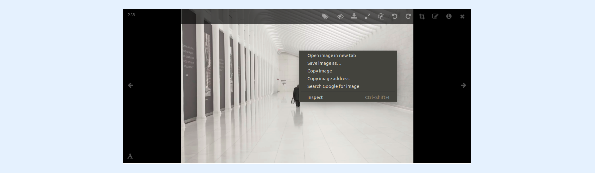

---
layout:
  width: default
  title:
    visible: true
  description:
    visible: true
  tableOfContents:
    visible: true
  outline:
    visible: true
  pagination:
    visible: true
  metadata:
    visible: false
  tags:
    visible: true
---

# Browser Download – right click menu


**Tips:**&#x20;

While the current article shows how to download an image from a **SharinPix Album** , the most preferred way to carry out this task is from the image's **Full View** mode. Refer to the following article to know more: [Single Image download](single-image-download.md).


* Access the **Full View** mode of an image by clicking on its thumbnail.

* Right-click on the current image and select **Save image as...** as shown below.


**Info:** The option **Save image as...** may take a different name or can be absent altogether depending on the web browser you are currently using.



**Note SAVE IMAGE AS ONLY AVAILABLE WITHOUT ANNOTATIONS:**&#x20;

The Save as image menu option is only available when the image have no annotations on it. To get it back, use the show/hide annotation tool on the toolbar, then right click on the image without annotation.

**Note SAVE AS IMAGE save WEBP at LOW RESOLUTION:**&#x20;

The downloaded image obtained when using this method is of format **webp** and has a downgraded resolution as compared to the originally-uploaded image. To download the current image with its original format and resolution, please refer to the following article: [Single Image download](single-image-download.md)

