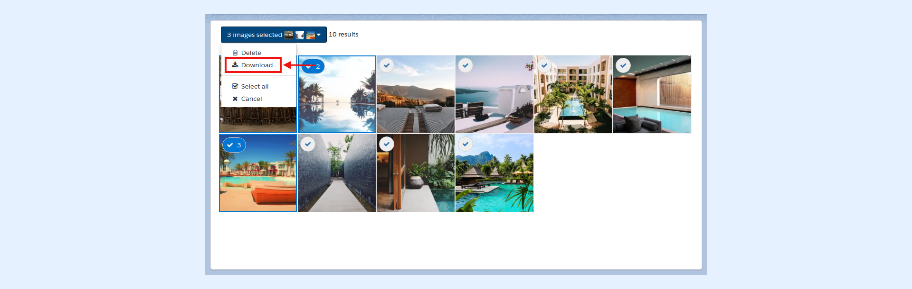

---
layout:
  width: default
  title:
    visible: true
  description:
    visible: true
  tableOfContents:
    visible: true
  outline:
    visible: true
  pagination:
    visible: true
  metadata:
    visible: false
  tags:
    visible: true
---

# Multiple Image download (ZIP) - make it available for your Search Results

This article demonstrates how to:

* [Zip and download multiple images selected from the SharinPix Search component](multiple-image-download-zip-make-it-available-for-your-search-results.md#steps-to-zip-and-download-images)
* [Enable the download zip option on the SharinPix Search component](multiple-image-download-zip-make-it-available-for-your-search-results.md#enable-the-download-zip-option-on-the-sharinpix-search-component)


**Prerequisite:**

To enable the download option on a SharinPix album, the **download** parameter should be set to **true**.

Click [here](multiple-image-download-zip-make-it-available-for-your-search-results.md#enable-the-download-zip-option-on-the-sharinpix-search-component) for more information on how to enable the **download** parameter for your album.


## Steps to zip and download images

To zip and download images, follow the steps below:

1\. Access a SharinPix album

2\. Select some images from the search component by clicking on the select icon as indicated below:

3\. Once the desired images are selected, open the thumbnail menu as demonstrated below:

4\. Next, click on the option **Download**. This action will display a **Download Zip** button

5\. Click on the **Download Zip** button to download a zipped file containing the selected images:

## Enable the download zip option on the SharinPix Search component

To enable the download option on a SharinPix Search component, the **download parameter should be set to true**.

The download attribute can be enabled through:

* _The SharinPix Global Settings_ :

Click [here](../../access-and-security/customizing-your-sharinpix-global-settings.md) for more information on how to use the SharinPix Global Settings.

* _A SharinPix Permission record_ :

Once the SharinPix Permission record is created, it can be assigned to the SharinPix Search component. Click [here](../../access-and-security/sharinpix-permission-object-how-to-create-and-assign-custom-permission.md) for more information on how to create and use the SharinPix Permission record.


**Tips:**

SharinPix also allows you to personalize the download filenames. For more information on how to configure the filenames, refer to the article below:

[Multiple Image download (ZIP) - How to personalize the download filenames](multiple-image-download-zip-how-to-personalize-the-download-filenames.md)


