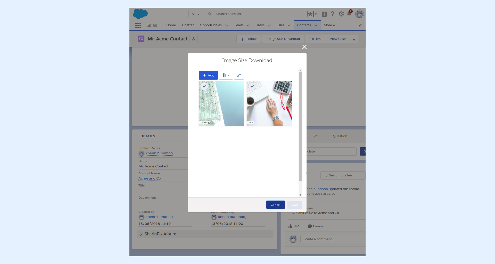
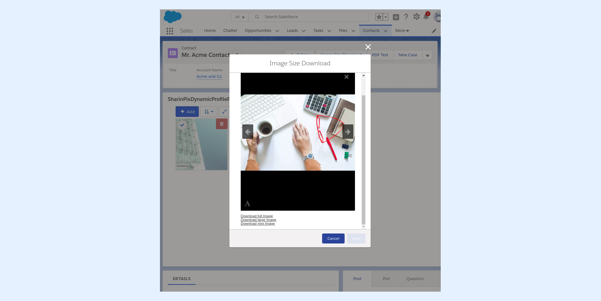

---
layout:
  width: default
  title:
    visible: true
  description:
    visible: true
  tableOfContents:
    visible: true
  outline:
    visible: true
  pagination:
    visible: true
  metadata:
    visible: false
  tags:
    visible: true
---

# Personalized image download for a specific size/format

The present article will show how it is possible to create custom hyperlinks that will download the same specific image but in different sizes, namely:

* **Full** corresponds to a size of **1920 x 1280** pixels.
* **Thumbnail** corresponds to a size of **200 x 200** pixels.
* **Mini** corresponds to a size of **100 x 100** pixels.


**Info:**&#x20;

The **Visualforce Page** and **Apex Class** used in the present article can be found on **GitHub** by following this link: [https://github.com/SharinPix/demo-apex/tree/personalized-size-download](https://github.com/SharinPix/demo-apex/tree/personalized-size-download)


* In the present context, the **Visualforce Page** is launched from a **custom lightning action** found on the record page of the Contact object. The screenshot below shows the custom action being executed.

* Upon clicking on an image's thumbnail, several hyperlinks appear. Each of these hyperlinks downloads the current image in a different size.

* Upon clicking on the **Download full Image** hyperlink, an image of size **1920 x 1280** pixels is downloaded.

* Upon clicking on the **Download thumbnail Image** hyperlink, an image of size **200 x 200** pixels is downloaded.

* Upon clicking on the **Download mini Image** hyperlink, an image of size **100 x 100** pixels is downloaded.

