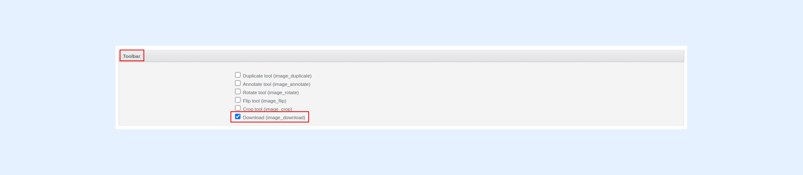

---
layout:
  width: default
  title:
    visible: true
  description:
    visible: true
  tableOfContents:
    visible: true
  outline:
    visible: true
  pagination:
    visible: true
  metadata:
    visible: false
  tags:
    visible: true
---

# Personalized image download with annotations (Admin-Oriented)

This article demonstrates how to download images with their corresponding annotations.

This feature can be applied:

1. [To all SharinPix albums by default using the SharinPix Global Settings.](personalized-image-download-with-annotations-admin-oriented.md#enabling-download-with-annotation-using-the-sharinpix-global-settings)
2. [On specific SharinPix albums using a SharinPix Permission record.](personalized-image-download-with-annotations-admin-oriented.md#enabling-download-with-annotation-using-a-sharinpix-permission-record)


The **Download types** parameter is used to enable download with annotations.

It is also used to download all transformations applied to an image, including watermarks and crops.

The following sections demonstrate how to set the _Download types_ parameter for downloads with image transformations.


## Enabling download with annotation using the SharinPix Global Settings

To enable image download with annotations **on all SharinPix albums by default**, follow the steps below:

1\. Access the [SharinPix Global Settings](../../getting-started-with-sharinpix/overview-of-the-sharinpix-administration-dashboard.md) by searching for **SharinPix Settings** using the **App Launcher**

2\. Next, click on the **Go to administration dashboard** button. This action will open the global settings.

 (1).png>)

3\. On the global settings, click on **Settings** on the top menu bar.

4\. Next, click on the button **Edit Organization**.

5\. Verify if the **Download (image\_download)** parameter in the **Toolbar** section has been set to true. This parameter enables image downloads.

6\. Scroll down to the **Download** section and tick the checkbox labeled _Full_. This parameter enables image download with annotations.

7\. Click on the button **Update Organization** at the bottom of the page to save the changes.

## Enabling download with annotation using a SharinPix Permission record

To enable image download with annotations **on specific SharinPix albums**, follow the steps below:

1\. Create a new [SharinPix Permission](../../access-and-security/sharinpix-permission-object-how-to-create-and-assign-custom-permission.md) or edit an existing one (if applicable).

2\. On the SharinPix Permission record, if the **Download (image\_download)** parameter in the **Tools** section has been set to true. This parameter enables image downloads.

3\. Next, scroll down to the **Menu** section and set the value of the parameter **Download types** to _full_. This parameter enables image download with annotations.

4\. Enable/disable the other parameters as desired.

5\. Click on the **Save** button when done.

## DEMO: How to download an image with annotations


**Note:**&#x20;

If you use a [custom permission object with the **download\_types** parameter](personalized-image-download-with-annotations-admin-oriented.md#enabling-download-with-annotation-using-a-sharinpix-permission-record), that permission must be assigned to an album to follow this demo.

You can follow [SharinPix Permission Object's article](../../access-and-security/sharinpix-permission-object-how-to-create-and-assign-custom-permission.md) on assigning a custom permission object to an album.


Once the **Download types** has been set to **full** using either of the above methods, open an image containing annotations or transformations in full view.

The example below depicts an image opened in full view along with its annotations.

To download the image, click on the download icon in the top menu bar.

The example below depicts the downloaded image with the annotations.

.jpg>)


**Note:**

In case the downloaded image does not contain all your modifications (crop, rotation, annotations, etc.), clearing your browser cache will help.

