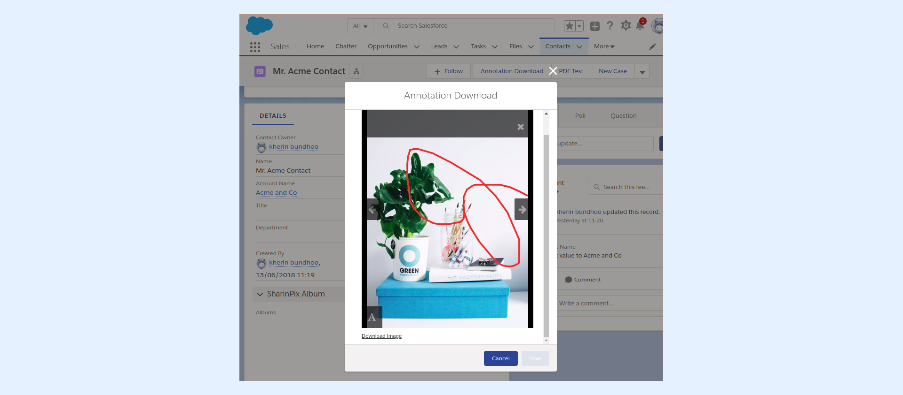

---
layout:
  width: default
  title:
    visible: true
  description:
    visible: true
  tableOfContents:
    visible: true
  outline:
    visible: true
  pagination:
    visible: true
  metadata:
    visible: false
  tags:
    visible: true
---

# Personalized image download with annotations (Developer-Oriented)

The present article will show how it is possible to create a custom hyperlink that will download the image along with its corresponding annotations.


**Info:**&#x20;

The **Visualforce Page** and **Apex Class**  used in the present article can be found on GitHub by following this link: [https://github.com/SharinPix/demo-apex/tree/custom-annotation-download](https://github.com/SharinPix/demo-apex/tree/custom-annotation-download)


* In the current context, the Visualforce Page is launched from a **custom Lightning action** found on the record page of the **Contact** object. The screenshot below describes the custom lightning action being executed.

<figure><figcaption></figcaption></figure>

* Upon clicking on an image's thumbnail, the **Download Image** hyperlink appears.

* When clicking on the **Download Image** hyperlink, the image that is currently being viewed is downloaded along with its annotations.


For the example to work, the image to be downloaded must already possess one or more annotations.

