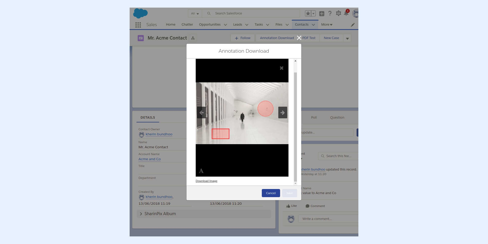

---
layout:
  width: default
  title:
    visible: true
  description:
    visible: true
  tableOfContents:
    visible: true
  outline:
    visible: true
  pagination:
    visible: true
  metadata:
    visible: false
  tags:
    visible: true
---

# Personalized image download without annotations

This article shows how it is possible to create a custom hyperlink that will download an image without its annotations.


**Info:**&#x20;

The **Visualforce Page** and **Apex Class** used in the present article can be found on GitHub by following this link: [https://github.com/SharinPix/demo-apex/tree/custom-footer-download](https://github.com/SharinPix/demo-apex/tree/custom-footer-download)


* In the present context, the **Visualforce Page** is launched from a **custom Lightning action** found on the record page of the Contact Object. The screenshot below shows the custom action being executed.

<figure><figcaption></figcaption></figure>

* Upon clicking on an image's thumbnail the **Download Image** hyperlink appears.

* When clicking on the **Download Image** hyperlink, the image that is currently being viewed is downloaded without its annotations.
* Hence, the resulting image downloaded is like the one shown below.

