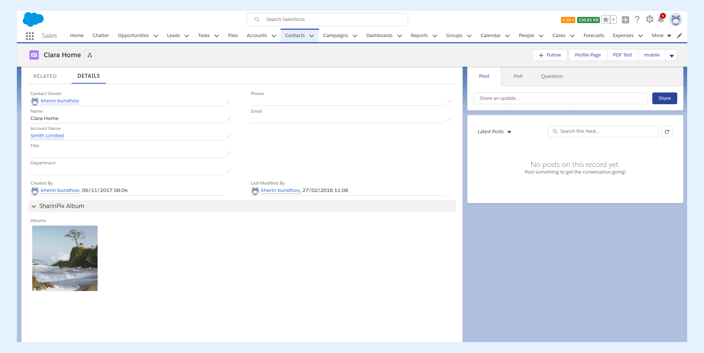
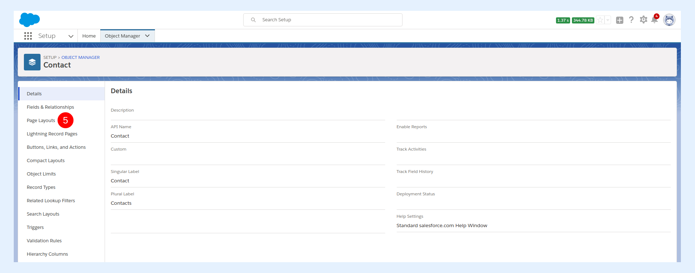
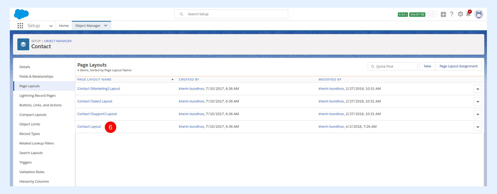
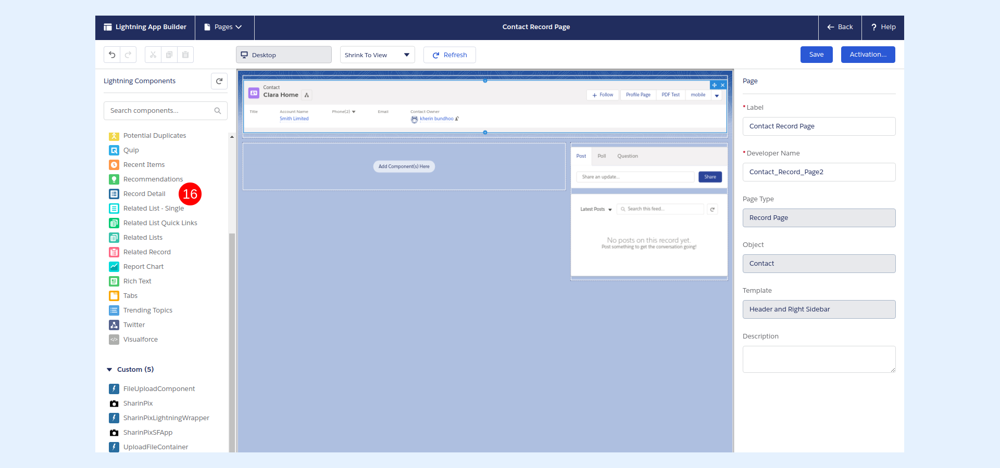
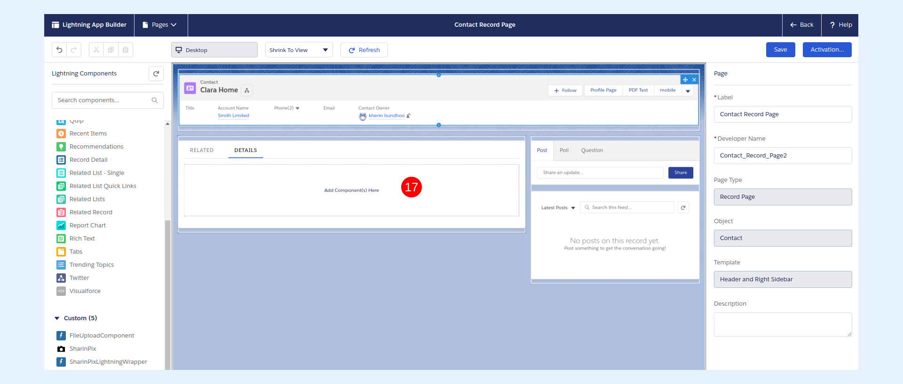
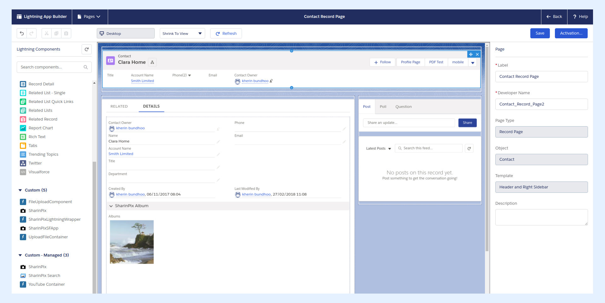

---
layout:
  width: default
  title:
    visible: true
  description:
    visible: true
  tableOfContents:
    visible: true
  outline:
    visible: true
  pagination:
    visible: true
  metadata:
    visible: false
  tags:
    visible: true
---

# Classic Look on a Lightning Page

There are quite a few steps for this workaround, when you have both Classic and Lightning Users, or when you are transitioning from Classic to Lightning and want to retain the look and feel of your familiar SharinPix.

We will walk through the steps for inserting SharinPix on a Lightning record's page-layout via either a Canvas app or a Visualforce component. The image below shows the expected final result when SharinPix has been added to the page-layout of the Contact object.


**Note:**

Since Canvas apps have some limitations such as limited number of calls within 24-hour, we strongly recommend the usage of the **SharinPix Visualforce Component** over the **SharinPix Canvas App** for implementations. The SharinPix Canvas App can still be used for testing purposes however.

For more information about Canvas app limitations, please refer to the following link:

[https://developer.salesforce.com/docs/atlas.en-us.platform\_connect.meta/platform\_connect/canvas\_framework\_limits.htm](https://developer.salesforce.com/docs/atlas.en-us.platform_connect.meta/platform_connect/canvas_framework_limits.htm)


* [Edit page-layout of record](classic-look-on-a-lightning-page.md#id-1.-edit-page-layout-of-record)
* [Drag and Drop Record Detail on the page of the record](classic-look-on-a-lightning-page.md#id-2.-drag-and-drop-record-detail-on-the-page-of-the-record)
* [Access the SharinPix Album features](classic-look-on-a-lightning-page.md#id-3.-access-the-sharinpix-album-features)

## 1. Edit page layout of record

From **Setup**,

3\. Click on **Object Manager.**

4\. Select the Object you wish to modify. In this context, we are going to use the **Contact** object as an example.

.png>)

5\. Select **Page Layouts.**

Select the relevant page-layout on which you intend to add SharinPix:

6\. For this example, we've picked the **Contact Layout.**

You will be redirected to the **Page Layout Editor.**

7\. From the **Component Types List,** select the type of component, containing SharinPix, that you wish to add to the page-layout.

 (1) (1).png>)

The component can be either:

8\. A canvas app.

 (1).png>)

9\. Or a Visualforce component. Instructions for configuring the VF component can be found [here.](/broken/spaces/2putv2B9RAZpym8daOH2/pages/RGusPjruaQUX3OFeLMVW)

 (1).png>)

In the present context, we used the **SharinPix Canvas** App named **Albums.** You can learn to set this up in the Getting Started Chapter.

 (2).png>)

Drag and drop the selected component into the desired region. In this case:

10\. The section **SharinPix Album** has been created on the page-layout with the following properties:

 (2).png>)

11\. The **Albums** canvas app has been dragged and dropped inside the **SharinPix Album section.**

 (3).png>)

12\. Edit the properties of the canvas app as shown below. (**Note:** Apply the same properties in the case of a Visualforce component)

 (3).png>)

13\. Click on **Save**, when you are done.

 (1).png>)

## 2. Drag and Drop Record Detail on the page of the record

Navigate to the Lightning App Builder on the **Contact** record (or in your case, the relevant object).

Start by opening a Contact Record. Then:

14\. Click on the **Setup** icon.

15\. Select **Edit Page.**

 (1).png>)

Drag and Drop the **Record Detail** component onto the desired region.(In this case, the dropping zone will be the **DETAILS** tab)

16\. Click and drag the **Record Detail** component from the **Lightning Components** list found on the right sidebar of the **Lightning App** **Builder.**

17\. Drop the **Record Detail component** onto the desired region.

From the previous image, it can be seen that the contents of the record detail reflects the contents of the Object's page-layout. Hence, the SharinPix **Albums** canvas app is indeed displayed inside the **SharinPix Albums** section.

Click on **Save** when you are done.

The SharinPix canvas app now appears on the record page of the **Contact** object.

 (2).png>)

## 3. Access the SharinPix Album features

In order to be able to access the features of the SharinPix Album embedded within the **Record Detail** component, you need to click upon the album which will open another view.

* Click on SharinPix Album.

 (2).png>)

* A new view loads.

 (2).png>)

* The SharinPix Album features are now accessible inside this view.

 (2).png>)


<mark style="color:red;">**Reminder**</mark>: This method has the ability to ensure consistent behavior across both the Classic and Lightning/Mobile Experience, for organizations that have users in both camps, or who have been in Classic and are now moving to Lightning.

However, the method as presented in this article is only truly optimized for the Classic Experience and does not represent the best way to add SharinPix for Lightning . A more adequate solution that fits the Lightning Experience can be found in the article [Using SharinPix on Lightning From a Record Page](using-on-a-lightning-record-page.md).

