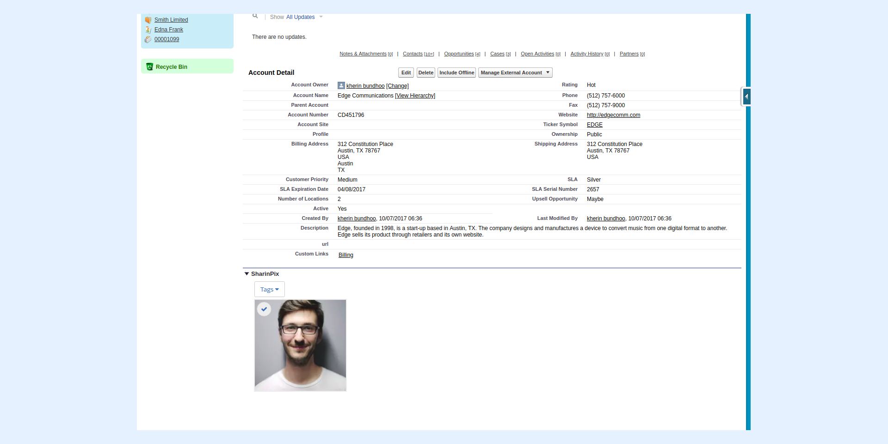

---
layout:
  width: default
  title:
    visible: true
  description:
    visible: true
  tableOfContents:
    visible: true
  outline:
    visible: true
  pagination:
    visible: true
  metadata:
    visible: false
  tags:
    visible: true
---

# Using on Classic with a Visualforce Page WITH an Apex Controller (Developer skills required)

In this article we will see how it is possible to reference the **SharinPix Visualforce Component** and **SharinPix Canvas App** inside a **Visualforce Page** while using an Apex Controller to define the abilities enabled inside the SharinPix Album.

* [1. SharinPix Visualforce Component](using-on-classic-with-a-visualforce-page-with-an-apex-controller-developer-skills-required.md#id-1.-sharinpix-visualforce-component)
* [2. SharinPix Canvas App](using-on-classic-with-a-visualforce-page-with-an-apex-controller-developer-skills-required.md#id-2.-sharinpix-canvas-app)

## 1. SharinPix Visualforce Component

In this section, we will see how it is possible to reference the **SharinPix Visualforce Component** inside a Visualforce Page while using an Apex Controller to define the SharinPix Abilities enabled or disabled on a SharinPix Album.

### Create Apex Controller

1. Click on  . Select **Developer Console**.
2. In the Developer Console, click on **File**.
3. Under **New**, select **Apex Class**.

 (1).png>)

3\. For the name of the Apex Controller Class, enter **SharinPixVFComponentCtrl.**

4\. Then paste the following code inside the newly-created **Apex Controller Class**.

```apex
global with sharing class SharinPixVFComponentCtrl {

    global String parameters {get;set;}

    global SharinPixVFComponentCtrl(ApexPages.StandardController stdCtrl) {
        Id albumId = stdCtrl.getId();

        Map<String, Object> params = new Map<String, Object> {
            'abilities' => new Map<String, Object> {
                albumId => new Map<String, Object> {
                    'Access' => new Map<String, Object> {
                        'see' => true,
                        'image_list' => true,
                        'image_upload' => true,
                        'image_delete' => true
                    }
                }
            },
            'Id' => albumId
        };
        parameters = JSON.serialize(params);
    }
}
```

5\. **Save** the file when you're done.

### SharinPix Visualforce Component

It is possible to reference the **SharinPix Visualforce Component** within a **Visualforce Page** by following the steps below.

1\. Click on  . Select **Developer Console**.

Once inside the **Developer Console:**

2\. Under **File**, select **New,** then select **Visualforce Page**.

 (1).png>)

3\. For the name of the Visualforce Page, enter **SharinPixVisualforceComponentPage.**

4\. Paste the following code inside the **Visualforce Page.**

```html
<apex:page StandardController="Account" extensions="SharinPixVFComponentCtrl">
    <sharinpix:SharinPix height="100%" parameters="{! parameters }" enableCustomData="true" componentId="component1"></sharinpix:SharinPix>
</apex:page>
```

5. **Save** the changes when you're done.

As demonstrated in the above code snippet, the Standard Controller used is the **Account** object while the Apex extension class used is the **SharinPixVFComponentCtrl**.

The merge field **{! parameters }** is used to reference the **parameters** variable found in the Apex Class **SharinPixVFComponentCtrl**. This variable is used to define the SharinPix Abilities which are enabled or disabled on the SharinPix album.

The **enableCustomData="true"** field is utilized to allow the display of a custom label on the image within an album. For more information on custom labels, please refer to this documentation: [Thumbnail View - Display infos](../user-interface/thumbnail-view-display-infos.md)


The following section will show the steps on how to add the Visualforce Page to the page-layout of the Account Object.


* Go to a record of any **Account** Object.
* Select **Edit Object**.
* Go to **Page Layout** then select **Visualforce Pages** as shown in the screenshot below.

 (2).png>)

* Drag and Drop the Visualforce Page implemented in the previous steps (in this case **SharinPixVisualforceComponentPage**) onto the desired region of the record page-layout.

The screenshot below demonstrates how the SharinPix Album is displayed on the record page after adding the **Visualforce Page** to the page layout of the Account Object.

 (2).png>)


**Tip:**

The SharinPix Visualforce component can be modified in such a way to only display an upload button.

For such implementation, refer to the article that follows:

[Implement a SharinPix upload button in a Visualforce page](../../cookbook/implement-a-sharinpix-upload-button-in-a-visualforce-page.md)


## 2. SharinPix Canvas App

In this section, we will be shown how it is possible to reference the SharinPix Canvas App inside a Visualforce Page while using an Apex Controller to define the SharinPix Abilities enabled or disabled on a SharinPix Album.

* Click on  . Select **Developer Console**.
* In the **File** menu, select **New** then **Visualforce Page.**
* Give a name to the Visualforce Page (in this case, it is called **SharinPixCanvasPage**)

 (2).png>)

* Paste the following code snippet inside the Visualforce Page:

```html
<apex:page StandardController="Account" extensions="SharinPixCanvasCtrl">
    <apex:canvasApp developerName="Albums" namespacePrefix="SharinPix" parameters="{! parameters }"/>
</apex:page>
```

* **Save** the changes when you're done.
* The **Standard Controller** for the Visualforce Page is **Account** since the Visualforce Page is intended to be added to the page-layout of the Account Object.
* The **extensions** attributes take as value the name of the Apex Controller **SharinPixCanvasCtrl**, from which we can reference a variable defining the SharinPix Abilities allowed on the SharinPix Album.
* The **developerName** of the **canvasApp** element is **Albums,** which comes along when you installed the SharinPix Package.
* The **namespacePrefix** is **SharinPix.**
* The attribute **parameters** take as value a merge-field, **{! parameters }**, which references the variable **parameters** which defines the SharinPix Abilities allowed or denied on a SharinPix Album.

The code snippet below shows the implementation of the Apex Controller for the Visualforce Page:

* In the Developer Console, select **New** from the **File** menu, then click on **Apex Class.**


* Enter a name for the Apex class. In this case, it is **SharinPixCanvasCtrl**.
* Paste the code snippet below into the newly-created Apex class with the corresponding class name and constructor signature.

```apex
global with sharing class SharinPixCanvasCtrl {

    global String parameters {get;set;}

    global SharinPixCanvasCtrl(ApexPages.StandardController stdCtrl) {
        Id albumId = stdCtrl.getId();

        Map<String, Object> params = new Map<String, Object> {
            'abilities' => new Map<String, Object> {
                albumId => new Map<String, Object> {
                    'Access' => new Map<String, Object> {
                        'see' => true,
                        'image_list' => true,
                        'image_upload' => true,
                        'image_delete' => true
                    }
                }
            }
        };
        parameters = JSON.serialize(params);
    }
}
```

* **Save** the changes when you're done.

The following code snippet shows how the SharinPix abilities are defined.

```apex
Map<String, Object> params = new Map<String, Object> {
            'abilities' => new Map<String, Object> {
                albumId => new Map<String, Object> {
                    'Access' => new Map<String, Object> {
                        'see' => true,
                        'image_list' => true,
                        'image_upload' => true,
                        'image_delete' => true
                    }
                }
            }
        };
```

The SharinPix abilities are defined by a Map data structure containing the name of the abilities as keys. These keys have values either true or false corresponding to whether they are enabled or disabled respectively.

The remaining steps demonstrate how to add the newly-created Visualfroce page onto the Page Layout of the Account Object.

* Access any record of type **Account.**
* Click on **Edit Layout.**
* Once on the page-layout editor, select **Visualforce Pages.**


* Drag and Drop the Visualforce page implemented onto the desired area on the page-layout of the Account object.
* Click **Save** when done.

The screenshot below demonstrates how the SharinPix Album is displayed on the record page after adding the **Visualforce Page** to the page layout of the Account Object.


