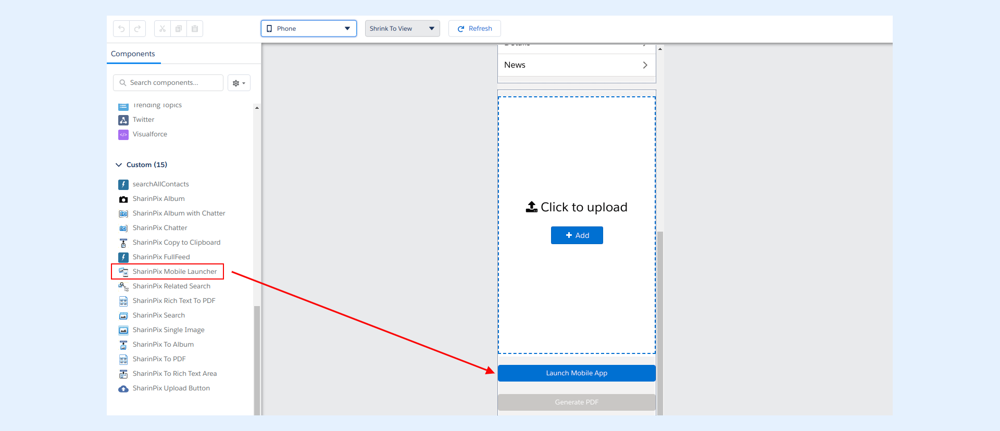

---
layout:
  width: default
  title:
    visible: true
  description:
    visible: true
  tableOfContents:
    visible: true
  outline:
    visible: true
  pagination:
    visible: true
  metadata:
    visible: false
  tags:
    visible: true
---

# Using on Lightning with "SharinPix Mobile Launcher" Lightning Component (Admin Friendly)

SharinPix uses the **SharinPix Mobile Launcher** component to launch the SharinPix mobile app from the Salesforce mobile app.

In this article, you will learn how to use the SharinPix Mobile Launcher.

## How to access the SharinPix Mobile Launcher component?

* Access the record page of any Salesforce object and open the **Lightning App Builder**. In this case, it is the **Account** object.
* To preview the behavior on a mobile device, switch from the **Desktop** view to the **Phone** view as shown below:

 (1).png>)

* The **SharinPix Mobile Launcher** component is accessible in the **Lightning App Builder** under the **Custom Managed** section as depicted in the screenshot below:

 (1).png>)

* Drag and drop the component onto the preview pane.

SharinPix also provides the possibility of applying different settings on the Mobile Launcher component. These settings can be used to modify the behavior of the SharinPix mobile app when launched.

The Mobile Launcher settings are available in the right pane of the Lightning App Builder. The picture below shows how the settings are displayed:

 (1).png>)

The SharinPix Mobile Launcher settings are:

* **Button label:** Allows you to set the component's label. By default it is set as "**Launch Mobile App**".
* **Album ID:** refers to the ID of the album in which images will be uploaded. You can leave this field blank if you intent to upload images for the current record.
* **Mode:** Using this option in **camera** mode will directly open the camera upon launching the SharinPix app. Using it in **roll** mode will force the SharinPix app to open the roll/gallery.
* **Allow images from roll/gallery:** To allow image upload from roll/gallery.
* **Confirm image taken:** Enables the option to confirm an image captured before the upload.
* **Camera flash:** To enable/disable the camera flash.
* **Tags:** allows the setting up of a tag list that will be made available when capturing photos.
* **Auto tags:** allows you to set an auto tag.
* **Default tags:** allows you to set a default tag.
* **Checklist:** allows you to set a checklist.
* **Skip job association screen:** To enable/disable the job association screen.
* **Show overlay:** Use selected image from a SharinPix Album as overlay. The component will be disabled if no image is selected.
* **Custom parameters:** allows addition of user-defined parameters to the SharinPix app launcher URL.
* **Component Id:** Component ID to be matched by SharinPix components on the page. This is any text which will be common between this component and the SharinPix album component. It allows for matching components to communicate in case some components need to be repeated on the same record page. Example: Set 'sharinpix-1' as Component Id here and also on SharinPix Album component's Component ID field.


**Note:**

For the **Tags** , **Auto tags** , **Default tags,** and **Checklist** settings, the semi-colon symbol ";" is to be used to separate the tag values.



More information about some of the setting options are available in the following article:

[SharinPix mobile App : Deeplink syntax](../../mobile-app/sharinpix-mobile-app-deeplink-syntax.md)


When finished, click **Save** and **Activation** buttons.

## Launch the SharinPix mobile app using SharinPix Mobile Launcher

You can now access the SharinPix Mobile Launcher from the Salesforce mobile app. To do so, follow the steps below:

* Open the Salesforce app
* Go to an Account and select the Mobile Launcher component labelled as (**Launch Mobile App**).

.png>)

* This action will launch the SharinPix mobile app.

 (1).png>)


For more information about the **SharinPix Mobile Launcher** syntax, refer to the following article:

[Using the Mobile Launcher Visualforce Component](using-the-mobile-launcher-visualforce-component.md)

