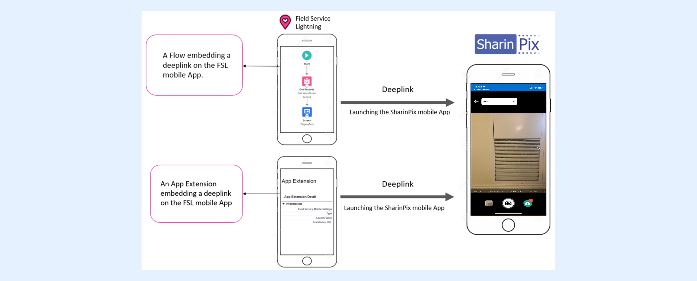

---
layout:
  width: default
  title:
    visible: true
  description:
    visible: true
  tableOfContents:
    visible: true
  outline:
    visible: true
  pagination:
    visible: true
  metadata:
    visible: false
  tags:
    visible: true
---

# Using on Salesforce Field Service App (Field Service Lightning)


**Information:**

Salesforce Field Service (SFS) was formerly known as Field Service Lightning (FSL).


When it comes to image management, the SFS mobile App provides limited integration, especially when used offline.

SharinPix has a mobile application that can address such limitations. Using SharinPix alongside the SFS Mobile App enables a frictionless experience for the mobile workforce facing situations where they are required to perform their field service duties even without access to the internet.

The SharinPix mobile App can be integrated with the SFS mobile App through two possibilities:

1. **AppExtension** using a deeplink
2. A **Flow** that embeds a deeplink



## Integration of SharinPix with SFS

### How is it done?

To launch the SharinPix mobile App from the SFS App, SharinPix uses deeplink.

Deeplink is simply an URL that indicates the location where the images captured by the user will be uploaded. This URL includes a token relating to the record on which the images will be uploaded.

The example below demonstrates the deeplink syntax used to upload images:

```
sharinpix://upload?token=token_value
```

The SharinPix deeplink URL above can be integrated with a Flow or an App Extension. Upon selecting the same URL in the SFS App, the SharinPix mobile App will be launched.


**Tips:**

For more information about the deeplink syntax, refer to the following article:

[SharinPix mobile App: deeplink syntax](../../mobile-app/sharinpix-mobile-app-deeplink-syntax.md)

In this article, you will learn about all the options you can add to the deeplink to change the behavior of the SharinPix mobile app and have different options to offer to your users. One behavior would be to return automatically to the field service app after submission; please follow [this article](../../mobile-app/sharinpix-mobile-app-deeplink-syntax.md#ret_url) to configure this functionality.


### Implementation

For your first implementation, we suggest creating an App Extension embedding a deeplink URL, but before that, a token needs to be generated at the record level in advance. One easy way to generate mobile upload tokens is by using a **Flow**.


**Set-Up:**

To generate mobile upload tokens automatically using a Flow, refer to the following article:

[SharinPix automatic mobile upload token generation (Admin Friendly)](../../mobile-app/sharinpix-automatic-mobile-upload-token-generation-admin-friendly.md)


In short, to integrate the SharinPix App with the SFS App using an App Extension, you need to:

1. Generate the token
2. Integrate the token generated in a deeplink
3. Use the deeplink in an App Extension


For more information about how to use a deeplink URL in an App Extension, refer to the following article: [Integration of SharinPix App with SFS (FSL) App using App Extension](../../integrations/salesforce-field-service/integration-of-sharinpix-app-with-sfs-fsl-app-using-app-extension.md)



**Tip**:

* As mentioned earlier, the SharinPix App can also be integrated with the SFS App using a **Flow**. For more information about how this is performed, refer to the following article:\
  [Integration of SharinPix App with SFS (FSL) App using Flows](../../integrations/salesforce-field-service/integration-of-sharinpix-app-with-sfs-fsl-app-using-flows.md)
*   SharinPix Images can also be added to SFS Service Reports. How more information about how this is done, please refer to the following article:

    [Display Images in Service Report (Salesforce Field Service / FSL)](../../integrations/salesforce-field-service/display-images-in-service-report-salesforce-field-service-fsl.md)

