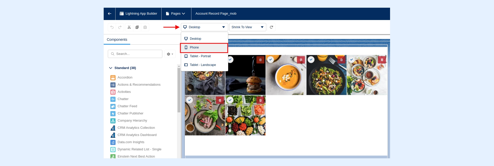
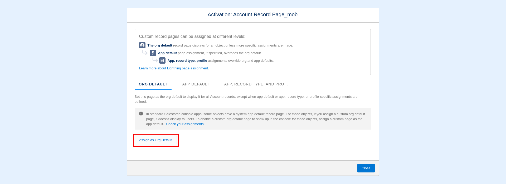

---
layout:
  width: default
  title:
    visible: true
  description:
    visible: true
  tableOfContents:
    visible: true
  outline:
    visible: true
  pagination:
    visible: true
  metadata:
    visible: false
  tags:
    visible: true
---

# Using on Salesforce Mobile Apps

The following article demonstrates how to:

1. [Integrate the SharinPix Album component in the Salesaforce mobile app.](using-on-salesforce-mobile-apps.md#integration-of-the-sharinpix-album-component-in-the-salesforce-mobile-app)
2. [Launch the SharinPix mobile app from the Salesforce mobile app.](using-on-salesforce-mobile-apps.md#launching-the-sharinpix-mobile-app-from-the-salesforce-mobile-app)
3. [Launch the SharinPix mobile app from the Salesforce Field Service mobile app.](using-on-salesforce-mobile-apps.md#launching-the-sharinpix-mobile-app-from-the-salesforce-field-service-mobile-app)


**Note:**

This article also outlines [old-fashioned methods](using-on-salesforce-mobile-apps.md#old-fashioned-methods) used by SharinPix to perform the above actions .

Kindly note that these methods are deprecated and are only for your reference if you are still using old SharinPix implementations.

_**For new implementations, we strongly advise to stick with the above methods (highlighted in the blue section).**_


## Integration of the SharinPix Album component in the Salesforce mobile app

Integrating a [SharinPix Album](../../lightning-web-component/sharinpix-album.md) component in the SF mobile app allows mobile users to view, upload and manipulate images available on records.

To configure the above, follow the steps below:

1. From the desired record page, open the the Lightning App Builder.
2. From the top menu, click on the dropdown button labeled as _Desktop_ and select _Phone_ to preview how that record page on the SF app:

 (2).png>)

3. Next, drag and drop the SharinPix Album component onto your page layout. For more information on how to configure the component's parameter, kindly refer to this link: [Lightning Component Parameters](../../lightning-web-component/sharinpix-album.md#lightning-component-parameters)

.png>)

**Note:** _You can also embed the component in a Tab as demonstrated below:_

 (1).png>)

.png>)

4. Click on the _Activation_ _button_ located on the top right corner of the screen:

.png>)

5. Click on the _Assign_ as Org Default _button_:

.png>)

6. Ensure that either the _Phone_ or _Desktop and phone_ option is activated to apply the changes to the SF mobile app:

.png>)

7. Then, click on _Next_ -> _Save_.
8. To complete, click on the _Save_ button located on the top-right corner.

## Launching the SharinPix mobile app from the Salesforce mobile app

The SharinPix mobile app can be used to capture photos. The [SharinPix Mobile Launcher](../../lightning-web-component/sharinpix-mobile-launcher.md) component can be used to launch the SharinPix mobile app from the Salesforce mobile app.


**Tip:**\
For more infomation about the SharinPix mobile app features, refer to the following documentation: [SharinPix Mobile App](../../#mobile-app)


To configure the SharinPix Mobile Launcher component, follow the steps below:

1. From the desired record page, open the the Lightning App Builder.
2. From the top menu, click on the dropdown button labeled as _Desktop_ and select _Phone_ to preview how that record page on the SF app:



3. Next, drag and drop the SharinPix Mobile Launcher component onto your page layout. For more information on how to configure the component's parameter, kindly refer to this link: [Lightning Component Parameters](../../lightning-web-component/sharinpix-mobile-launcher.md#lightning-component-parameters).
4. Click on the _Activation button_ located on the top right corner of the screen:

.png>)

5. Click on the _Assign_ as Org Default _button_:



6. Ensure that the either the _Phone_ or _Desktop and phone_ option is activated to apply the changes to the SF mobile app:


7. Then, click on _Next_ -> _Save_.
8. To complete, click on the _Save_ button located on the top-right corner.

## Launching the SharinPix mobile app from the Salesforce Field Service mobile app

The SharinPix mobile app can be launched from the SFS either using **App Extensions** or **Field Service Mobile Flows**.

To configure an App Extension to launch the SharinPix mobile app, refer to the following article: [Integration of SharinPix App with SFS (FSL) App using App Extension](../../integrations/salesforce-field-service/integration-of-sharinpix-app-with-sfs-fsl-app-using-app-extension.md)

To configure a Field Service Mobile Flow to launch the SharinPix mobile app, refer to the following article: [Integration of SharinPix App with SFS (FSL) App using Flows](../../integrations/salesforce-field-service/integration-of-sharinpix-app-with-sfs-fsl-app-using-flows.md)

## Old-Fashioned Methods

This section highlights the old-fashioned ways of:


This section highlights the old-fashioned ways of:

1. [Integrating of the SharinPix Album component in the Salesforce mobile app using](https://docs.sharinpix.com/m/documentation/l/890535-using-on-salesforce-mobile-apps#integration-of-the-sharinpix-album-component-in-the-salesforce-mobile-app_1)
   * Canvas App on a detail page
   * Lightning action
   * VisualFlow
2. [Launch the SharinPix mobile app from the Salesforce mobile app using](https://docs.sharinpix.com/m/documentation/l/890535-using-on-salesforce-mobile-apps#launching-sharinpix-mobile-app-from-salesforce-mobile-app-using-visualforce-page)
   * Using a Visualforce page&#x20;
   * Formula fields
   * Lightning Action and Visualforce page


### Integration of the SharinPix Album component in the Salesforce mobile app

1\. Addition of the SharinPix Canvas App

The SharinPix package includes the **SharinPix Canvas App** that can be added to a record page. The screenshot below depicts the SharinPix Canvas App.

.png>)


**Tip:**

For more information on how to add the **SharinPix Canvas App** to a record page, refer to the following article: [Basic Setup - Step 3a](https://app.gitbook.com/s/2putv2B9RAZpym8daOH2/basic-setup/basic-setup-step-3a-for-classic-users-setup-sharinpix-for-salesforce-classic)


2\. Opening SharinPix Album with Lightning action

SharinPix Album components can be embedded in a Lightning Actions within the Salesforce mobile app as demonstrated below:

.png>)

.png>)


**Tip:**

For more information on how to embed a SharinPix Album in Lightning Actions, refer to the following article: [Integrating SharinPix Album with Lightning Action](using-on-lightning-with-sharinpix-album-lightning-action.md)


### Launch the SharinPix mobile app from the Salesforce mobile app

1\. Launching SharinPix Mobile App from Salesforce Mobile App using Visualforce page

It is possible to construct a Visualforce page that opens open the SharinPix mobile app using the **Mobile Launcher Visualforce component**. Such configuration is explained in the following article: [Using the Mobile Launcher Visualforce Component](using-the-mobile-launcher-visualforce-component.md).

The Mobile Launcher Visualforce component is depicted in the screenshot below:

.png>)

2\. Launching SharinPix Mobile App from Salesforce Mobile App using Formula Fields

The SharinPix mobile app can be launced from the SF app using formula fields. Such configuration includes a formula field of type text embedding the **HYPERLINK** function. The formula field should point to a SharinPix mobile app URL as demonstrated below:

```
HYPERLINK('sharinpix://upload?token=' & SharinPix_Token_Part_1__c & SharinPix_Token_Part_2__c & SharinPix_Token_Part_3__c , 'Click to Open Camera', '_blank')
```


**Tip:**

SharinPix native mobile app integrates with Salesforce mobile using deeplink (URL starting with Sharinpix://). For more information on SharinPix deeplinks, refer to the following article:

[SharinPix deeplink syntax here](../../mobile-app/sharinpix-mobile-app-deeplink-syntax.md).


The screenshot below depicts a formula field, **Launch SharinPix Mobile App** , embedding a SharinPix mobile app URL:

.png>)

Upon clicking on this **Open Camera App** field, the SharinPix mobile app is launched.

3\. Launching SharinPix Mobile App from Salesforce Mobile App with Lightning Action and Visualforce Page

The SharinPix Mobile app can aslo be launched from the Salesforce mobile application using Lightning Actions as depicted below:

.png>)

The above Lightning Action embeds a custom Visualforce page which contains **SharinPix URLs** used to launch the SharinPix app:

.png>)

Each **SharinPix URL** contains a different set of parameters which will launch the **SharinPix Mobile Application** into different modes.

For instance, clicking on **Take Pictures with Camera** automatically launches the **SharinPix Mobile Application** in Camera Mode.


**Tip:**

For more information on how to constructs such Visualforce page, refer to the following article: [Integrating SharinPix with Salesforce Mobile App using Lightning Action and Visualforce](../../cookbook/integrating-sharinpix-with-salesforce-mobile-app-using-lightning-action-and-visualforce.md)

