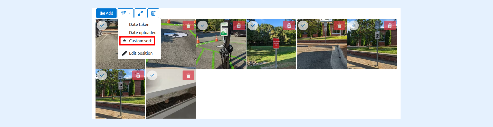
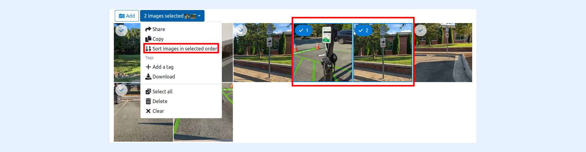
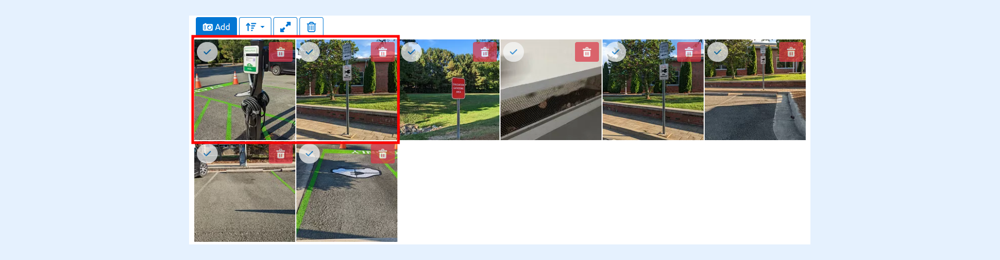
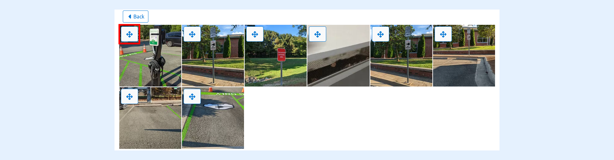
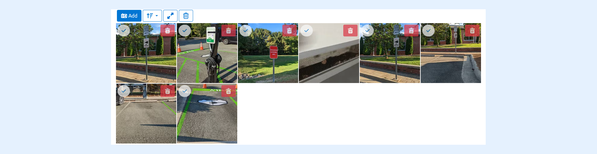
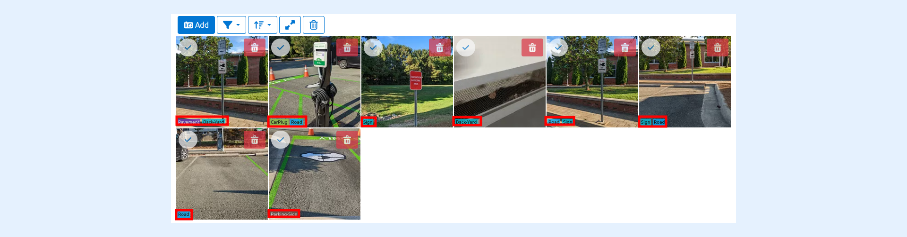

---
layout:
  width: default
  title:
    visible: true
  description:
    visible: true
  tableOfContents:
    visible: true
  outline:
    visible: true
  pagination:
    visible: true
  metadata:
    visible: false
  tags:
    visible: true
---

# Custom Sort Action in Thumbnail Menu

This article demonstrates how to sort images in an album using custom sorting based on the order the images were selected.

To enable this feature you can:

1. [Either Enable "Enabled sorting images via selection" using a SharinPix Permission for specific albums.](custom-sort-action-in-thumbnail-menu.md#enabling-sorting-images-via-selection-using-a-sharinpix-permission)
2. [Or Add the "Enabled sorting images via selection" default in your organization to all your album.](custom-sort-action-in-thumbnail-menu.md#enabling-sorting-images-via-selection-using-sharinpix-global-setting)


**Warning:**

If the album contains more than 200 images, sorting cannot be performed.


## Enabling sorting images via selection using a SharinPix Permission

To enable "**Enabled sorting images via selection** " _on specific albums_, follow the steps below:

1. Create a new [SharinPix Permission](../../access-and-security/sharinpix-permission-object-how-to-create-and-assign-custom-permission.md) or edit an existing one (if applicable).
2. On the SharinPix Permission record, in the sort section check "**Enabled sorting images via selection** " and the sort field should be **Custom Sort**.

3\. Click on the **Save** button when done.


**Tip:**

For more information on how to assign the SharinPix Permission to albums, refer to this article: [SharinPix Permission object](../../access-and-security/sharinpix-permission-object-how-to-create-and-assign-custom-permission.md)


## Enabling sorting images via selection using SharinPix Global Setting

To enable "**Enabled sorting images via selection** " _on all SharinPix albums by default_, follow the steps below:

1\. Access the [SharinPix Global Settings](../../getting-started-with-sharinpix/overview-of-the-sharinpix-administration-dashboard.md) by searching for **SharinPix Settings** using the **App Launcher**.

2\. Next, click on the **Go to administration dashboard** button. This action will open the global settings.

<figure><figcaption></figcaption></figure>

3\. On the global settings, click on **Settings** on the top menu bar.

4\. Next, click on the button **Edit Organization**.

5\. Enable "**Enabled sorting images via selection**" and make sure you are using **Custom Sort** in the sort section.

.png>)

6\. Click on the button **Update Organization** at the bottom of the page to save the changes.


**Note:**

In the sort field, you should choose "**Custom Sort**" as depicted below.



**Tip:**

You can get more information on the Thumbnail custom sort [here](../user-interface/thumbnail-view-sort.md).


## Demo: How to use Sort images in selected order.

Steps to sort images in selected orders:

* Select your images (**The way you want to order them**).
* Click on the dropdown menu and select "**Sort Images in the selected order** ".

* The Image will automatically be arranged in the order you sorted them.

After you click on "**Sort Images in the selected order**", you can further sort the images in any order you want.

After you have completed your changes, click on the back button, and you will be able to view all the images as you have sorted them.

## Sort images by tags

If you have tagged images, click on the tag on the image to filter the album with the selected tag.

You can perform a tag sorting. You have to click on the tag on which you to see all the images.

In the screenshot below, a filter on the tag "**Road**" was performed.

