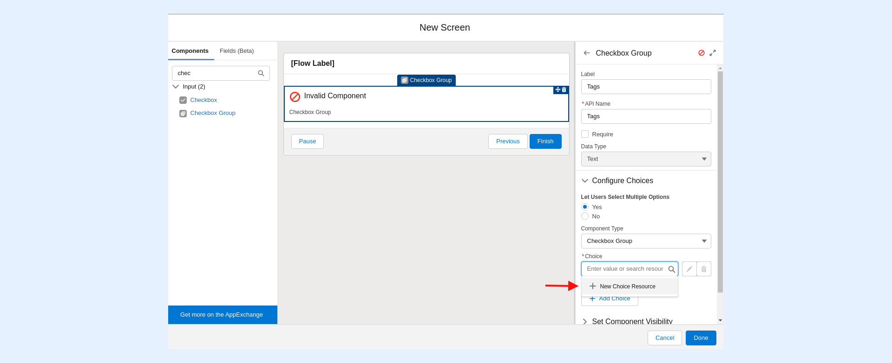
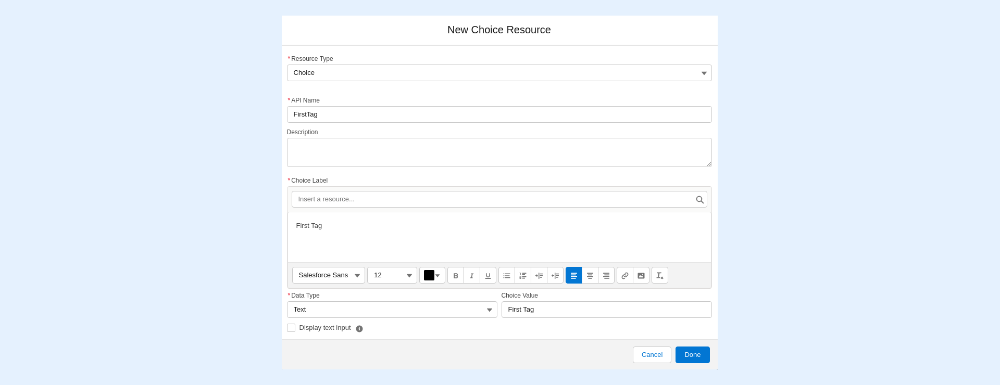
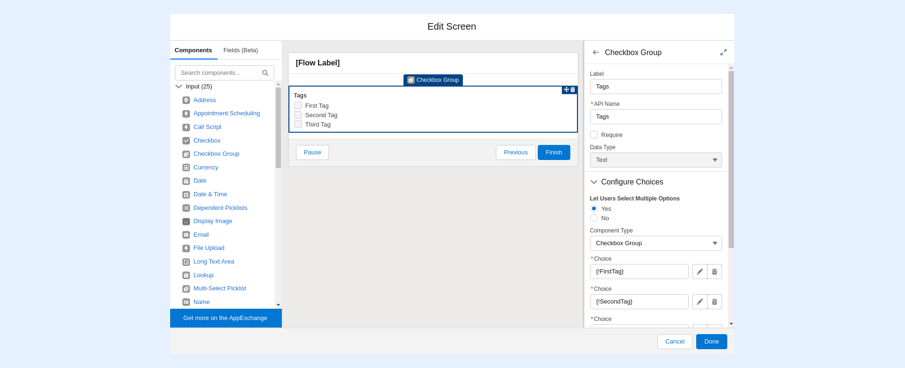
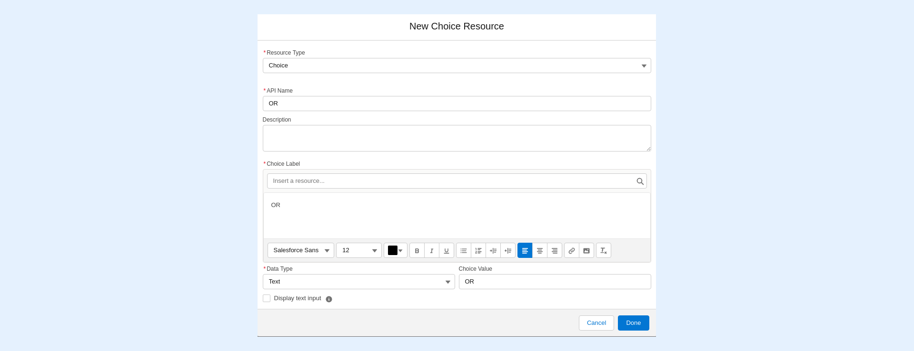
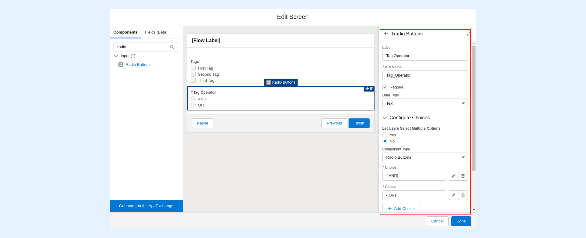
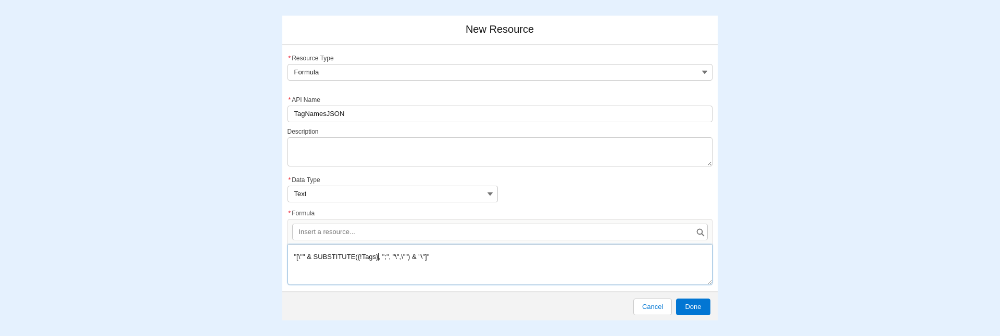
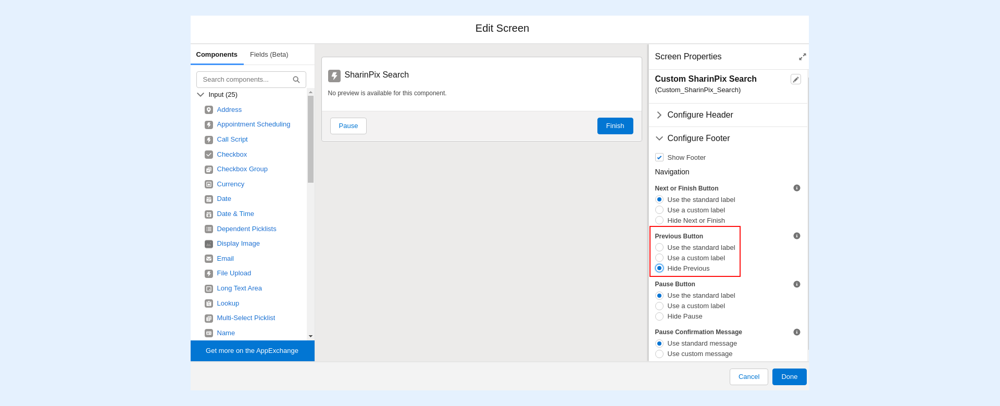

---
layout:
  width: default
  title:
    visible: true
  description:
    visible: true
  tableOfContents:
    visible: true
  outline:
    visible: true
  pagination:
    visible: true
  metadata:
    visible: false
  tags:
    visible: true
---

# Using your personalized Search in a Salesforce Flow (Admin-Oriented)

This article demonstrates how to personalize the [SharinPix Search](../../lightning-web-component/sharinpix-search.md) component in Salesforce Flows.

In the following setions, we will set up a Salesforce Flow that will allow user to:

1. Make use of the SharinPix Search component to search photos uploaded to records returned by a Salesforce report
2. Filter the SharinPix Search by tag names
3. Apply a tag operator on the SharinPix Search

## Setting up the Flow

To create the flow, follow the steps below:

* Go to Setup then type Flow in the Quick Find box. Under Process Automation, select **Flows**.
* Click on New Flow. You will be directed to the Flow Designer.
* Click on **Screen** **Flow**. Then click on **Create**.
* Add a new **Screen** on the canvas:

 (4).png>)

* Enter **Search Parameter** as the _Screen_ label.

### Step 1: Configuration of Tag Name Parameter

In this section, we will add a **Checkbox Group** component to filter our custom search by tag names.

* First, drag and drop a **Checkbox Group** component on the newly-added Screen. Enter the following details for the new Checkbox Group:
  * Label: **Tags**
  * _Let Users Select Multiple Options_ parameter: **Yes**
  * _Component Type_ parameter: **Checkbox Group**
  * In the \_Choice \_section, add your desired tag options by clicking on New Choice Resource as demonstrated below:

* For the new choice resource, enter the following details:
  * Resource Type: **Choice**
  * API Name (enter your desired API Name): for example, **FirstTag**
  * Choice Label (enter your desired Choice Label): for example, **First Tag**
  * Data Type: **Text**
  * Choice Value (enter your desired Choice Value): for example, **First Tag**
  * Click**Done** to save.

* Next, click on _Add Choice_ to add and repeat the _New Choice Resource_ steps to create more tags choices. For our demo, we created two more tag choices: **Second Tag** and **Third Tag**.

### Step 2: Configuration of Tag Operator Parameter

In this section, we will add a **Radio Buttons** component to apply a tag operator to our custom search.

_Note: Tag operators are used to specify the operator when applying multiple tags to filter the search. The values available for this field are **OR** and **AND**. When using **OR** , the search will return the images having any of the tags specified whereas using **AND** in the search will return images having all of the tags specified._

First, drag and drop a **Radio Buttons** component on the Screen. Enter the following details for the new Radio Buttons:

* Label: **Tag Operator**
* Check the _Require_ parameter.
* _Let Users Select Multiple Options_ parameter: **No**
* _Component Type_ : **Radio Buttons**
* In the _Choice section_, add the **AND** tag operator by clicking on _New Choice Resource._
* For the new choice resource, enter the following details:
  * Resource Type: **Choice**
  * API Name: **AND**
  * Choice Label: **AND**
  * Data Type: **Text**
  * Choice Value: **AND**
  * Click **Done** to save.
* Next, create another _New Choice Resource_ , to create the **OR** tag operator:
  * Resource Type: **Choice**
  * API Name: **OR**
  * Choice Label: **OR**
  * Data Type: **Text**
  * Choice Value: **OR**
  * Click **Done** to save.

* Click on **Done** to save the Screen when finished.

### Step 3: Configure the Tag Names Format

The SharinPix Search component only accepts the tags to be applied to the search in JSON format, for example, **\["First Tag", "Second Tag", "Third Tag"]**.

The tag string returned by the _Checkbox Group_ component within the Flow is as follows: **First Tag, Second Tag, Third Tag**.

Therefore a _Formula_ variable is needed to convert the value returned by the _Checkbox Component_ into the required JSON format used by the SharinPix Search component, that is, from **First Tag, Second Tag, Third Tag to \["First Tag", "Second Tag", "Third Tag"]**.

To do so, follow the steps below:

* From the **Manager** section, click on **New Resource**. For the newly-created resource, enter the following details:
  * Resource Type: **Formula**
  * API Name: **TagNamesJSON**
  * Data Type: **Text**
  * In the Formula section, enter the following formula:

<mark style="color:red;">`"[\"" & SUBSTITUTE({!Tags}, ";", "\",\"") & "\"]"`</mark>

The above formula convert the tag string returned by the _Checkbox Group_ (stored in the **Tags** variable) into the required JSON format.

* Click on **Done** to save.

### Step 4: Addition and Configuration of the SharinPix Search Component

Once your tag names and tag operator are set up, go ahead and add a SharinPix Search component onto your Flow.

To do so, follow the steps below:

* Add a new **Screen** component on the canvas and enter **Custom SharinPix Search** as the Screen label.
* Next, drag and drop a **SharinPix Search** component on the Screen.
* For the SharinPix Search component, enter the following details:
  * API Name: **SharinPix\_Search**
  * In the _Report ID_ parameter, enter your desired report ID.
  * In the _Tag Names (JSON)_ paramater, enter the Formula variable, that is, **TagNamesJSON**.
  * In the _Tag Operator_ parameter, enter the tag operato variable, that is, **Tag\_Operator**.


**Note:**

The SharinPix Search component is available on the Salesforce Flow in SharinPix package versions **1.238** and higher.

If the SharinPix Search component is not available in the Screen's components list, kindly upgrade your SharinPix package. For more information on how to upgrade your SharinPix package, click [here](https://app.gitbook.com/s/i8tH1o5AHthxksYgF6ij/how-to-update-sharinpix-package-from-the-appexchange) or contact Salesforce support at **sharinpix@support.com**.


* Next, click on _Configure Footer_ and check the **Hide Previous** in the _Previous Button_ section to ensure proper refresh of the search component:

Save your Flow when done and add the same on your desired record page layout.


**Tip:**

The custom SharinPix Search may be personalized as desired within Salesforce Flows by configuring the parameters available on the component.

On top of the tag names and tag operator filters, another common use case is filtering by record ID.

To filter the search by a record ID, you should:

1. Add a new Screen Flow component to capture the record ID.
2. Then make use of the Report Parameter available on the SharinPix Search component to filter the search component by the inserted report ID.

For more information on how to configure the report parameters, kindly refer to this link:

[Report Filters](how-to-open-the-image-search-page-with-a-report-id-and-filters-dynamically.md#report-filters)

