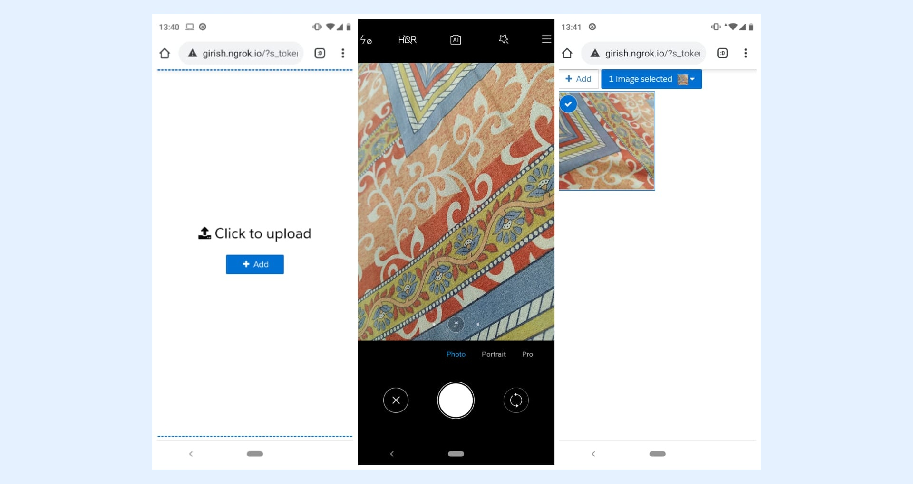

---
layout:
  width: default
  title:
    visible: true
  description:
    visible: true
  tableOfContents:
    visible: true
  outline:
    visible: true
  pagination:
    visible: true
  metadata:
    visible: false
  tags:
    visible: true
---

# Allowing Camera only image uploads (Mobile only)


**Note:**&#x20;

This documentation does not apply to SharinPix's mobile application. It applies to when SharinPix is being used on Salesforce Mobile App integration or Web Browser usage on a mobile phone.


Usually, SharinPix allows uploading images that have already been captured or that are stored on the device's storage. This is not always the desired behavior.

So, in order to get direct access to the camera and not have to go through a menu to choose between sourcing images from the camera or the roll, we have added a parameter.

In this documentation, we will show you how to enable SharinPix to open the camera directly for image uploads.

## How to proceed?

In order to enable camera-only uploads from a mobile browser or Salesforce mobile. You will need to add the <mark style="color:$danger;">`upload_source`</mark> parameter to your SharinPix's token base and give its value as <mark style="color:$danger;">`camera`</mark>.

```json
{
  "upload_source": "camera",
  "path": "/pagelayout/YOUR_ALBUM",
  "abilities": {
    "YOUR_ALBUM": {
      "Access": {
        "see": true,
        "image_list": true,
        "image_upload": true
      }
    }
  }
}
```

Voila, that's all. Below is a screenshot to demonstrate this behavior.




**Limitation:**

Using the **upload\_source** ability to restrict uploads to the device's camera only is currently not supported on Android devices.

