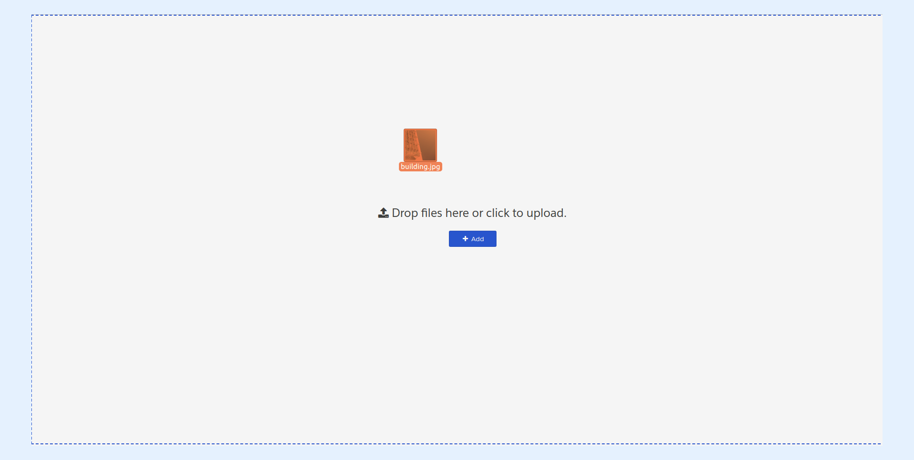

---
layout:
  width: default
  title:
    visible: true
  description:
    visible: true
  tableOfContents:
    visible: true
  outline:
    visible: true
  pagination:
    visible: true
  metadata:
    visible: false
  tags:
    visible: true
---

# Drag and Drop

* It is possible to drag and drop a file onto the SharinPix Album to upload it. The following screenshots illustrate how to do this.

<figure><figcaption></figcaption></figure>
