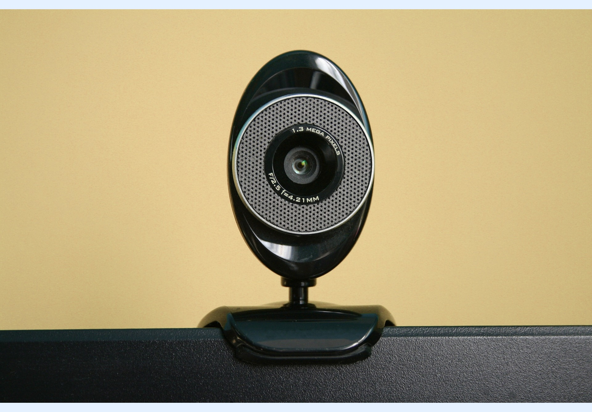

---
layout:
  width: default
  title:
    visible: true
  description:
    visible: true
  tableOfContents:
    visible: true
  outline:
    visible: true
  pagination:
    visible: true
  metadata:
    visible: false
  tags:
    visible: true
---

# Upload from Webcam

It is possible to upload images to SharinPix Album using a webcam connected to the host device.

* Upon uploading, the current browser you are using might prompt you to **Allow Camera.** Click on **Allow.**


Important: To enable the **webcam** ability on a specific album, you will need to define the abilities as presented in the following article: [SharinPix Webcam Permissions](../../access-and-security/sharinpix-webcam-permissions.md)

