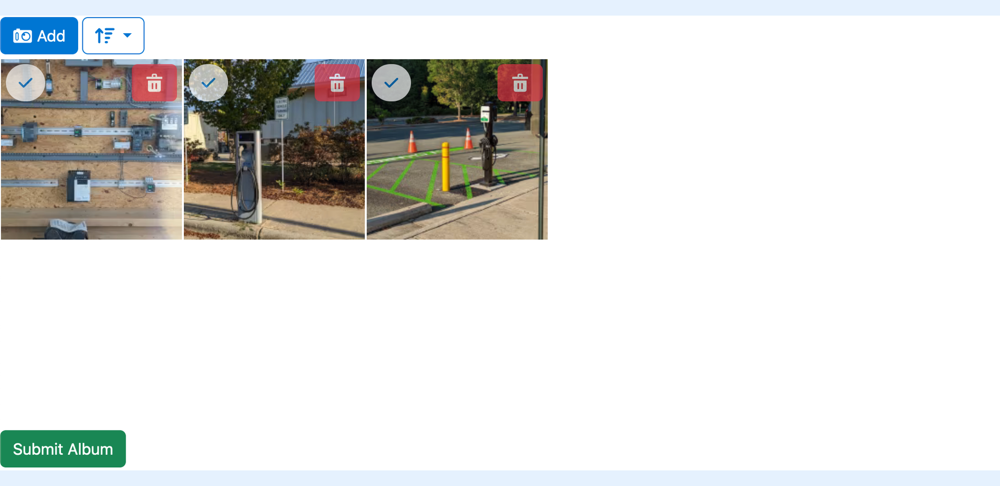

---
layout:
  width: default
  title:
    visible: true
  description:
    visible: true
  tableOfContents:
    visible: true
  outline:
    visible: true
  pagination:
    visible: true
  metadata:
    visible: false
  tags:
    visible: true
---

# Upload using WebForms


In some cases, external users may need to upload images. For this purpose, we have the **SharinPix WebForm component**, which sets upload constraints to an album.


## SharinPix WebForm Implementation

Two versions of the WebForm functionality exist, allowing you to choose the one that best aligns with your needs and technological preferences:

1. [**Lightning Web Components**:](upload-using-webforms.md#lightning-web-component) For those who have adopted the Lightning Experience and are building on Salesforce’s modern framework, we provide a Lightning Web Component (LWC) version of the WebForm.
2. [**Visualforce Component**:](upload-using-webforms.md#visualforce-component) This version is ideal for those utilizing Visualforce pages within their Salesforce implementation.

Both versions offer the same core functionality, allowing external users to upload images that meet predefined constraints to a target album in Salesforce. Which version to implement depends on your specific environment and development preferences.

## Parameters

The **WebForm** component is included in the SharinPix package and consists of the following attributes:

1. **constraints**: The restrictions set on the WebForm album before the submission. The constraints are written in a JSON format. Available constraints are:
   * min\_files : Minimum number of files that need to be uploaded to the album.
   * _file\_extensions_: Accepted file formats.
2. **targetAlbumId**: This attribute refers to the ID of the target album. Here, the target album ID refers to the current record ID.
3. **permissionId** : The ID of the [SharinPix Permission](../../access-and-security/sharinpix-permission-object-how-to-create-and-assign-custom-permission.md), which defines the WebForm album abilities.
4. **submitButtonLabel** : The label to be displayed on the submit button in the component. The default value is 'Submit'.
5. **height** : The height of the component. The default value is **500px**.

## Lightning Web Component

To implement the WebForm, you need to create a Lightning Web Component (LWC) that will encapsulate the SharinPix WebForm component as demonstrated in the code snippet below:

```html
<template>
<sharinpix-webform target-album-id={recordId} height={height} 
        permission-id={permissionId} 
        submit-button-label={submitButtonLabel}
        constraints={constraints}></sharinpix-webform>
</template>
```

```javascript
import { LightningElement, api } from 'lwc'

export default class WebformDemo extends LightningElement {
    @api recordId

    permissionId = 'Webform_Upload_Only'
    height = 900
    submitButtonLabel = 'Submit Photos'
    constraints = {
        min_files: 3,
        file_extensions: ['jpg', 'png']
    }

    connectedCallback () {
        window.addEventListener('message', (e) => {
            if (e.origin != 'https://app.sharinpix.com') { return; }
            if (e.data.name == 'album-validated') {
                //perform your logc here
            }
        })
    }
}
```

## Visualforce Component

To implement the WebForm, you need to create a Visualforce Page that will encapsulate the SharinPix WebForm component as demonstrated in the code snippet below:

```apex
<apex:page>
<sharinpix:WebForm constraints="{ 'min_files': 3, 'file_extensions': ['jpg', 'png'] }" 
        targetAlbumId="{! CASESAFEID($currentPage.parameters.Id) }"
        permissionId="Webform_Upload_Only"
        submitButtonLabel="Submit Album"
        height="400px"/>
</apex:page>
```

```apex
<apex:page >
    <apex:form >
        <apex:outputPanel id="panelID">
            <sharinpix:WebForm constraints="{ 'min_files': 3, 'file_extensions': ['jpg', 'png'] }" 
                       targetAlbumId="{! CASESAFEID($currentPage.parameters.Id) }"
                       permissionId="a0AR000000JQIFdMAP"
                       submitButtonLabel="Submit Album"
                       height="400px"/>
        </apex:outputPanel>    
        <apex:actionFunction name="rerenderPanel" rerender="panelID" />

        <script>
            var eventMethod = window.addEventListener ? "addEventListener" : "attachEvent";
            var eventer = window[eventMethod];
            var messageEvent = eventMethod == "attachEvent" ? "onmessage" : "message";
            eventer(messageEvent, function (e) {
                if (e.origin !== "https://app.sharinpix.com") return;

                if (e.data.name == "album-validated") {
                    rerenderPanel();
                }
            }, false);
        </script>
    </apex:form>
</apex:page>
```


**Tip:**

The SharinPix WebForm component triggers an event named **album-validated** upon successful submission of images. This event can be captured and used to perform several actions, such as the display of successful messages or to refresh the component.

The code snippet below demonstrates how the **album-validated** event can be used to refresh the WebForm component upon successful image submission:


* If the files uploaded to the album do not match the constraints provided to the WebForm, appropriate error messages will be displayed. For example, if fewer than 3 images are uploaded to the album and submission is attempted, the following pop-up will appear.


* After uploading at least 3 images, the submit button will turn green, and the submission will be allowed. The submitted images will be transferred to the target album.


