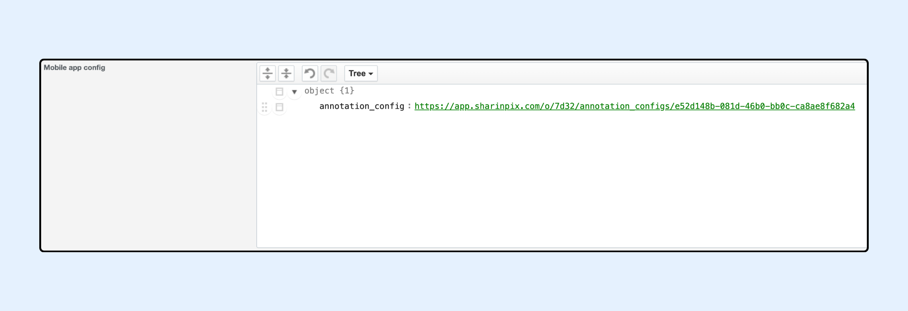

---
layout:
  width: default
  title:
    visible: true
  description:
    visible: true
  tableOfContents:
    visible: true
  outline:
    visible: true
  pagination:
    visible: true
  metadata:
    visible: false
  tags:
    visible: true
---

# Annotations Configurator

## Overview

The Annotations Configurator allows users to configure the tools, colors, and other parameters for the annotation engine.

Once an Annotation Configuration is created, it can be assigned to:

* SharinPix Mobile App via the Mobile App Config
* SharinPix Components via a SharinPix Permission

In this article, we will demonstrate how to:

* [Create and add an Annotation Config to your Mobile App Config to have the custom annotations in the SharinPix Mobile App](annotations-configurator.md#creating-and-adding-an-annotation-config-to-your-mobile-app-config)
* [Create and add an Annotation Config to a SharinPix Permission to have the custom annotations on SharinPix Components](annotations-configurator.md#creating-and-adding-an-annotation-config-to-your-sharinpix-permission)

## Creating and Adding an Annotation Config to your Mobile App Config

### Creation of an Annotation Config

To create an Annotation Config, follow these steps:

* Access the SharinPix Administration Dashboard


**Info:**

For details on accessing the SharinPix Administration Dashboard, please check the SharinPix documentation on the [Overview of the SharinPix Administration Dashboard](../../getting-started-with-sharinpix/overview-of-the-sharinpix-administration-dashboard.md).


* Then on the SharinPix Dashboard, find and click Annotation Configs tab

.png>)

* Next, on this page, configure all the tools that you need. For example, in the screenshot below, I have configured these tools:
  * Line - Red colour
  * Highlighter - Yellow colour
  * Marker - Green colour
  * Cross Sticker
  * Check Sticker

.png>)


**Tips:**

Clicking on a tool will allow you to modify different properties of this tool. For example:

* Tooltip/Name of the tool
* Colors of the tool. For example, background or foreground color
* Size of the tool. For example, for path, the thickness of the line
* Style of tool. For example, for a line, a solid line or a dashed line
* Add a custom icon for the tool


* Save the config
* Then, click on Copy link to add to the [Mobile App Config](annotations-configurator.md#adding-the-annotation-config-to-your-mobile-app-config).

.png>)

### Adding the Annotation Config to your Mobile App Config

To add an Annotation Config on SharinPix Mobile App, follow these steps:

* Go to the [Global Configuration](../../mobile-app/sharinpix-mobile-app-global-configuration.md), on the setting tab, add **annotation\_config: the copied URL** in the Mobile app Config. Your config should look like the screenshot below

## Creating and Adding an Annotation Config to your SharinPix Permission


**Info:**

For details on how to access the SharinPix Permissions, please check the SharinPix documentation on [Creation of a SharinPix Permission Record](../../access-and-security/sharinpix-permission-object-how-to-create-and-assign-custom-permission.md#creation-of-a-sharinpix-permission-record).


To create an Annotation Config for a SharinPix Permission, follow these steps:

* Access the SharinPix Permissions
* Then, on the created SharinPix Permission, find the Advanced section
* Next, click on New annotation engine (beta)

.png>)

* Then, click on the Setting icon of the Tool menu

<figure><figcaption></figcaption></figure>

* Next, on this page, configure all the tools that you need. For example, in the screenshot below, I have configured these tools:
  * Selection
  * Line - Red colour
  * Circle - Thich blue colour
  * Marker - Green colour
  * Highlighter - Yellow colour

.png>)


**Tip**

Clicking on a tool will allow to modify different properties of this tool. For example:

* Tooltip/Name of the tool
* Colors of the tool. For example, background or foreground color
* Size of the tool. For example for path, the thickness of tht line
* Style of tool. For example for line, solid line or dashed line
* Add a custom icon for the tool


* Save the config and the SharinPix Permission record.
* Then assign this [SharinPix Permission to a SharinPix Component](../../access-and-security/sharinpix-permission-object-how-to-create-and-assign-custom-permission.md#assign-a-sharinpix-permission-record-to-the-sharinpix-component).
