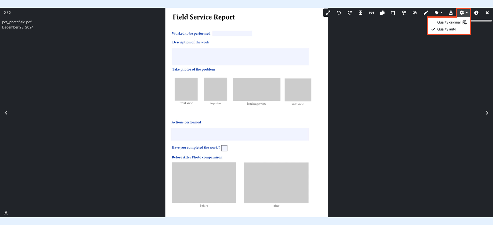
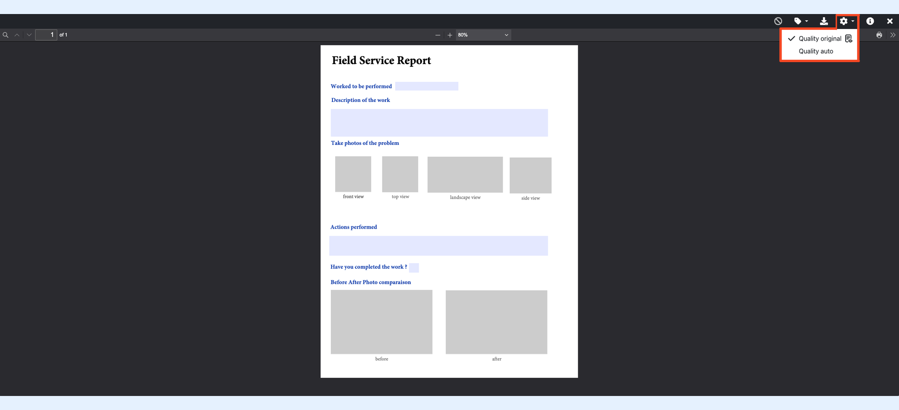

---
layout:
  width: default
  title:
    visible: true
  description:
    visible: true
  tableOfContents:
    visible: true
  outline:
    visible: true
  pagination:
    visible: true
  metadata:
    visible: false
  tags:
    visible: true
---

# Image and PDF Quality Settings

SharinPix has two viewing modes for images and PDFs: auto and original. These modes define the quality of the file being previewed. With **quality auto**, files are optimized for viewing performance, while **original quality** displays the uncompressed, original version. This functionality is supported for images and PDF files, providing different viewing experiences based on the selected quality.


**Note:**

When you change the quality setting, it applies to all files in your album. Any file you open afterward will be displayed in the quality mode selected previously.


The sections below demonstrate how to change the quality of images and PDF files.

## Quality Settings: Working with Images

From the gallery view, click on any image to view it.

 (1).png>)

Within the viewer, you can access various controls and adjust quality settings. Click on the close button on the top right to return to the gallery view.

 (1).png>)

Within the viewer:

1. Locate the settings icon in the top bar
2. Click to open the quality dropdown
3. Select either **auto** or **original** quality

 (1).png>)

### Quality Settings: Working with PDFs

From the gallery view, click on any PDF to view it.

 (2).png>)

#### Quality Auto

When viewing PDFs in quality **auto** , only one page of the PDF is displayed in the viewer.

#### Quality Original

Selecting **original** quality opens the PDF in the _PDF viewer_, allowing you to access all pages. The top bar only displays PDF-specific features and other album abilities will be hidden.


**Note:**

If you close the PDF viewer, subsequent PDF files will automatically open within the PDF viewer when in **original** quality mode. To return to the image viewer with all features enabled, switch back to **auto** quality mode using the setting dropdown.



**Supported File Types:**\
SharinPix allows you to view a variety of file types, including **images**, **PDF documents**, **Office documents** (such as Word, Excel, and PowerPoint), and **3D files**. The availability of certain file types depends on the active software license.

For more details on how to view supported file types and to understand the licensing requirements, please [follow this link](https://app.gitbook.com/s/i8tH1o5AHthxksYgF6ij/what-is-the-pricing-for-sharinpix).

