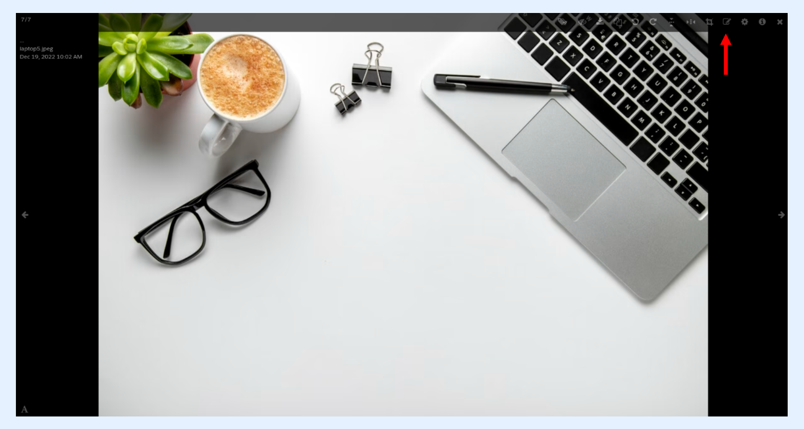
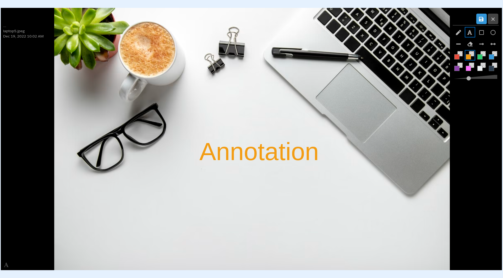
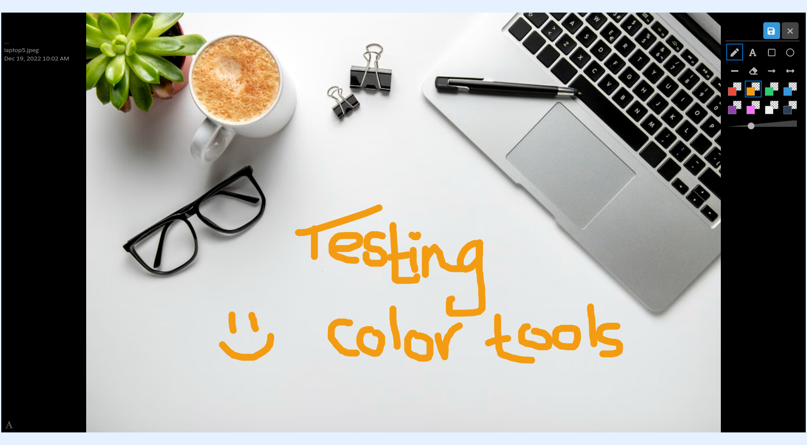
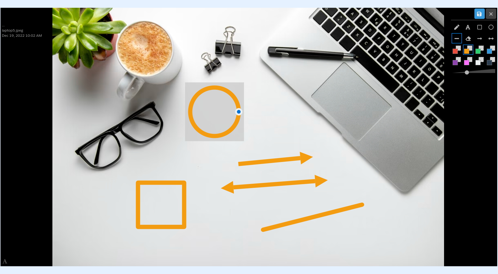

---
layout:
  width: default
  title:
    visible: true
  description:
    visible: true
  tableOfContents:
    visible: true
  outline:
    visible: true
  pagination:
    visible: true
  metadata:
    visible: false
  tags:
    visible: true
---

# Large View: Annotation – Color Selection

This article demonstrates the following:

* [Large View](large-view-annotation-color-selection.md#large-view)
* [Apply color to tools](large-view-annotation-color-selection.md#apply-color-to-tools)
* [Apply color to selection](large-view-annotation-color-selection.md#apply-color-to-selection)

## Large View

* The large view of an image can be accessed by clicking on its thumbnail.

* Click on the **edit** icon to activate **editing** mode.

* **Editing** mode is activated.

## Apply color to tools

* It is possible to select a specific color by selecting from the **color-palette**.

* Click on the desired color to select it.
* The selected color is now applied to all annotation tools:
* Text annotation

* Free-drawing annotation

* Shape annotation

## Apply color to selection

* Apply a new color to a selection by clicking on it and selecting the desired color.


**Info:**

The annotation colors can be configured. Follow the article below for more information: [Annotation Configurator](annotations-configurator.md)

