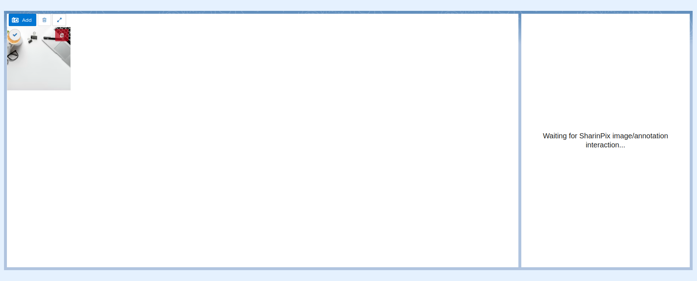
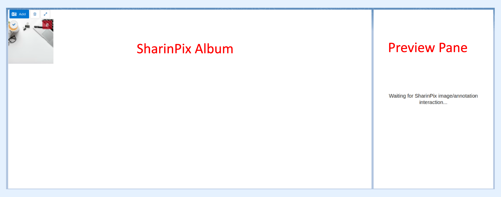
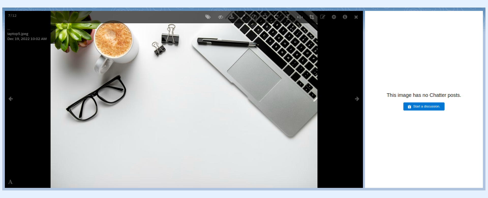
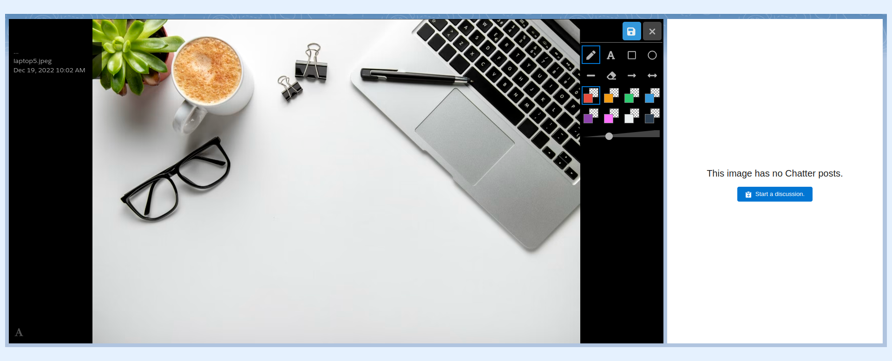
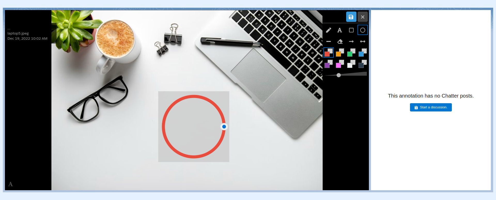
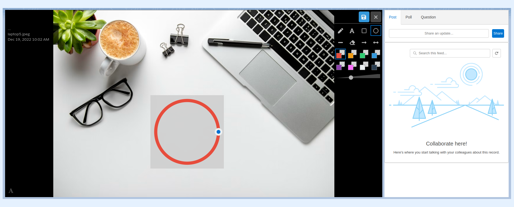
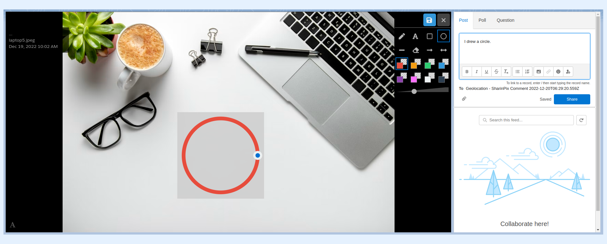
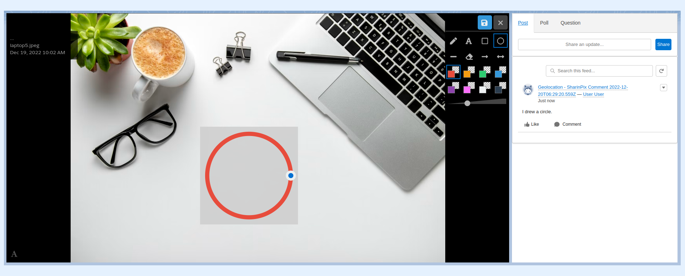
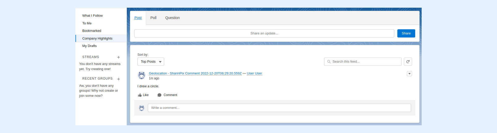

---
layout:
  width: default
  title:
    visible: true
  description:
    visible: true
  tableOfContents:
    visible: true
  outline:
    visible: true
  pagination:
    visible: true
  metadata:
    visible: false
  tags:
    visible: true
---

# Large View: Annotation – Comment with Chatter

## SharinPix Album with Chatter


**Note:**&#x20;

The present example makes use of the **SharinPix Album with Chatter** (previously named SharinPix with Chatter) component on the record page of the **Contact** object as shown in the screenshot below.


## Preview Pane

The **SharinPix Album with Chatter** component consists of two elements:

* The **SharinPix Album**
* The **Preview Pane**

## Large View

* Access the large view of an image by clicking on its thumbnail.

* It can be witnessed that when the image is opened in the large view mode, the preview pane reacts accordingly and indicates that the current image has no Chatter Posts.

## Create Chatter Post for an annotation

* It is possible to create a new **Chatter Post** which is related to a specific annotation.
* Activate **annotation** mode as shown below.

* Draw an annotation.

.png>)

* Select the annotation by clicking on it.
* As it can be seen below, upon selecting the annotation, the preview pane indicates that the current annotation has no **Chatter posts.**

* Click on the **Start a discussion** button to create a Chatter Post which is related to the currently selected annotation.

* It is now possible to share an update or make a post about this annotation.

## Chatter Feed

* It should also be mentioned that the new post about the newly-created annotation is displayed as well on the Chatter Feed.

