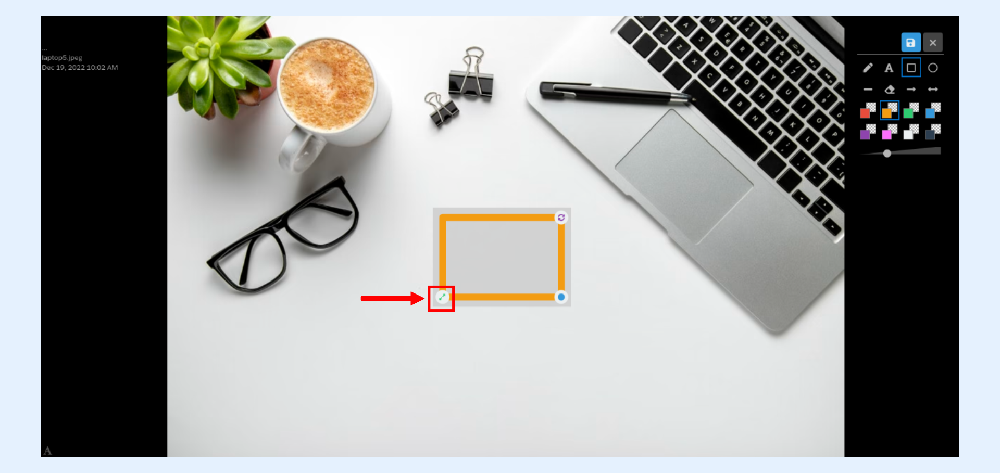
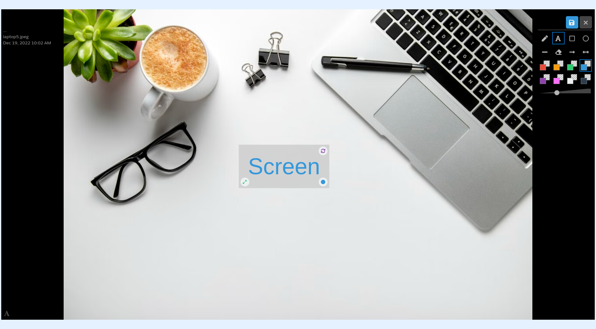

---
layout:
  width: default
  title:
    visible: true
  description:
    visible: true
  tableOfContents:
    visible: true
  outline:
    visible: true
  pagination:
    visible: true
  metadata:
    visible: false
  tags:
    visible: true
---

# Large View: Annotation – Edit

## Large view

* Access the large view of an image by clicking on its thumbnail.

## Resize annotation

An annotation can be resized by using the annotation **handle**. Select an annotation by clicking on it or tapping on it (applicable to touchscreen devices ). The **handle** is shown below.

## Resize text annotation

* If applied on a text, it changes the size of the font.

## Resize drawing annotation

* If applied on a drawing tool, it changes the scale of the annotation.

## Delete annotation

* Delete an annotation by clicking on the **eraser** icon, then select the annotation you want to delete.
* Click on the **eraser** icon to remove an annotation.

* Select the annotation you intend to remove by clicking on it.
* Annotation is now removed.

