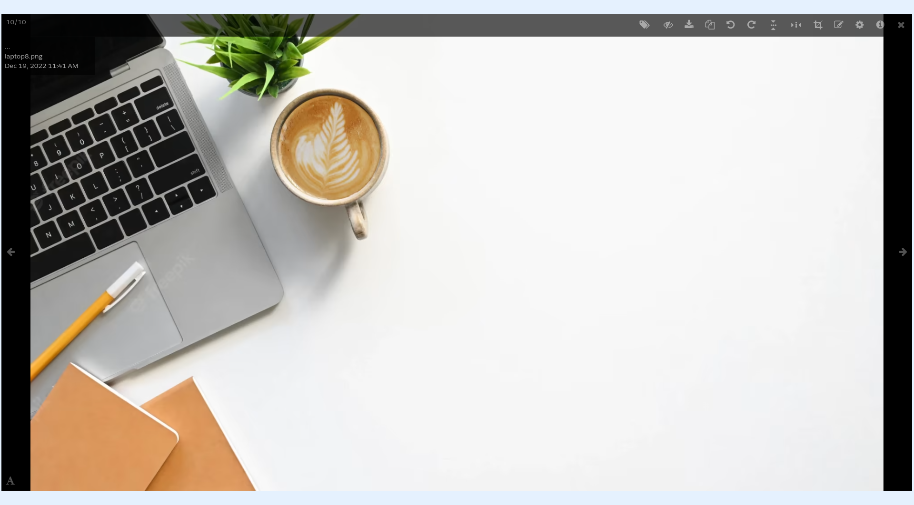
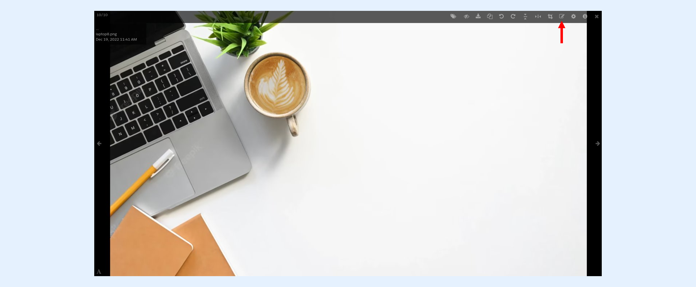
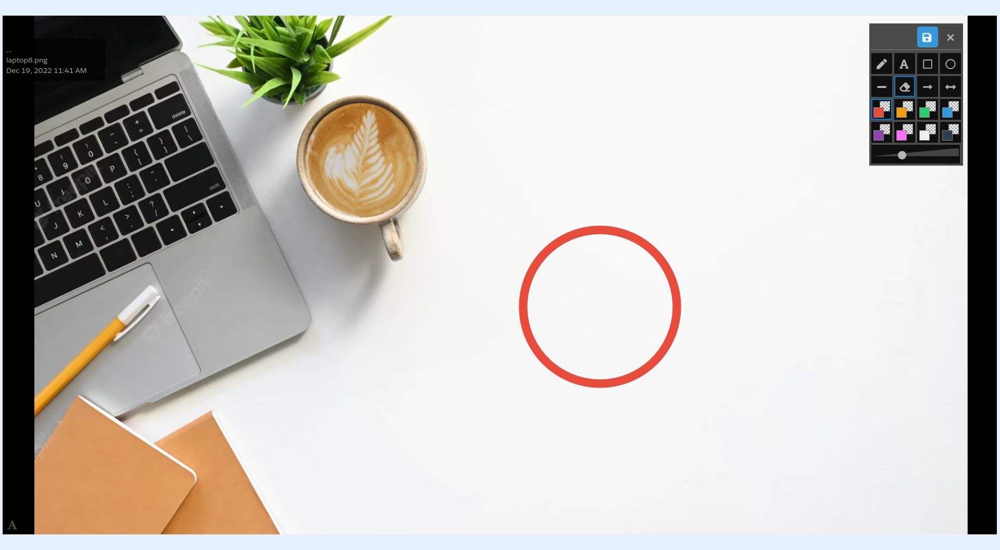
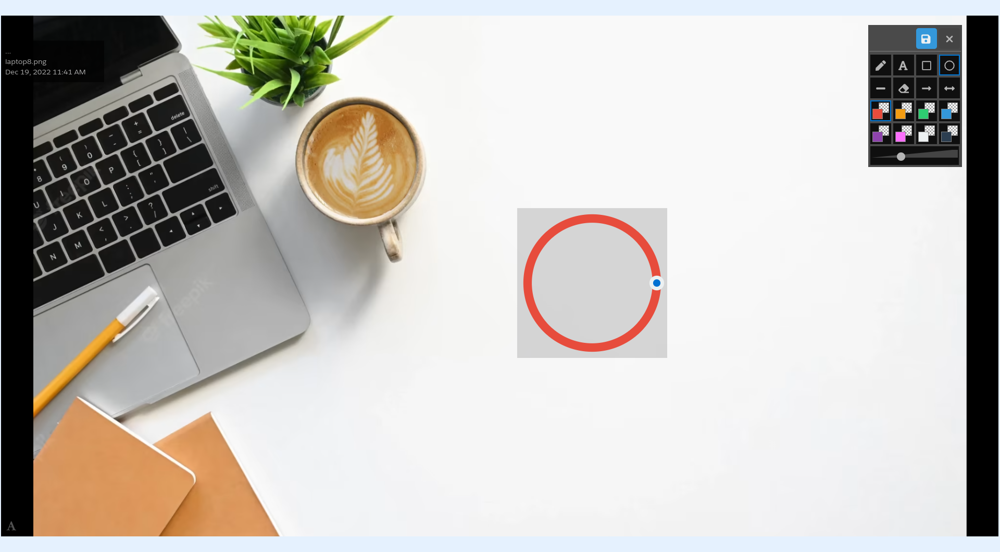
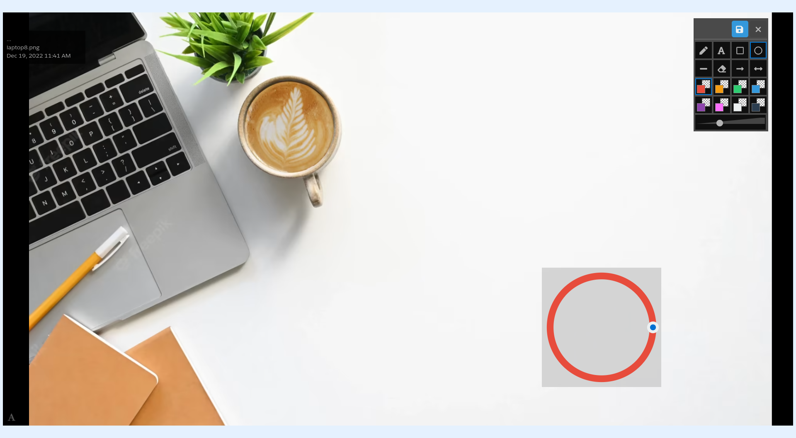
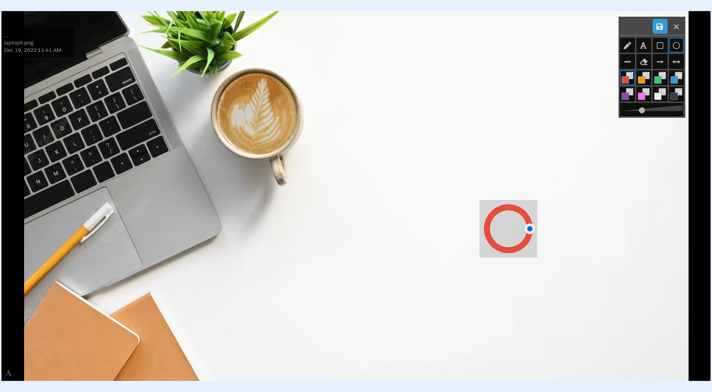

---
layout:
  width: default
  title:
    visible: true
  description:
    visible: true
  tableOfContents:
    visible: true
  outline:
    visible: true
  pagination:
    visible: true
  metadata:
    visible: false
  tags:
    visible: true
---

# Large View: Annotation – Move

* Access the large view of an image by clicking on its thumbnail.

* Activate the **Annotation mode** by clicking on the icon indicated below.

* **Annotation mode** is now activate&#x64;**.**&#x20;

* Draw an annotation.

* Click on the annotation (or tap on it when using touch devices). A handle for the annotation should appear as shown below.

## Move annotation

* Drag the annotation to the desired position across the image.

## Resize annotation

* Click on the **move icon** and drag the handle to resize the image annotation as per the desired scale.&#x20;

