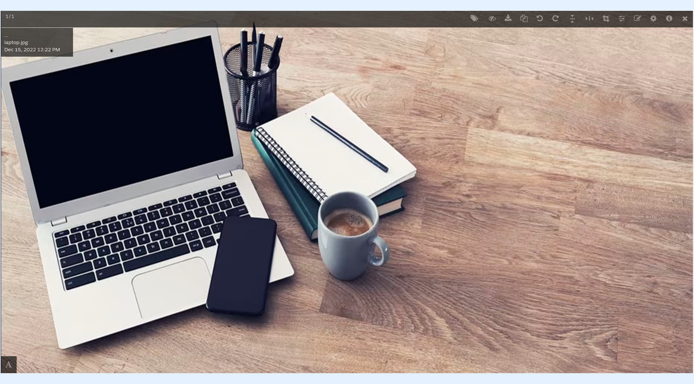
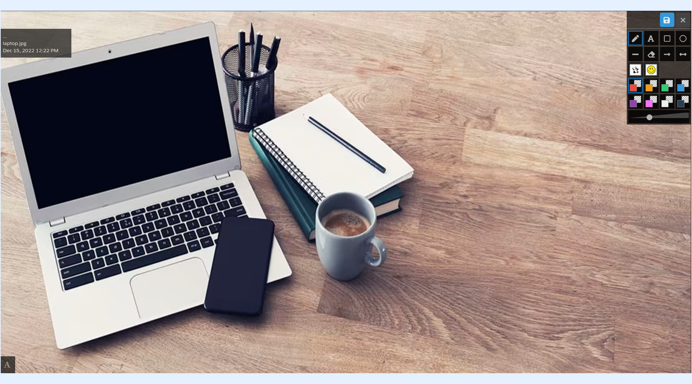
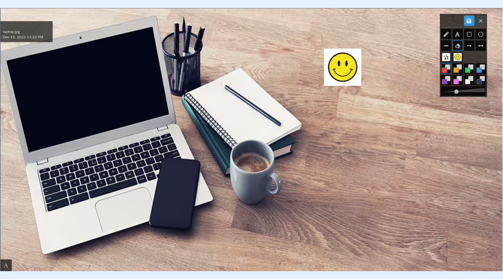
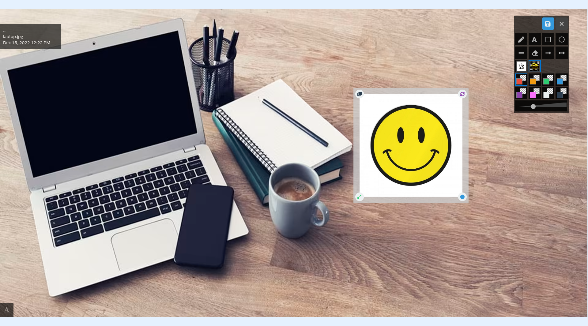

---
layout:
  width: default
  title:
    visible: true
  description:
    visible: true
  tableOfContents:
    visible: true
  outline:
    visible: true
  pagination:
    visible: true
  metadata:
    visible: false
  tags:
    visible: true
---

# Large View: Annotation – Stickers

Stickers are SVG files that you can add to your SharinPix organization to enhance the annotation with your own vector images.

## Large view

* Access the large view of an image by clicking on its thumbnail.

## Editing mode

* Click on the **edit** icon to activate **editing** mode.

## Adding sticker to an image

* Choose sticker.

<figure><figcaption></figcaption></figure>

* Once chosen, it will be available on the image and can be **moved around, resized** or **rotated**.

## Adding new stickers

Those SVG files need to be uploaded into the sticker album, which you can find on the [SharinPix Global Settings](../../getting-started-with-sharinpix/advanced-setup/advanced-configuration-customizing-your-sharinpix-components-with-sharinpix-permissions.md). To do so, follow the steps below:

* From App Launcher, search for **SharinPix Settings**
* Click on the button labeled as **Go to administration dashboard** to open the SharinPix global settings
* On the global settings, click on **Settings** from the top menu bar
* Click on **Editing Organization**
* Add your new stickers in the album available in the **Sticker** section


**Note:**&#x20;

SVG files need to be well-formed and include width and height values. Those files are text files, so don’t hesitate to add those values by yourself if necessary.


## Changing Stickers Scale

The sizes of stickers applied to images depend on the screen size. However, if you need to preserve actual sticker sizes, for example, if you have stickers that are 20px by 20px and you want it to appear as such when added on an image, you can force the scale to 1, however, if you want the sticker to be 40px by 40px, then you put the scale to 2.

To do so, edit the global settings of your organization to set the **Annotation sticker scale** field to the scale you want. You can find it on the [SharinPix Global Settings](../../getting-started-with-sharinpix/advanced-setup/advanced-configuration-customizing-your-sharinpix-components-with-sharinpix-permissions.md). To do so, follow the steps below:

* From App Launcher, search for **SharinPix Settings**
* Click on the button labeled '**Go to administration dashboard'** to open the SharinPix global settings
* On the global settings, click on **Settings** from the top menu bar
* Click on **Edit Organization**
* Set the desired scale on the **Annotation sticker scale** field


The sticker size limit is 40kb. Stickers exceeding this limit won’t be rendered in the annotation menu.

