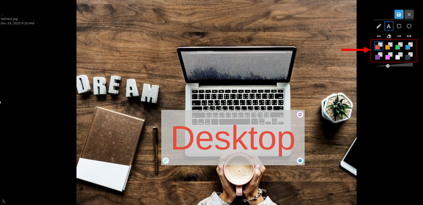

---
layout:
  width: default
  title:
    visible: true
  description:
    visible: true
  tableOfContents:
    visible: true
  outline:
    visible: true
  pagination:
    visible: true
  metadata:
    visible: false
  tags:
    visible: true
---

# Large View: Annotation – Text

## Large View

* Access the large view of an image by clicking on its thumbnail.

## Editing mode

* Access the **editing** mode by clicking on the **edit** icon.&#x20;

<figure><figcaption></figcaption></figure>

## Add text

* Add text to an image by selecting the **text icon.**

<figure><figcaption></figcaption></figure>

* Enter the desired content inside text box.

* The text is now displayed on the image.

* The text can be:
  * **moved**
  * **rotated**
  * **resized**

by using the handle.

## Change text

* The text content can be modified by double-clicking on it.

## Change text color

* Select the desired color from the color-palette by clicking on it as shown below.

* The text is now colored as previously selected.

## Delete text

* A text can be deleted from the image by clicking on the eraser icon and then click the text you want to delete.

.png>)

* Text is now removed.

