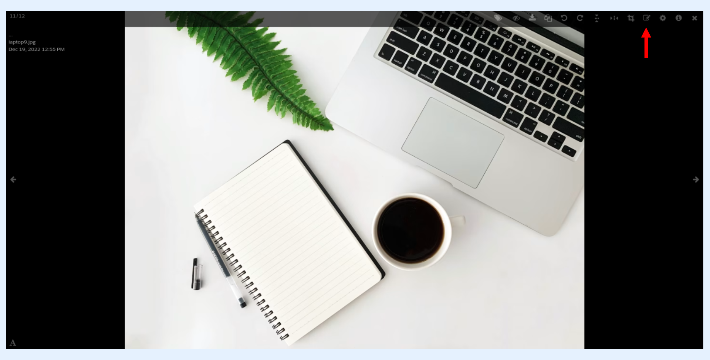

---
layout:
  width: default
  title:
    visible: true
  description:
    visible: true
  tableOfContents:
    visible: true
  outline:
    visible: true
  pagination:
    visible: true
  metadata:
    visible: false
  tags:
    visible: true
---

# Large View: Annotation – Tools

## Large View

* Access the large view of an image by clicking on its thumbnail.

## Editing Mode

* The tools can only be accessed within the **editing mode.**
* Activate the **editing mode** by clicking on the **edit** icon.

* The tools can be accessed/switched by selecting the adequate tool from the editing menu.

* The editing menu displays a list of tools which you can choose from.
  * [Hand drawing](large-view-annotation-tools.md#hand-drawing)
  * [Area as Square](large-view-annotation-tools.md#area-as-square)
  * [Area as Circle](large-view-annotation-tools.md#area-as-circle)
  * [Single Arrow](large-view-annotation-tools.md#single-arrow)
  * [Double Arrow](large-view-annotation-tools.md#double-arrow)
  * [Single Line](large-view-annotation-tools.md#single-line)

### Hand drawing

* Select the **hand drawing** tool as shown below.

* Press and hold the left-mouse-button (or long press on touch devices) to start drawing and release to end the drawing.

### Area as Square

* Select the **Area as Square** tool as shown below.

* Drag the cursor to create a square with the intended size.

### Area as Circle

* Select the **Area as Circle** tool as shown below.

* Drag the cursor to create a circular area with the intended size.

### Single Arrow

* The single-arrow tool can be accessed from the editing menu as shown below.

* Drag the cursor to draw the arrow.

* After drawing the arrow, you have the possibility to add an accompanying text.

* The text will be added at the starting point of the arrow which proves to be useful when labeling subjects inside pictures.

### Double Arrow

* The **double-arrow** tool can be accessed from the editing menu as shown below.

* Drag the cursor to draw the **double-arrow.**

* After drawing the double-arrow, you have the possibility to add an accompanying legend. This might prove useful when you are required to indicate the scale of subjects in a given picture.

### Single Line

* The **line** tool can be accessed from the editing menu as shown below.

* After selecting the line **tool**, drag the cursor across the image to draw a line with the intended length.


**Info:**

The annotation tools can be configured. Follow the article below for more information: [Annotation Configurator](annotations-configurator.md)

