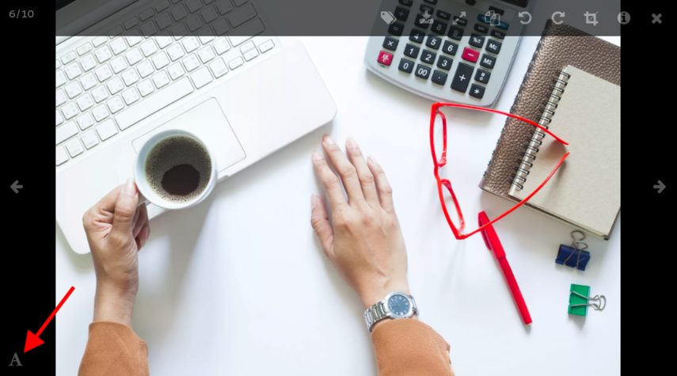
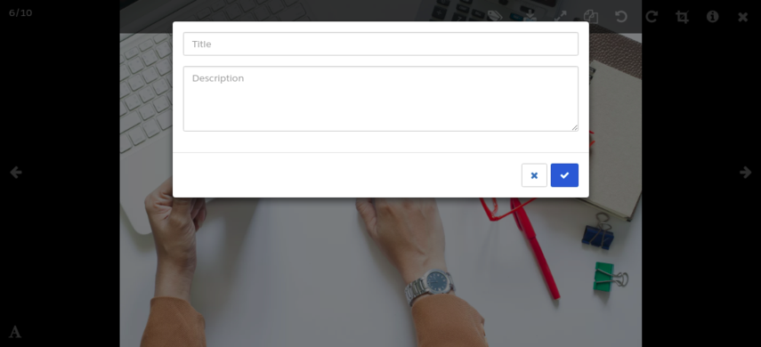
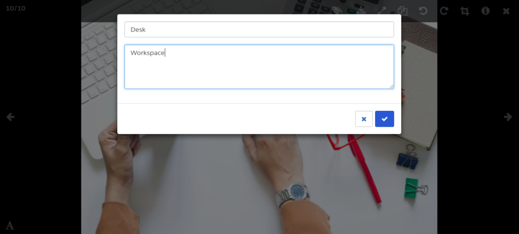
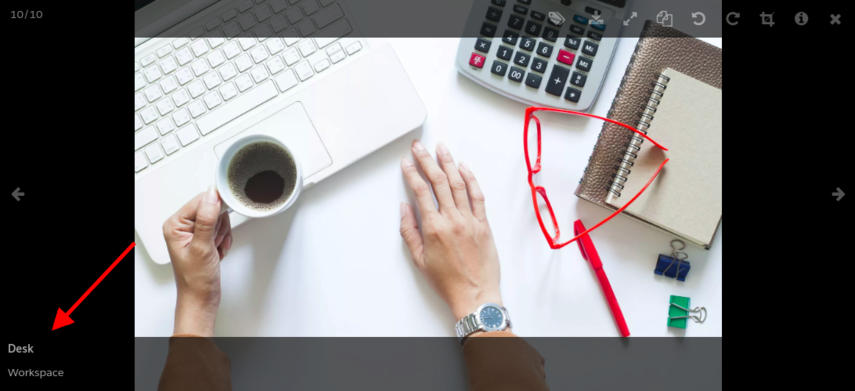

---
layout:
  width: default
  title:
    visible: true
  description:
    visible: true
  tableOfContents:
    visible: true
  outline:
    visible: true
  pagination:
    visible: true
  metadata:
    visible: false
  tags:
    visible: true
---

# Large View: Caption/Title and Description

## Access Large View

* Click on an image's thumbnail to open it in **Large View** mode.

* Access the **Title and Description** feature by selecting the icon shown below.

* Enter the **Title** and **Description** in the corresponding fields as shown below.

The **Title** and **Description** can be seen displayed on the left-hand-side within the footer.

