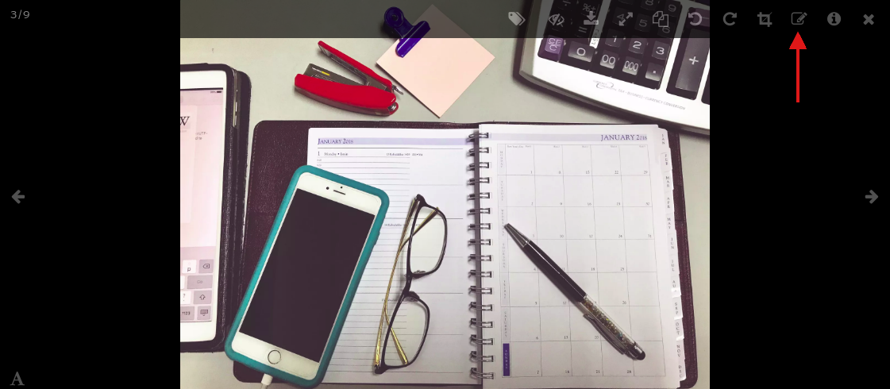

---
layout:
  width: default
  title:
    visible: true
  description:
    visible: true
  tableOfContents:
    visible: true
  outline:
    visible: true
  pagination:
    visible: true
  metadata:
    visible: false
  tags:
    visible: true
---

# Large View: Toolbar – Annotate

* [Large View](large-view-toolbar-annotate.md#large-view)
* [Annotation Mode](large-view-toolbar-annotate.md#annotation-mode)
* [Annotation Tools](large-view-toolbar-annotate.md#annotation-tools)
* [Annotation Auto-save](large-view-toolbar-annotate.md#annotation-auto-save)

## Large View

* Access the large view of an image by clicking on its thumbnail.


## Annotation Mode

* Activate **Annotation mode** by clicking on the **annotate** icon.



## Annotation Tools

For more details on the tools available inside the **annotation** mode, please refer to the following chapters:

* [Stickers](large-view-annotation-stickers.md)
* [Text](large-view-annotation-text.md)
* [Color Selection](large-view-annotation-color-selection.md)
* [Edit](large-view-annotation-edit.md)
* [Move](large-view-annotation-move.md)
* [Tools](large-view-annotation-tools.md)
* [Comment with Chatter](large-view-annotation-comment-with-chatter.md)

## Annotation Auto-save

If you want to make sure that your annotations are saved as you draw, you can activate the auto-save option. To activate it, set `annotation_auto_save` to `true` at the root of your token or organisation's configuration, as shown below.

```
    {
      "annotation_auto_save": true,
      "abilities": {
        "Id": {
          "Access": {…}
        }
      }
    }
```
