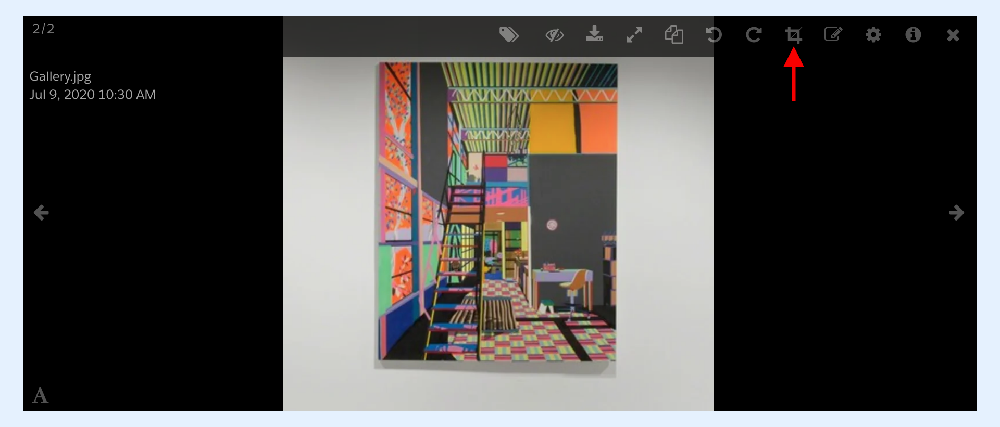
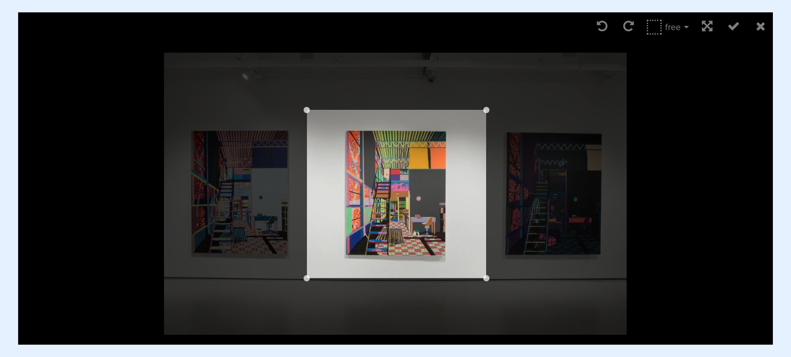

---
layout:
  width: default
  title:
    visible: true
  description:
    visible: true
  tableOfContents:
    visible: true
  outline:
    visible: true
  pagination:
    visible: true
  metadata:
    visible: false
  tags:
    visible: true
---

# Large View: Toolbar – Crop

This article demonstrates how to make use of the crop option available from the SharinPix Album to crop an image.

To crop an image using SharinPix, you first need to open it in large view mode. This can be done by simply clicking on the image's thumbnail from the album as indicated below:

 (2).png>)

The example below shows the image when opened in large view mode:

 (2).png>)

## Access the Editing Mode

Now that the image is displayed in large view, you can access the toolbar.

On the toolbar, select the crop option to activate the **Editing Mode** by clicking on the **Crop** icon as demonstrated below:

 (2).png>)

The **Editing Mode** is depicted in the example below:

.png>)

The Editing Mode provides the following options:

1. **Rotate Left**: To apply a left rotation
2. **Rotate Right**: To apply a right rotation
3. **Aspect Ratio**: To select and apply an aspect ratio
4. **Reset**: To reset the crop frame
5. **Check**: To save the changes
6. **Close**: To close the Editing Mode

 (2).png>)

## Crop the Image

To crop an image, select the **Aspect Ratio** option, then resize the crop frame from there:

 (2).png>)

 (2).png>)


**Tip:**

As shown above, the Aspect Ratio feature provides different options (that is, 4:3, 1:1, 16:9 and free in this case). These options should be defined by the user in advance so as to be accessible.

For more information about the aspect ratio and how to set the values, refer to the next article or click on the following link:

[Large View: Toolbar - Crop with Aspect Ratios](large-view-toolbar-crop-with-aspect-ratios.md)


## Save the Cropped Image

To save your changes, simply click on the **Check** icon as shown below:

 (3).png>)

And here is how the result should look like after saving the cropped image:

 (3).png>)

## How to Undo the Changes?

If you are not satisfied with the cropped image, you can undo your recent changes and readjust the crop frame. To do so, click on the **Crop** icon again as shown below:

This action will open the Editing Mode.

In the Editing Mode, go ahead and readjust the crop frame and save your new changes when done.

