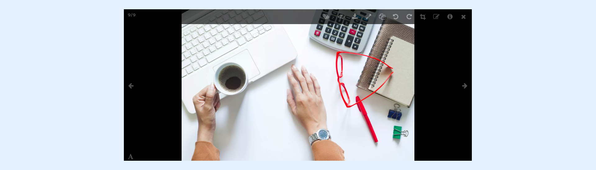

---
layout:
  width: default
  title:
    visible: true
  description:
    visible: true
  tableOfContents:
    visible: true
  outline:
    visible: true
  pagination:
    visible: true
  metadata:
    visible: false
  tags:
    visible: true
---

# Large View: Toolbar – Download

## Open large view

* Access the large view of an image by clicking on its thumbnail.

## Download image

* Download the current image by clicking on the **Download** icon.

